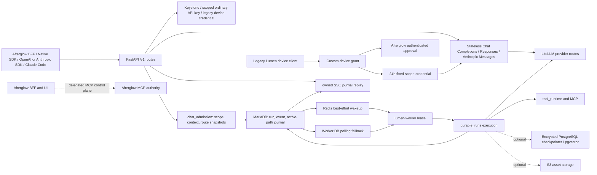

# Lumen Architecture

## Overview

Lumen은 LiteLLM provider 실행, LangGraph/LangChain agent runtime, 대화·durable run journal, server-managed tool/skill/memory, usage ledger와 provider secret을 소유하는 독립 AI 채팅 서비스다. Afterglow는 제품 UI와 인증된 BFF를 소유하고, Lumen은 `/v1` API와 실제 실행·영속성을 소유한다.

- Repository: https://github.com/openstack-afterglow/lumen
- 분석 기준: `dev` branch, 현재 working tree source와 설정
- 버전: root `lumen` package `0.2.2` (`pyproject.toml`, `lumen/__init__.py`), 독립 `lumen-sdk` `0.2.1` (`sdk/pyproject.toml`), discovery/API contract `1.0.0` (`lumen/api/compat/discovery.py`)
- 주요 실행 단위: FastAPI API(`lumen/main.py`), durable worker(`lumen/worker.py`), migration CLI(`lumen/scripts/migrate.py`), 독립 `lumen-sdk`, 선택적 local Console(`lumen_console/`)

짧게 말하면 HTTP route는 인증·scope·입력 검증과 journal 조회만 담당하고, `chat_admission`이 실행에 필요한 권한·context·provider/model·extension snapshot을 고정한다. `durable_runs`가 MariaDB transaction으로 intent/run/event를 기록하고, worker가 lease를 획득해 provider·tool을 실행한다. Redis는 wakeup 최적화일 뿐 queue 정본이 아니다.

## Development status

| 기능 범위 | Implementation | Verification evidence | Current limit | Source |
| --- | --- | --- | --- | --- |
| Native conversation/temp durable run admission | implemented | source-reviewed, test-defined | native admission의 `execution_mode`는 현재 `chat`만 허용되며 API/SSE가 실행 수명을 소유하지 않는다 | `lumen/api/completions.py`, `lumen/services/chat_admission.py`, `lumen/services/durable_runs/admission.py` |
| MariaDB journal과 SSE replay | implemented | source-reviewed, test-defined | retention 밖 cursor는 410이며 webhook push는 제공하지 않는다 | `lumen/models/chat_runs.py`, `lumen/services/durable_runs/queries.py`, `lumen/api/completions.py` |
| OpenAI/Anthropic compatibility | implemented | contract/system gates plus installed Codex CLI 0.154.0 and Claude Code 2.1.278 text/local-tool continuations passed (2026-09-20) | `/v1/responses`는 stateless·non-stored subset이고 `/v1/messages`/`count_tokens`는 Anthropic-native wire/SSE다. Responses는 Codex `prompt_cache_key`를 provider에 전달하지만 local thread/session의 `client_metadata`는 제거한다. Anthropic transport는 current Claude Code의 `context_management`, `output_config`, native tool/thinking blocks와 `anthropic-*` protocol headers를 보존하되 caller auth credential은 provider로 전달하지 않는다. Explicit output budget은 legacy 4096 cap으로 자르지 않고 provider selector ambiguity는 409다. | `lumen/api/compat/openai.py`, `lumen/api/compat/responses.py`, `lumen/api/compat/anthropic.py`, `lumen/services/completion_api.py`, `lumen/services/litellm_client.py`, `tests/system/fake_openai.py` |
| OpenAI virtual `model="lumen"` | implemented | focused compatibility suite passed (2026-09-19) | text transcript만 허용하며 caller tool, memory, MCP와 native tool 실행은 비활성화된다 | `lumen/api/compat/openai.py`, `lumen/services/openai_compat.py` |
| Active-path conversation history | implemented | full contract and real MariaDB/Redis integration gates passed (2026-09-20) | immutable parent graph를 보존하면서 indexed projection만 resume/context/page hot path에 사용한다. Opaque cursor는 revision-fenced이므로 branch 변경 후 409로 stale 처리된다. | `lumen/migrations/012_chat_history_path.sql`, `lumen/services/message_graph.py`, `lumen/services/conversation_store.py`, `lumen/api/conversations.py`, `sdk/lumen_sdk/_api.py` |
| Legacy Lumen device authorization | implemented | full contract, real MariaDB/Redis lifecycle, and Docker issue→approve→token→inference path passed (2026-09-20) | one-time fixed-scope 24시간 custom credential, Redis/MariaDB fail-closed 계약이다. Refresh와 official `/protocol`이 없으므로 current Claude Apps Gateway login과 호환된다고 advertise하지 않는다. | `lumen/migrations/013_claude_gateway_device_auth.sql`, `lumen/api/claude_gateway.py`, `lumen/services/claude_gateway.py`, `lumen/auth.py` |
| Provider/model routing, credentials, billing | implemented | focused billing/admin-key/migration tests passed (2026-09-13) | 공개 `api_model_name`/`api_provider`와 내부 LiteLLM route key를 분리한다. Bulk 관리자 projection은 모든 provider의 Lumen 귀속 일·주·월·누적 ledger usage와 고정 공식 console 링크를 반환한다. OpenRouter/DeepSeek는 inference key 기반 live 잔액을, direct OpenAI/Anthropic은 별도 암호화 administrator key 기반 현재 UTC 일·주·월 조직 cost/usage를 제공한다. Gemini는 console-only이고 Perplexity Computer Analytics는 API Platform billing과 범위가 달라 호출하지 않는다. Provider/report 실패는 fail-soft로 격리한다. | `lumen/services/providers/repository.py`, `lumen/services/providers/routing.py`, `lumen/services/providers/credentials.py`, `lumen/services/providers/billing.py`, `lumen/api/models.py`, `lumen/migrations/011_provider_billing_admin_key.sql` |
| Provider-native Web Search and citations | implemented | current integrated chat regression: 265 passed; installed transport exercised with synthetic provider responses, not live provider confirmation | Native mode is executor-bound. Lumen opts into strict function mode only for compatible closed schemas, preserves explicit compatibility-client choices, and always validates server-executed arguments. Agent Sonar has intrinsic search without a duplicate hosted tool; explicit hosted search coexists with function tools. Only provider-returned citations/search-result events prove source production. The pinned `/v1/responses` transport versus the official Agent endpoint still needs live confirmation. Native request/tool surcharges remain outside token-credit accounting. | `lumen/models/chat_contracts.py`, `lumen/services/{capabilities,chat_admission,engine,litellm_client,graph}.py`, `lumen/services/durable_runs/execution.py` |
| 사용자 quota policy와 usage ledger | implemented | focused tests passed (2026-09-11) | runtime 기본 월 한도와 개인 상속/override를 분리하고, 주간 무제한이어도 월 ceiling을 강제한다. 관리자 상세은 immutable ledger projection이며 reservation 없는 동시 overshoot 가능성은 유지된다. | `lumen/services/quota_policy.py`, `lumen/services/credit.py`, `lumen/services/stats.py`, `lumen/api/quotas.py`, `lumen/api/stats.py` |
| Native managed tools, skills, MCP | partial | source-reviewed, test-defined | 일반 declarative extension package installer, subagent spawn, sandbox binding, semantic prompt ranking은 schema/policy가 있어도 현재 실행 runtime이 아니다. 내장 Notion/GitHub connector bundle은 별도 경로로 구현되어 있다 | `lumen/services/tool_runtime/`, `lumen/services/mcp_adapter.py`, `docs/agent-platform.md` |
| Built-in MCP connector bundles (Notion, GitHub) | implemented | focused bundle/admission tests passed (29 passed, 2026-09-22); live Notion/GitHub MCP authorization not exercised | Declarative `scope="global"` presets installed by an administrator; per-user OAuth only, no bundle-carried credential. Install is idempotent by destination so a shared row is never rewritten and no user's connection is revoked. Unconnected connectors are dropped from implicit selection instead of warning on every run. | `lumen/services/mcp_bundles.py`, `lumen/services/chat_admission.py`, `lumen/api/extensions.py` |
| Provider-native server-side compaction | implemented | focused compaction tests passed (78 passed, 2026-09-22); synthetic provider payloads only — no live Anthropic or OpenAI compaction observed | Anthropic on the chat path, Anthropic and OpenAI Responses on the stateless proxies, because those are the transports whose pinned LiteLLM surface forwards `context_management`. Trigger is absolute with a per-protocol floor (50,000 Anthropic, 1,000 Responses) and is left unarmed when the window cannot express the ratio. Compaction blocks round-trip within a run. A proxy caller that sent its own `context_management` is never overridden. KNOWN GAP, wrong in BOTH directions: `cost_from_usage` prices only an input and an output component, so Anthropic's prompt-cache tokens have no rate of their own. On `/v1/chat/completions` LiteLLM folds them into `prompt_tokens`, which bills cache reads at the full input rate — roughly ten times their real cost (catalog `cache_read_input_token_cost` is 0.1x input) — while under-billing cache creation (1.25x input). On the native `/v1/messages` passthrough they are read from raw Anthropic usage and billed at zero. Aligning the passthrough to the chat path would therefore spread the over-billing rather than fix it; the rate model needs a cache component first, which is a pricing decision, not a refactor. | `lumen/services/native_compaction.py`, `lumen/services/graph.py`, `lumen/services/durable_runs/execution.py`, `lumen/services/completion_api.py` |
| Memory and semantic store | partial | source-reviewed, test-defined | authoritative memory는 MariaDB이며 PostgreSQL/pgvector는 선택 기능이고 protocol v2에는 encrypted PostgreSQL checkpointer가 필수다 | `lumen/models/chat_db.py`, `lumen/services/semantic_memory.py`, `lumen/services/checkpointer.py` |
| API-key and Keystone SDK transports | implemented | source-reviewed, test-defined | SDK는 native API surface를 호출하며 provider credentials를 소유하거나 직접 노출하지 않는다 | `sdk/lumen_sdk/client.py`, `sdk/lumen_sdk/proxy.py`, `lumen/auth.py` |
| Local Console | partial | source-reviewed, test-defined | Afterglow 제품 UI가 아닌 localhost 개발자/운영자 tooling이며 Lumen auth/scope를 우회하지 않는다 | `lumen_console/app.py`, `docs/local-console.md` |
| Kolla/Compose deployment | implemented | source-reviewed, test-defined | `lumen` root wheel은 Kolla role shared data를 제공하고, service runtime dependency와 Kolla-Ansible은 각각 `service` extra와 operator environment가 소유한다. migration은 API/worker 시작 전에 별도로 적용해야 하며 `/v1/health`는 process health만 의미한다 | `pyproject.toml`, `docker/Dockerfile`, `docker-compose.yml`, `deploy/kolla/ansible/roles/lumen/`, `docs/operations.md` |

위 표의 `test-defined`는 해당 경계를 검사하는 테스트 코드와 명령이 정의되어 있다는 뜻이다. 2026-09-20 `uv run lumen-test contract -q`는 service 1049건을 통과하고 1건을 skip·13건을 deselect했으며 root/SDK Ruff와 SDK 126건도 통과했다. `uv run lumen-test integration -q`는 일회용 실제 MariaDB/Redis에서 active-path revision/branch와 Gateway one-time expiring key lifecycle을 포함한 전체 integration gate를 통과했다. `uv run lumen-test system -q`는 8건 모두 통과했으며 실제 API/worker/MariaDB/Redis process stack에서 fake provider를 상대로 Responses non-stream/SSE/function-call full-input continuation과 Gateway device authorization 및 Anthropic non-stream/SSE를 검증했다. 별도의 isolated stack에서는 설치된 Codex CLI 0.154.0의 text turn과 실제 `exec_command` 후속 요청도 통과했다. 이는 외부 provider 호출, 실제 Keystone approval 또는 운영 배포 증거가 아니다.

## System context



텍스트 흐름은 다음과 같다. 요청은 Lumen이 직접 받은 `/v1` 요청이거나 Afterglow의 인증 BFF forwarding이다. route가 principal과 least-privilege scope를 확인하면 admission이 project ownership, capability, provider/model, context, tool/skill/MCP 선택을 계산하고 immutable snapshot을 만든다. `durable_runs.admission`은 MariaDB transaction 안에서 user turn, run, 첫 journal event를 함께 commit한 뒤 Redis에 best-effort wakeup을 발행한다. worker는 Redis 신호를 우선 사용하지만 누락·장애 시 MariaDB의 queued run을 polling하고 lease를 획득한다. provider/tool I/O와 각 단계의 결과는 worker가 journal에 기록하며, 클라이언트는 HTTP/SSE 연결이 끊겨도 run ID와 cursor로 journal을 replay한다.

## Code map

| 경로 | 핵심 심볼/책임 | 의존 방향 |
| --- | --- | --- |
| `lumen/main.py` | FastAPI lifespan, discovery/health, `/v1` router mounting과 host gate | API → auth/config/service |
| `lumen/auth.py` | `Principal`, Keystone `validate_token`, API-key verification, scope와 project/target-project 경계 | route → auth; OpenStack connection은 Keystone principal에서만 생성 |
| `lumen/api/completions.py` | native completion/temp completion, idempotency, run 조회·cancel·approval·SSE | route → `chat_admission`, `durable_runs` |
| `lumen/services/chat_admission.py` | capability/feature gate, context·memory·skill·extension/model snapshot | API-independent preparation → stores/providers/tool runtime |
| `lumen/services/durable_runs/admission.py` | idempotency, ownership/active-run lock, atomic user turn/run/event persistence | admission → MariaDB ORM; commit 후 wakeup |
| `lumen/services/durable_runs/common.py` | fingerprint, descriptor, protocol validation, `wake_run` | durable admission/execution 공통 |
| `lumen/services/durable_runs/execution.py` | lease owner가 graph/provider/tool output을 journal에 append하고 usage/terminal 상태를 기록 | worker → graph/engine/stores |
| `lumen/services/durable_runs/queries.py` | owner-scoped run/event read와 cursor replay | API → MariaDB |
| `lumen/worker.py` | Redis BRPOP 및 DB polling, lease execution, stale recovery, expiry/reconciliation jobs | worker → durable runs/checkpointer/memory jobs |
| `lumen/api/compat/openai.py`, `responses.py`, `anthropic.py`, `streaming.py` | Chat Completions/Responses/Anthropic-native stateless route, 공개 ID/provider 선택, SSE ping/drain, virtual `lumen` durable bridge | API-key auth → `openai_compat` 또는 `completion_api` |
| `lumen/api/claude_gateway.py`, `lumen/services/claude_gateway.py` | legacy Lumen custom OAuth device issuance/poll, authenticated human approval, one-time 24h credential, models/settings/Messages surface | public custom device route + Afterglow Keystone BFF → MariaDB/Redis/API-key store; current Claude Apps Gateway login 아님 |
| `lumen/services/completion_api.py` | 공개 route resolve, quota precheck, uncapped explicit positive compat output budgets, LiteLLM stateless completion/usage billing | compat/Gateway → providers/litellm |
| `lumen/services/message_graph.py`, `lumen/services/conversation_store.py` | immutable ancestry 검증, active-path append/replace, projection page와 branch metadata | native admission/execution/API → MariaDB transaction |
| `lumen/api/api_keys.py`, `lumen/services/api_key_store.py` | owner/admin API-key CRUD, expiring Gateway credential verification, 이름 변경과 월·주간 owner 한도 projection | Keystone/Gateway route → MariaDB; 한도 상한은 사용자 지갑 쿼터 |
| `lumen/api/quotas.py`, `lumen/services/credit.py`, `lumen/services/quota_policy.py`, `lumen/services/quota_periods.py` | runtime 기본 월 quota, 사용자 `NULL` 상속/양수 override/`0` 무제한, reset, 월·주간 ledger admission | admin route → MariaDB policy/wallet/usage ledger |
| `lumen/api/stats.py`, `lumen/services/stats.py` | 관리자 aggregate와 사용자별 기간·model·web/API·timestamp/token/cost ledger drill-down | admin route → immutable MariaDB usage ledger |
| `lumen/services/providers/` | provider/model CRUD, 공개 ID projection, route/credential policy, 모든 provider의 grouped local usage 및 공식 portal을 포함한 bulk billing projection, OpenRouter/DeepSeek inference-key snapshot, direct OpenAI/Anthropic administrator-key organization reports | repository/billing → ORM grouped ledger query 및 capability별 고정 provider HTTPS endpoint; compat/worker snapshot 소비 |
| `lumen/services/graph.py`, `lumen/services/engine.py` | LangGraph model/tool loop와 normalized stream boundary | durable execution → provider/tool/checkpointer |
| `lumen/services/tool_runtime/` | binding, frozen selection, schema, managed/custom dispatch | admission snapshot → worker-time revalidation |
| `lumen/services/mcp_adapter.py` | Afterglow MCP control-plane snapshot/claim bridge | Lumen worker → configured Afterglow endpoint |
| `lumen/models/chat_db.py`, `lumen/models/chat_runs.py` | catalog, conversation, memory, credentials, usage와 run/event/lease ORM | services → MariaDB |
| `lumen/cache.py`, `lumen/services/checkpointer.py`, `lumen/services/semantic_memory.py` | Redis cache/wakeup, optional PostgreSQL checkpointer/pgvector | optional/optimization 경계 |
| `sdk/lumen_sdk/client.py`, `sdk/lumen_sdk/proxy.py`, `sdk/lumen_sdk/_api.py` | 동일 native route mixin의 httpx API-key transport와 OpenStack SDK transport | caller → `/v1` |
| `docker/Dockerfile`, `docker-compose.yml`, `deploy/kolla/ansible/roles/lumen/` | root build context를 유지하는 local API/worker/migrate/Console container stages와 root wheel Kolla role shared data | operator → service processes |

## Runtime flows

### Native durable admission and replay

1. `POST /v1/conversations/{conversation_id}/completions` 또는 `/v1/temp-completions`가 UUID `Idempotency-Key`, owner project, required scopes를 확인한다.
2. `prepare_context_input()`이 모델 capability, workspace/memory, agent/skill, extension selection, execution protocol과 tool schema를 계산한다. protocol v2는 encrypted PostgreSQL checkpointer 설정 없이는 admission되지 않는다.
3. `durable_runs.admission.create_persistent_run()` 또는 `create_temp_run()`이 idempotency fingerprint, active-run 및 revision fence를 잠근 뒤 user message, active-path append, `active_leaf_id`, encrypted request payload, run/provider rows, `run.started`/queued event를 하나의 MariaDB transaction으로 저장한다.
4. commit 이후 `wake_run()`이 `afterglow:chat:runs`에 ID를 넣는다. Redis가 없거나 publish가 유실되면 worker의 `queued_run_ids()` polling이 queued state를 발견한다.
5. worker가 run lease를 소유한 뒤 graph/engine을 호출한다. provider call, tool call, delta, usage, approval/interaction, terminal result를 journal에 기록한다. lease owner/expiry가 맞지 않으면 write를 중단하고 stale recovery가 재시도 또는 fail-closed한다.
6. `GET /v1/runs/{run_id}/events`는 owner-scoped MariaDB journal을 cursor 이후 읽고, terminal event까지 polling SSE와 keepalive를 제공한다. HTTP request나 SSE 연결은 실행을 취소하거나 실행 lifetime을 소유하지 않는다.

Native Search는 `chat_admission`이 고정한 feature options를 `durable_runs.execution` → `engine.stream` → `graph.stream` → provider transport까지 전달한다. 저장된 capability override나 subscription credential은 실제 native 지원 범위를 늘릴 수 없고 capability는 검색 실행 증거가 아니다. Perplexity legacy Sonar는 Chat Completions `web_search_options`를 유지하고, Agent Responses의 non-Sonar native opt-in은 hosted `web_search` tool을 function tools와 함께 보낸다. Agent Sonar에는 중복 hosted tool을 보내지 않는다. Lumen의 자동 `strict=true`는 지원하는 recursively closed schema에만 적용하며, compatibility client의 명시적 strict 선택과 선택적인 description/parameters는 보존한다. 서버 도구 실행은 strict 여부와 무관하게 JSON/schema를 검증하고 실패 시 dispatch하지 않는다. Provider-returned URL citations/search-result items만 canonical durable citation parts로 저장한다. Native 모델의 token 가격이 있어도 managed 검색의 별도 component 가격이 없으면 admission을 거부한다. Perplexity Agent Sonar와 legacy Sonar의 서로 다른 가격은 API base로 구분하고, exact Agent Sonar/GLM-5.3 공식 가격의 provenance를 admission snapshot과 관리자 model projection에 유지한다.

### Active-path history and branches

`chat_messages.parent_id` graph는 immutable audit/branch history로 남고 `chat_conversation_active_path(conversation_id, position, message_id)`가 resume, context와 history page의 hot-path 정본이다. `lumen-migrate --apply`는 migration 012 뒤 unready conversation을 lock하고 legacy `active_leaf_id` ancestry로 projection을 backfill한 다음 contiguous/root-to-leaf/terminal-leaf integrity를 검증한다. Append, assistant completion, regeneration, retry, fork와 active-leaf switch는 conversation/run fence 아래 graph와 projection을 같은 transaction에서 갱신한다.

Message page는 `anchor=first|latest` 또는 HMAC-signed opaque `cursor` 하나를 받고 projection order로 최대 100개를 반환한다. Cursor는 conversation ID, `history_revision`, direction과 exclusive position을 묶는다. Branch switch가 revision을 올리면 old cursor는 409이며 malformed/tampered/cross-conversation cursor는 422다. Response의 before/after cursor와 message별 sibling metadata가 browser/SDK의 bidirectional navigation과 `descend=true` branch switch를 지원한다.

### Compatibility paths

`POST /v1/chat/completions`에서 `model="lumen"`이면 `lumen/services/openai_compat.py`가 text-only transcript를 검증하고 durable temporary run을 만든다. Provider model ID는 `completion_api`가 active public route와 quota를 resolve해 stateless provider transport로 실행한다. `POST /v1/responses`는 Responses-native non-stream/SSE object를 relay하고 stateful storage/background options를 거부한다. Codex `prompt_cache_key`는 explicit provider option으로 전달하고 local `client_metadata`는 제거하며 full-input function continuation을 stateless하게 relay한다. `/v1/messages`와 `/v1/messages/count_tokens`는 Anthropic-native transport다. Current Claude Code의 native blocks, `context_management`, `output_config`, `anthropic-*` headers는 explicit request/header boundary를 통해 전달하고 caller `Authorization`/`x-api-key`는 전달하지 않는다.

Compat route는 API-key 전용이고 native server-managed tool/memory/approval contract를 제공하지 않는다. OpenAI path가 output budget을 생략하면 4096 default를 적용하지만 explicit positive `max_tokens`/`max_output_tokens`는 cap하지 않는다. Anthropic `max_tokens`는 필수 양수다. Native durable admission의 별도 4096 cap, worker 45초 lease, durable execution semaphore 4, custom HTTP/MCP 64 KiB/4000자 boundary와 temporary thread 30일 retention은 유지된다.

Configured `/v1/claude-gateway`는 legacy Lumen custom metadata/device/token과 credential-kind-guarded models/settings/Messages/count_tokens를 노출한다. Device/user/client code는 hash로 저장되고 Redis rate limit은 fail-closed다. Afterglow approval 뒤 interval-valid poll이 grant를 한 번 consume해 fixed-scope API key를 24시간 발급한다. Ordinary key는 custom route를 사용할 수 없고 refresh credential과 official `/protocol`은 없다. Current Claude Code는 ordinary key로 direct Anthropic `/v1/messages`를 사용하며 이 custom flow를 native Apps Gateway login으로 discover하지 않는다.

### Worker recovery and background work

`lumen/worker.py`는 최대 동시 실행 semaphore, stale run recovery, pending input/approval expiry, temporary thread purge, title/memory/background workspace jobs를 처리한다. Redis wakeup은 latency 최적화이며 MariaDB queued state·lease·journal이 재시작과 장애 후 복구의 기준이다. provider가 완료됐는지 불확실한 segment는 중복 replay하지 않고 fail-closed 규칙을 따른다.

Title recovery reuses the durable first-title job rather than doing model work in a GET. Once per idle minute it selects an active, titleless `auto/idle/revision=0` conversation with a completed persistent root exchange and no title job; empty conversations cannot starve later candidates. Unusable route/source candidates become `unavailable`. Manual updates atomically mark the title explicit/ready and advance its revision, so late first-title results cannot overwrite them. Legacy/manual/failed/deleted rows and ambiguous provider calls are not replayed.

Context capacity resolves exact catalog input windows, including the stored Perplexity route alias, while explicit reviewed overrides retain precedence. Unknown limits, uncountable input and invalid budgets have distinct reason codes and never project a fabricated percentage. Text counter failure retains a labeled estimate. Both manual compaction endpoints return the actual unavailable reason. Agent search-result events/output items (including `response.output_item.added`) survive LiteLLM's empty-chunk filtering through provider-specific delta metadata, then join URL annotations in the canonical citation projection without losing inline ranges. A failed tool-schema validation is persisted and emitted with failed tool status rather than being projected as a completed task. These changes add no service, database schema or ownership boundary.

Provider-native compaction layers under, not over, that fence. `native_compaction.py` resolves an Anthropic `context_management` edit at the same 0.80 occupancy ratio, but the provider trigger is an absolute input-token count against the raw window while the Lumen fence divides by `input_budget`, so the Lumen fence always trips first and stays the durable, provider-neutral mechanism. The edit is armed only where the pinned LiteLLM chat transport forwards `context_management` — Anthropic today; every other route resolves to `None` rather than sending a parameter `drop_params` would silently discard. A window that cannot express the ratio above the documented 50,000-token floor is left unarmed rather than clamped to a trigger that can never fire. `chat_native_compaction_enabled` disables it without touching Lumen's own compaction. Returned `compaction` blocks are carried on every later assistant turn of the run, including replayed turns, because a dropped block makes the provider re-compact and re-bill the same prefix; blocks are bounded and re-validated before they are sent back. On the Anthropic passthrough surface the per-iteration `usage.iterations` breakdown now drives billing, since the top-level counters exclude the compaction iteration entirely. Compaction blocks are carried within a run, not across conversation turns — cross-turn continuity remains Lumen's encrypted summary checkpoint. This adds no service, database schema or ownership boundary.

The stateless compatibility proxies (`/v1/messages`, `/v1/responses`, and the Claude gateway) carry no durable run, so Lumen's own fence never sees them and the provider's compaction is the only thing between a long client session and a hard context-length error. `complete_anthropic` and `complete_responses` therefore supply a resolved `context_management` value when — and only when — the caller sent none; a caller that sent its own configuration keeps it untouched, because overriding it would silently change a compatibility client's contract. The two protocols share neither a wire shape nor a floor: Anthropic takes `{"edits": [...]}` with a 50,000-token minimum while the Responses API takes `[{"type": "compaction", "compact_threshold": N}]` with a 1,000-token minimum, so they are resolved separately instead of being translated at the transport. `chat_native_compaction_passthrough_enabled` gates the proxies independently of the chat path because their blast radius differs: a proxy client that does not replay the compaction block pays for a fresh compaction each turn rather than reusing the previous one.

Built-in remote MCP connector bundles (`mcp_bundles.py`) are declarative presets for `scope="global"` rows in `chat_mcp_servers`: Notion and GitHub, both `auth_mode="oauth"` and `load_policy="on_demand"`. Neither product is an Anthropic-executed server tool, so the MCP connector path is the only mechanism; the bundles therefore reuse the existing per-user PKCE OAuth flow and carry no credential material of their own. Installation is additive and idempotent by destination because rewriting a shared global row bumps `config_version` and revokes every user's connection to it. Because an active global row is implicitly selected for every user, admission now excludes an OAuth connector with no usable connection from an *implicit* selection instead of freezing it and having the worker reject it with a credential warning on every run; an explicitly selected or agent-allowlisted connector still surfaces that warning.

`ContextState.breakdown`은 preview와 request scope에서 메시지·system prompt·workspace·memory·skills·agent·summary·attachment·function/MCP schema와 framing의 안전한 이름, 개수, token measurement를 제공한다. `context_inspector.py`는 실제 카운팅 입력의 marginal 비용을 배분하며 complete이면 included component 합계가 `input_tokens`와 같다. Shared custom-tool schema builder가 admission과 runtime schema 차이를 방지한다. On-demand 도구는 deferred로 분리하고, 아직 발견하지 못한 MCP schema나 읽지 못한 attachment는 uncounted로 표시하여 거짓 잔여 비율을 막는다. 실제 노출된 도구는 모든 내부 identity를 비교해 deferred에서 제거하며 공개 이름 목록만 bounded 처리한다. 모델 입력 한도가 unknown이어도 구성 이름과 개수를 유지하고, 기존 journal에는 optional breakdown의 부재를 허용한다.

## Data and contracts

- **Authoritative MariaDB**: provider/model catalog, immutable conversation graph와 active-path projection/revision, run/event/turn/segment/lease journal, ordinary/expiring legacy-device API-key hash·scope·owner/admin 한도, hashed one-time custom device grants, quota policy/wallet, encrypted provider credentials, extension/skill/memory metadata와 immutable usage ledger가 정본이다. Projection은 normal read path이고 parent graph는 audit/branch operation을 보존한다. Secret-bearing content는 encryption boundary를 통과하며 raw secret을 response에 복제하지 않는다.
- **Redis cache/queue/rate-limit roles**: cache와 run wakeup은 유실되어도 MariaDB 정합성을 바꾸지 않고 worker가 DB polling한다. 단, legacy device brute-force/poll admission limiter는 보안 경계이므로 Redis 장애 시 해당 operation만 fail-closed 503이다.
- **PostgreSQL boundary**: configured encrypted LangGraph checkpointer는 protocol v2 admission prerequisite이며, `CHAT_MEMORY_PGVECTOR_URL`은 선택 semantic-memory index다. PostgreSQL은 MariaDB run/event/catalog의 대체 정본이 아니다. semantic ranking과 recency prompt hydration도 별도 경로다.
- **Other stores**: configured S3는 service-owned asset object store이고 ClamAV/sandbox/MCP는 optional external boundary다. asset metadata/ownership은 MariaDB가 보유한다.
- **Organization usage windows**: OpenAI/Anthropic 조회는 UTC 월 시작과 현재 주 월요일 중 이른 시각부터 가져온 뒤 일·주·월로 따로 집계한다. 월초에도 전월에 속한 이번 주 사용량을 누락하지 않으며 31개 daily bucket 범위를 유지한다. Route·credential·schema 경계는 변경하지 않는다.
- **Package dependency boundary**: root `lumen` distribution has no base runtime dependency and ships Kolla role files as wheel shared data. Service code, service CLI, and root tests require the explicit `service` extra; development adds `dev`. Kolla-Ansible remains an operator-owned dependency, not a Lumen package dependency.

- **API contracts**: native `/v1`은 run descriptor, UUID idempotency, active-path cursor, owner-scoped run/event, replay cursor와 terminal event를 계약으로 한다. Compat는 OpenAI Chat Completions/Responses와 Anthropic Messages/count_tokens를 stateless로 제공하고 discovery의 `clients.claude_code`는 ordinary-key direct Anthropic base를 가리킨다. Legacy Lumen device surface는 custom OAuth grant와 24시간 fixed-scope credential이며 current Claude Apps Gateway compatibility를 주장하지 않는다. discovery/API contract version은 `1.0.0`; root package `0.2.2`와 SDK `0.2.1`은 별개 release value다.
- **SDK transports**: `lumen_sdk.Client`와 OpenStack SDK `Proxy`는 opaque history cursor를 변환하지 않고 같은 native page contract를 전달한다. 이 둘은 Lumen API transport이며 provider credential transport가 아니다.
- **Protocol invariant**: accepted durable run에는 admission snapshot, pricing/provenance, selected extension/config fingerprint가 있어야 하며 worker가 mutable configuration을 재검증한다. `model="lumen"` bridge는 tools/memory가 없는 text-only 입력만 accepted한다. Compat provider request는 Lumen conversation/active-path에 저장되지 않는다.

## Deployment and operations

로컬 Compose(`docker-compose.yml`)는 MariaDB, Redis, migration/backfill, idempotent `seed-local`, API, worker, opt-in connection helper와 localhost Console을 분리한다. API 기본은 `127.0.0.1:8012`다. Provider key 없이 stack은 기동해도 completion은 실행되지 않는다. `lumen-migrate --apply`가 migration 012 projection backfill/integrity와 013 Gateway schema를 완료한 뒤 API/worker가 시작된다. Gateway local base는 loopback HTTP를 허용하지만 model/provider route가 없으면 inference는 503이다.

Migration 012의 active-path table은 기존 FK parent와 같은 database collation을 상속하도록 explicit charset/collation을 지정하지 않는다. MariaDB DDL autocommit 뒤 재실행해도 안전하도록 table, column, index 생성은 `IF NOT EXISTS`를 사용하며 integration datastore는 `utf8mb4_unicode_ci` database에서 이 계약을 검증한다.

Kolla role은 API/worker를 별도 host-network container로 실행하고 MariaDB/Valkey, Keystone, encryption key, PostgreSQL mode와 `claude_gateway_base_url/model/provider`, Afterglow `frontend_base_url`을 주입한다. Non-loopback Gateway base는 HTTPS와 exact `/v1/claude-gateway` path가 필수다. `deploy`, `upgrade`, `reconfigure` bootstrap이 migration/backfill을 API/worker start 전에 실행한다.

`GET /v1/health`와 Kolla healthcheck는 process HTTP response만 확인한다. Migration checksum/projection integrity, DB/Redis, worker, Gateway device login, provider inference readiness는 별도 검증한다. 운영 장애 시 journal, lease, provider snapshot, migration ledger/checksum, unready history count와 Gateway OAuth safe code를 함께 확인한다. Backup은 active-path/device/API-key metadata를 포함한 MariaDB, configured PostgreSQL, S3와 encryption key recovery를 일관되게 계획한다.

## Security boundaries

- **Principal**: Keystone token, scoped ordinary API key와 expiring legacy-device API key를 `Principal`로 정규화한다. 한 요청에 여러 credential을 보내면 400이다. 동일한 API key를 `X-API-Key`와 `Authorization: Bearer`로 중복 전달한 경우만 값이 일치할 때 허용하며(Claude Code 기본 동작), API key는 project에 고정된다. Custom gateway route는 `credential_kind="claude_gateway"`와 fixed scope를 추가 검사하며 ordinary key를 거부한다. Keystone만 management/approval route를 사용한다.
- **Authentication I/O scheduling**: async Keystone dependency는 동기 validation을 bounded Starlette thread pool에서 기다린다. Token rescope/target project/admin 판정은 유지하며 cache/fail-open을 추가하지 않는다.
- **Target project**: Keystone connection project와 logical target project를 분리하며 다른 target은 검증된 system admin만 지정할 수 있다. Gateway approval은 현재 authenticated user/project에 grant를 묶는다.
- **Secrets**: encryption key는 64 hex이며 domain separation으로 chat/provider/billing/extension content를 분리한다. Ordinary/Gateway API key와 device/user code는 hash만 저장하고 plaintext credential은 successful issuance response에서 한 번만 노출한다. Raw credential/provider/MCP/Git/S3/tool secret은 log/journal/response에 기록하지 않는다.
- **Network**: custom HTTP/MCP 경계의 SSRF/TLS 정책을 유지한다. Gateway public base는 non-loopback HTTPS만 허용하고 host gate를 적용한다. Device issuance/approval rate limiting은 Redis failure를 503으로 거부한다.
- **Execution trust**: durable admission은 immutable snapshot을 저장하고 worker가 route/credential generation을 재검증한다. Compat/Gateway stream disconnect는 provider read를 cancel하지 않는다. API/Gateway key revoke/expiry는 새 request를 막지만 이미 accepted durable run은 snapshot 계약을 따른다.
- **Console**: local Console SQLite는 local password hash/session hash만 저장하고 Lumen API key/Keystone token을 저장하지 않는다. seed volume과 one-shot connection output은 local development secret boundary이며 repository/CI log에 기록하지 않는다.

## Development and verification

2026-09-20의 Claude compatibility 변경은 `uv run lumen-test contract -q` (service 1051 passed, 1 skipped, 13 deselected; SDK 126 passed; 양쪽 Ruff 통과)와 `uv run lumen-test system -q` (8 passed; 실제 API/worker process와 fake OpenAI/Anthropic provider)을 완료했다. System proof에는 Responses text/function-call continuation, Anthropic current request fields/protocol headers, native tool lifecycle, legacy custom-device one-time exchange/replay rejection이 포함된다. 별도 isolated stack에서 설치된 Claude Code 2.1.278의 streaming text와 실제 local `Bash`→native `tool_result` continuation, Codex CLI 0.154.0 text/tool continuation도 통과했다. Current Claude Code는 direct ordinary-key Anthropic path로 검증했고 legacy custom device protocol은 current Apps Gateway login으로 claim하지 않는다. Provider는 합성이며 이번 변경 뒤 live provider/Keystone 배포와 integration tier는 재검증하지 않았다.

| 목적 | 명령 | 실제 전제와 경계 |
| --- | --- | --- |
| architecture freshness | `python3 scripts/check_architecture.py` | parent가 canonical guard를 vendor한 뒤 Python 3와 Git만 필요 |
| root service install | `uv sync --extra service --extra dev --frozen` | root service/test development dependencies; Kolla-Ansible은 설치하지 않는다 |
| contract | `uv run lumen-test contract` | MariaDB/Redis/provider/Keystone를 fake 또는 in-process 경계로 둔다 |
| integration | `uv run lumen-test integration` | MariaDB 11, Redis 7, migrations와 direct worker가 필요하다 |
| system | `uv run lumen-test system` | Docker Compose process stack, fake OpenAI/Responses/Anthropic HTTP provider와 generated local credentials를 사용한다 |
| native API-key durable path | `uv run pytest tests/integration/test_native_api_key_flow.py -q` | 실제 MariaDB/Redis가 필요하며 provider는 test-controlled path다 |
| process stack | `uv run pytest tests/system/test_process_stack.py -q` | Docker stack과 fake provider; 실제 외부 provider proof가 아니다 |
| SDK | `cd sdk && uv run pytest && uv run ruff check .` | SDK package 자체의 httpx/OpenStack transport contract |
| focused source tests | `uv run pytest -m "not integration and not system" tests` | in-process contract 범위; live deployment/provider 검증 아님 |

`tests/integration/test_native_api_key_flow.py`와 `tests/integration/test_history_gateway_flow.py`는 HTTP admission, MariaDB/Redis persistence, active-path revision fence, Gateway one-time credential, worker execution/replay와 usage attribution을 정의하지만 외부 provider live 검증은 아니다. `tests/system/test_process_stack.py`는 `tests/system/fake_openai.py`와 container stack을 사용해 Chat Completions, Responses의 function-call/full-input continuation과 `prompt_cache_key` 전달/`client_metadata` 차단, Anthropic Messages와 Gateway issue/token/inference를 검증하므로 fake-provider system evidence를 live provider evidence로 승격하지 않는다. 실제 Keystone/OpenStack 배포 검증은 Lumen 외부 배포/Afterglow 소유 범위다.

## Change guide

| 변경 | 먼저 읽을 코드/문서 | 함께 갱신할 계약·검증·문서 |
| --- | --- | --- |
| native completion, idempotency, SSE | `lumen/api/completions.py`, `lumen/services/chat_admission.py`, `lumen/services/durable_runs/` | `lumen/models/chat_runs.py`, native API docs, focused/integration tests, 이 문서의 Runtime flows/Data and contracts |
| provider/model/credential | `lumen/services/providers/`, `lumen/api/models.py`, `lumen/auth.py` | encrypted secret boundary, route snapshot/locking, provider tests, `docs/security.md`, `docs/operations.md` |
| OpenAI/Anthropic compatibility | `lumen/api/compat/`, `lumen/services/completion_api.py`, `lumen/services/openai_compat.py` | response/error/SSE contract, `tests/test_ai_compat.py`, `docs/afterglow-integration.md` |
| tool/MCP/skill | `lumen/services/tool_runtime/`, `lumen/services/mcp_adapter.py`, `lumen/services/extensions_store.py` | SSRF/owner/version/fingerprint contract, `docs/agent-platform.md`, tool tests; implementation status must remain honest |
| memory/checkpointer/assets | `lumen/services/semantic_memory.py`, `checkpointer.py`, `assets.py`, relevant models/migrations | MariaDB authority vs PostgreSQL/S3 optional boundary, migrations, operations/security docs |
| auth/project scope | `lumen/auth.py`, API dependencies, SDK proxy | Keystone/API-key matrix, target-project invariant, security docs and auth tests |
| deployment/config | `pyproject.toml`, `docker/Dockerfile`, `docker-compose*.yml`, `lumen/config.py`, `deploy/kolla/ansible/roles/lumen/` | root wheel shared data, service-extra boundary, root build context/stages, migration/bootstrap order, independent image defaults, operations docs and Kolla tests |
| SDK surface | `sdk/lumen_sdk/{client,proxy,_api}.py`, `sdk/pyproject.toml` | package version, route mixin/transport tests, `docs/sdk.md` and this Code map |
| bugfix/refactor with no architecture change | actual source and affected tests | root architecture Maintenance marker summary must state why ownership/flow/store contracts are unchanged; still run guard before completion/commit |

## Maintenance

Architecture is a living snapshot, not a historical plan. 작업 전 이 파일을 읽고, code/config/schema/dependency/deploy/test 변경이 있으면 영향받는 본문과 해당 상세 문서를 같은 변경에서 갱신한다. 구조 영향이 없는 bugfix/refactor도 최신 review summary에 영향 없음의 근거를 남긴다. 실제 source와 tests를 읽은 뒤 architecture guard를 stamp하고, 완료/commit 전 working 또는 staged check를 통과시킨다. 문서와 source가 어긋나면 source가 정본이며 문서를 현재 구현에 맞춘다. 다른 checkout의 private module import나 새 network dependency를 문서 계약으로 만들지 않는다.

권장 순서:

1. 이 root 문서와 영향받는 detail docs를 읽는다.
2. source/config/schema/dependency/deploy/test의 실제 callsite와 현재 한계를 확인한다.
3. 본문·code map·status·change guide와 필요한 detail docs를 함께 수정하고, test-defined와 실제 실행된 evidence를 구분한다.
4. guard가 제공된 뒤 `python3 scripts/check_architecture.py`를 실행해 source snapshot을 확인한다. staged 제출 범위만 검토할 때는 `python3 scripts/check_architecture.py --staged`를 사용한다.
5. 변경 설명과 최신 review marker를 남기고 pre-commit/CI의 `architecture` hook을 통과시킨다. marker의 digest/timestamp/summary는 실제 stamp 결과만 사용한다.

<!-- architecture-review:start -->
```json
{
  "schema_version": 1,
  "source_sha256": "6963f29f4d8d984cf07e35b4a796d84d1158982e4cfbb5be161e9fa61f400b72",
  "reviewed_at": "2026-09-22T08:12:36Z",
  "summary": "Correct the prompt-cache billing gap statement: the chat-completions path over-bills cache reads at the full input rate while the native passthrough bills them at zero, so aligning one to the other is not the fix"
}
```
<!-- architecture-review:end -->

## Glossary

- **Admission**: 요청 권한·context·provider·extension·pricing을 계산해 immutable run snapshot과 MariaDB transaction을 만드는 단계.
- **BFF**: Afterglow Backend-for-Frontend. Lumen 내부 실행을 소유하지 않고 인증된 browser request를 Lumen `/v1`로 forwarding한다.
- **Durable run**: API/SSE 연결과 독립적으로 MariaDB journal, lease, worker execution으로 진행되는 실행 단위.
- **Journal**: `ChatRunEvent` sequence와 terminal state를 포함하는 authoritative run/event 기록.
- **Lease**: 한 worker owner만 run을 갱신하도록 하는 만료 가능한 실행 소유권.
- **Snapshot**: admission 시점 provider/model/feature/extension/context/pricing identity를 freeze한 값.
- **Stateless completion**: provider model ID를 직접 LiteLLM으로 호출하고 HTTP 요청의 응답으로 끝나는 compat 경로.
- **Virtual model `lumen`**: OpenAI compat에서만 제공되는 durable bridge 식별자. text-only native-like worker execution을 뜻한다.
- **MCP**: Model Context Protocol remote server/tool 경계. Lumen은 owner-scoped selection과 Afterglow control-plane authority를 재검증한다.
- **Checkpointer/pgvector**: 각각 protocol-v2 LangGraph state checkpoint와 선택 semantic-memory index를 위한 PostgreSQL 경계.
- **Console**: Afterglow UI가 아닌 local developer/operator tooling. Lumen API 인증·scope·durable admission을 우회하지 않는다.
