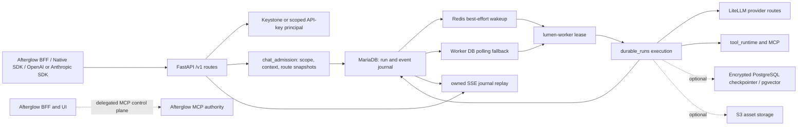

# Lumen Architecture

## Overview

Lumen은 LiteLLM provider 실행, LangGraph/LangChain agent runtime, 대화·durable run journal, server-managed tool/skill/memory, usage ledger와 provider secret을 소유하는 독립 AI 채팅 서비스다. Afterglow는 제품 UI와 인증된 BFF를 소유하고, Lumen은 `/v1` API와 실제 실행·영속성을 소유한다.

- Repository: https://github.com/openstack-afterglow/lumen
- 분석 기준: `dev` branch, 현재 working tree source와 설정
- 버전: `lumen` package `0.2.0` (`pyproject.toml`, `lumen/__init__.py`), `lumen-sdk` `0.2.0` (`sdk/pyproject.toml`), discovery/API contract `1.0.0` (`lumen/api/compat/discovery.py`)
- 주요 실행 단위: FastAPI API(`lumen/main.py`), durable worker(`lumen/worker.py`), migration CLI(`lumen/scripts/migrate.py`), 독립 `lumen-sdk`, 선택적 local Console(`lumen_console/`)

짧게 말하면 HTTP route는 인증·scope·입력 검증과 journal 조회만 담당하고, `chat_admission`이 실행에 필요한 권한·context·provider/model·extension snapshot을 고정한다. `durable_runs`가 MariaDB transaction으로 intent/run/event를 기록하고, worker가 lease를 획득해 provider·tool을 실행한다. Redis는 wakeup 최적화일 뿐 queue 정본이 아니다.

## Development status

| 기능 범위 | Implementation | Verification evidence | Current limit | Source |
| --- | --- | --- | --- | --- |
| Native conversation/temp durable run admission | implemented | source-reviewed, test-defined | native admission의 `execution_mode`는 현재 `chat`만 허용되며 API/SSE가 실행 수명을 소유하지 않는다 | `lumen/api/completions.py`, `lumen/services/chat_admission.py`, `lumen/services/durable_runs/admission.py` |
| MariaDB journal과 SSE replay | implemented | source-reviewed, test-defined | retention 밖 cursor는 410이며 webhook push는 제공하지 않는다 | `lumen/models/chat_runs.py`, `lumen/services/durable_runs/queries.py`, `lumen/api/completions.py` |
| OpenAI/Anthropic compatibility | implemented | test-passed (`uv run lumen-test contract`, 2026-09-08) | 공개 model ID는 stateless route이며 다른 provider와 겹치지 않는 고유 모델은 provider 생략 시에도 정상 라우팅되고 중복 ID는 `provider` 없이 409로 거부하며 공급사 전체 API 동등성은 보장하지 않는다 | `lumen/api/compat/openai.py`, `lumen/api/compat/anthropic.py`, `lumen/services/completion_api.py` |
| OpenAI virtual `model="lumen"` | implemented | source-reviewed, test-defined | text transcript만 허용하며 caller tool, memory, MCP와 native tool 실행은 비활성화된다 | `lumen/api/compat/openai.py`, `lumen/services/openai_compat.py` |
| Provider/model routing and credentials | implemented | test-passed (`uv run lumen-test contract`, 2026-09-08) | 공개 `api_model_name`/`api_provider`와 내부 LiteLLM route key를 분리하고 provider 설정은 관리자 소유이며 durable 실행 route는 snapshot과 worker 재검증을 거친다 | `lumen/services/providers/repository.py`, `lumen/services/providers/routing.py`, `lumen/services/providers/credentials.py` |
| Native managed tools, skills, MCP | partial | source-reviewed, test-defined | extension package installer, subagent spawn, sandbox binding, semantic prompt ranking은 schema/policy가 있어도 현재 실행 runtime이 아니다 | `lumen/services/tool_runtime/`, `lumen/services/mcp_adapter.py`, `docs/agent-platform.md` |
| Memory and semantic store | partial | source-reviewed, test-defined | authoritative memory는 MariaDB이며 PostgreSQL/pgvector는 선택 기능이고 protocol v2에는 encrypted PostgreSQL checkpointer가 필수다 | `lumen/models/chat_db.py`, `lumen/services/semantic_memory.py`, `lumen/services/checkpointer.py` |
| API-key and Keystone SDK transports | implemented | source-reviewed, test-defined | SDK는 native API surface를 호출하며 provider credentials를 소유하거나 직접 노출하지 않는다 | `sdk/lumen_sdk/client.py`, `sdk/lumen_sdk/proxy.py`, `lumen/auth.py` |
| Local Console | partial | source-reviewed, test-defined | Afterglow 제품 UI가 아닌 localhost 개발자/운영자 tooling이며 Lumen auth/scope를 우회하지 않는다 | `lumen_console/app.py`, `docs/local-console.md` |
| Kolla/Compose deployment | implemented | source-reviewed, test-defined | migration은 API/worker 시작 전에 별도로 적용해야 하며 `/v1/health`는 process health만 의미한다 | `docker-compose.yml`, `deploy/kolla/ansible/roles/lumen/`, `docs/operations.md` |

위 표의 `test-defined`는 해당 경계를 검사하는 테스트 코드와 명령이 정의되어 있다는 뜻이다. 2026-09-08 `uv run lumen-test contract`는 service contract 922건과 SDK 126건을 통과했고 service 1건을 skip·9건을 deselect했다. Perplexity Agent API HTTP sender와 자동 web_search 도구 주입은 합성 응답으로 검증했으며 실제 provider·datastore integration·배포 환경 관찰은 포함하지 않는다.

## System context



텍스트 흐름은 다음과 같다. 요청은 Lumen이 직접 받은 `/v1` 요청이거나 Afterglow의 인증 BFF forwarding이다. route가 principal과 least-privilege scope를 확인하면 admission이 project ownership, capability, provider/model, context, tool/skill/MCP 선택을 계산하고 immutable snapshot을 만든다. `durable_runs.admission`은 MariaDB transaction 안에서 user turn, run, 첫 journal event를 함께 commit한 뒤 Redis에 best-effort wakeup을 발행한다. worker는 Redis 신호를 우선 사용하지만 누락·장애 시 MariaDB의 queued run을 polling하고 lease를 획득한다. provider/tool I/O와 각 단계의 결과는 worker가 journal에 기록하며, 클라이언트는 HTTP/SSE 연결이 끊겨도 run ID와 cursor로 journal을 replay한다.

## Code map

| 경로 | 핵심 심볼/책임 | 의존 방향 |
| --- | --- | --- |
| `lumen/main.py` | FastAPI lifespan, discovery/health, `/v1` router mounting과 host gate | API → auth/config/service |
| `lumen/auth.py` | `Principal`, Keystone `validate_token`, API-key verification, scope와 project/target-project 경계 | route → auth; OpenStack connection은 Keystone principal에서만 생성 |
| `lumen/api/completions.py` | native completion/temp completion, idempotency, run 조회·cancel·approval·SSE | route → `chat_admission`, `durable_runs` |
| `lumen/services/chat_admission.py` | capability/feature gate, context·memory·skill·extension/model snapshot | API-independent preparation → stores/providers/tool runtime |
| `lumen/services/durable_runs/admission.py` | idempotency, ownership/active-run lock, atomic user turn/run/event persistence | admission → MariaDB ORM; commit 후 wakeup |
| `lumen/services/durable_runs/common.py` | fingerprint, descriptor, protocol validation, `wake_run` | durable admission/execution 공통 |
| `lumen/services/durable_runs/execution.py` | lease owner가 graph/provider/tool output을 journal에 append하고 usage/terminal 상태를 기록 | worker → graph/engine/stores |
| `lumen/services/durable_runs/queries.py` | owner-scoped run/event read와 cursor replay | API → MariaDB |
| `lumen/worker.py` | Redis BRPOP 및 DB polling, lease execution, stale recovery, expiry/reconciliation jobs | worker → durable runs/checkpointer/memory jobs |
| `lumen/api/compat/openai.py` | OpenAI stateless route, 공개 ID/provider 선택, virtual `lumen` durable bridge | API-key auth → `openai_compat` 또는 `completion_api` |
| `lumen/api/compat/anthropic.py` | Anthropic request/response/SSE 변환, 공개 ID/provider 기반 stateless completion | API-key auth → `completion_api` |
| `lumen/services/completion_api.py` | 공개 route resolve, quota precheck, LiteLLM stateless completion/usage billing | compat → providers/litellm |
| `lumen/api/api_keys.py`, `lumen/services/api_key_store.py` | owner/admin API-key CRUD, 이름 변경(`PATCH /v1/api-keys/{id}`), 월·주간 owner 한도(`PATCH /v1/api-keys/{id}/limits`)와 effective 한도 projection | Keystone route → MariaDB; 한도 상한은 사용자 지갑 쿼터 |
| `lumen/api/quotas.py`, `lumen/services/credit.py`, `lumen/services/quota_periods.py` | 관리자 사용자 쿼터 조회/설정(`GET/PUT /v1/admin/quotas`), 월(UTC 1일)·주간(ISO 월요일 UTC) 경계 계산, usage ledger 합계 기반 admission | admin route → MariaDB wallet/usage ledger |
| `lumen/services/providers/` | provider/model CRUD, 공개 ID projection, Perplexity route encoding, subscription credential policy, immutable route resolution/locking | repository → ORM; compat/worker execution snapshot 소비 |
| `lumen/services/graph.py`, `lumen/services/engine.py` | LangGraph model/tool loop와 normalized stream boundary | durable execution → provider/tool/checkpointer |
| `lumen/services/tool_runtime/` | binding, frozen selection, schema, managed/custom dispatch | admission snapshot → worker-time revalidation |
| `lumen/services/mcp_adapter.py` | Afterglow MCP control-plane snapshot/claim bridge | Lumen worker → configured Afterglow endpoint |
| `lumen/models/chat_db.py`, `lumen/models/chat_runs.py` | catalog, conversation, memory, credentials, usage와 run/event/lease ORM | services → MariaDB |
| `lumen/cache.py`, `lumen/services/checkpointer.py`, `lumen/services/semantic_memory.py` | Redis cache/wakeup, optional PostgreSQL checkpointer/pgvector | optional/optimization 경계 |
| `sdk/lumen_sdk/client.py`, `sdk/lumen_sdk/proxy.py`, `sdk/lumen_sdk/_api.py` | 동일 native route mixin의 httpx API-key transport와 OpenStack SDK transport | caller → `/v1` |
| `docker-compose.yml`, `deploy/kolla/ansible/roles/lumen/` | local API/worker/migrate/Console와 Kolla API/worker lifecycle/image/config | operator → service processes |

## Runtime flows

### Native durable admission and replay

1. `POST /v1/conversations/{conversation_id}/completions` 또는 `/v1/temp-completions`가 UUID `Idempotency-Key`, owner project, required scopes를 확인한다.
2. `prepare_context_input()`이 모델 capability, workspace/memory, agent/skill, extension selection, execution protocol과 tool schema를 계산한다. protocol v2는 encrypted PostgreSQL checkpointer 설정 없이는 admission되지 않는다.
3. `durable_runs.admission.create_persistent_run()` 또는 `create_temp_run()`이 idempotency fingerprint, active-run 및 revision fence를 잠근 뒤 user message, encrypted request payload, run/provider rows, `run.started`/queued event를 하나의 MariaDB transaction으로 저장한다.
4. commit 이후 `wake_run()`이 `afterglow:chat:runs`에 ID를 넣는다. Redis가 없거나 publish가 유실되면 worker의 `queued_run_ids()` polling이 queued state를 발견한다.
5. worker가 run lease를 소유한 뒤 graph/engine을 호출한다. provider call, tool call, delta, usage, approval/interaction, terminal result를 journal에 기록한다. lease owner/expiry가 맞지 않으면 write를 중단하고 stale recovery가 재시도 또는 fail-closed한다.
6. `GET /v1/runs/{run_id}/events`는 owner-scoped MariaDB journal을 cursor 이후 읽고, terminal event까지 polling SSE와 keepalive를 제공한다. HTTP request나 SSE 연결은 실행을 취소하거나 실행 lifetime을 소유하지 않는다.

### Compatibility paths

`POST /v1/chat/completions`에서 `model="lumen"`이면 `lumen/services/openai_compat.py`가 text-only transcript를 검증하고 durable temporary run을 만든다. completion route는 worker/journal 결과를 OpenAI response/SSE로 투영한다. provider model ID를 지정하면 `lumen/services/completion_api.py`가 active provider route와 quota를 resolve하고 LiteLLM을 직접 호출하는 stateless 경로로 처리한다. Anthropic `/v1/messages`는 `lumen/api/compat/anthropic.py`에서 Anthropic blocks를 내부 OpenAI 형식으로 변환한 후 동일한 stateless provider core를 사용한다. 두 compat surface는 API-key 전용이며 native server-managed tool/memory/approval contract를 제공하지 않는다.

실제 제한은 source 계약을 따른다. compat/native provider output의 `max_tokens` cap은 4096이고, worker lease는 45초이며 worker durable execution semaphore 기본값은 4다. custom HTTP/MCP tool 응답은 최대 64 KiB를 읽고 4000자로 잘라내며, temporary thread retention은 30일이다. 이 제한은 API/SSE 연결 timeout과 실행 lifetime을 동일시하지 않는다.

### Worker recovery and background work

`lumen/worker.py`는 최대 동시 실행 semaphore, stale run recovery, pending input/approval expiry, temporary thread purge, title/memory/background workspace jobs를 처리한다. Redis wakeup은 latency 최적화이며 MariaDB queued state·lease·journal이 재시작과 장애 후 복구의 기준이다. provider가 완료됐는지 불확실한 segment는 중복 replay하지 않고 fail-closed 규칙을 따른다.

## Data and contracts

- **Authoritative MariaDB**: `llm_providers`/`llm_models` catalog, conversations/messages, `chat_runs`/`chat_run_events`/turns/segments/leases, API-key hash·scope·월/주간 owner 한도, `user_wallets`의 월·주간 쿼터(`0` = 무제한), encrypted provider/extension/skill/memory metadata, usage ledger가 정본이다. 주간 사용량은 별도 카운터 없이 `chat_usage_logs` 합계로 계산한다. run input와 secret-bearing content는 encryption boundary를 통과하며 API response에 raw secret을 복제하지 않는다.
- **Redis cache/queue optimization**: `lumen/cache.py`의 cache와 `afterglow:chat:runs` wakeup은 유실되어도 데이터 정합성을 바꾸지 않는다. Redis가 authoritative durable queue가 아니므로 worker가 DB polling한다.
- **PostgreSQL boundary**: configured encrypted LangGraph checkpointer는 protocol v2 admission prerequisite이며, `CHAT_MEMORY_PGVECTOR_URL`은 선택 semantic-memory index다. PostgreSQL은 MariaDB run/event/catalog의 대체 정본이 아니다. semantic ranking과 recency prompt hydration도 별도 경로다.
- **Other stores**: configured S3는 service-owned asset object store이고 ClamAV/sandbox/MCP는 optional external boundary다. asset metadata/ownership은 MariaDB가 보유한다.
- **API contracts**: native `/v1`은 run descriptor, UUID idempotency, owner-scoped run/event, `Last-Event-ID` 또는 `after_seq` cursor, terminal event를 계약으로 한다. discovery/API contract version은 `1.0.0`; package version `0.2.0`과 SDK package version `0.2.0`은 별개의 release values다.
- **SDK transports**: `lumen_sdk.Client`는 API-key Bearer와 httpx를 사용하고, `lumen_sdk.register(openstack.Connection)`의 `Proxy`는 Keystone/OpenStack SDK session transport를 사용한다. 이 둘은 Lumen API transport이며 provider credential transport가 아니다.
- **Protocol invariant**: accepted run에는 admission snapshot, pricing/provenance, selected extension/config fingerprint가 있어야 하며 worker가 mutable configuration을 재검증한다. `model="lumen"` bridge는 tools/memory가 없는 text-only 입력만 accepted한다.

## Deployment and operations

로컬 Compose(`docker-compose.yml`)는 MariaDB, Redis, migration, idempotent `seed-local`, `lumen-api`, `lumen-worker`, opt-in `lumen-connection`, localhost-only `lumen-console`로 분리된다. API는 기본 `127.0.0.1:8012`, Console은 `127.0.0.1:7010`이며 provider key 없이 stack은 기동할 수 있어도 completion은 실행되지 않는다. `lumen-migrate --apply`가 API/worker보다 먼저 실행되어야 하며 Dockerfile은 migration을 자동 실행하지 않는다.

Kolla role(`deploy/kolla/ansible/roles/lumen/`)은 API와 worker를 별도 host-network container로 실행하고, MariaDB/Valkey, Keystone, encryption key와 PostgreSQL mode를 operator 설정으로 주입한다. 기본 image tag는 role `lumen_image_tag`와 package release에 맞추고, PostgreSQL은 `external` URL 또는 role-managed `bundled` mode 중 하나다. `deploy`, `upgrade`, `reconfigure`의 bootstrap 단계가 `lumen-migrate --apply`를 API/worker start 전에 실행한다.

`GET /v1/health`와 Kolla healthcheck는 process HTTP response만 확인한다. DB/Redis/checkpointer/pgvector readiness와 worker health는 별도 logs/readiness 관측 대상이다. 운영 장애 시 journal stage/terminal event, worker lease/recovery, provider snapshot, migration ledger/checksum을 함께 확인한다. Temporary thread는 30일 retention 대상이고 terminal run/usage는 accounting record다. Backup은 MariaDB journal/credential metadata, configured PostgreSQL state, S3 objects와 별도 encryption key recovery를 일관되게 계획해야 한다.

## Security boundaries

- **Principal**: `lumen/auth.py`는 Keystone token/Bearer와 scoped API key를 하나의 `Principal`로 정규화한다. 한 요청에 여러 credential을 보내면 400이고, API key는 project에 고정되며 `X-Project-Id`/`X-Target-Project-Id` 교차 사용을 허용하지 않는다. Keystone만 admin/management routes를 사용할 수 있다.
- **Target project**: Keystone token의 connection project와 logical target project를 분리하며, 다른 target은 검증된 system admin만 지정할 수 있다. OpenStack connection은 connection scope를 유지하고 principal project ownership은 target scope를 따른다.
- **Secrets**: `LUMEN_ENCRYPTION_KEY`는 64 hex이며 AES-GCM/HKDF domain separation으로 chat/provider/extension content를 보호한다. API key는 hash만 MariaDB에 저장하고 발급 응답에서만 plaintext를 노출한다. provider, MCP, Git, S3 secret과 raw tool args는 logs/journal/response에 기록하지 않는다.
- **Network**: custom HTTP tool은 SSRF/DNS pinning, private address 차단, redirect 미추적, response size 제한을 적용한다. MCP는 HTTPS Streamable HTTP와 owner/project selection 재검증을 사용하고 OAuth는 server-held state/PKCE browser flow다. TLS 검증이 기본이며 `insecure`는 예외적 개발 설정이다.
- **Execution trust**: admission이 immutable model/extension/context snapshot을 저장하고 worker가 route와 credential generation을 재검증한다. key revoke는 새 HTTP 요청을 막지만 이미 accepted run은 snapshot authorization에 따라 끝날 수 있다. cancellation은 owner Keystone/native write scope가 명시적으로 호출한다.
- **Console**: local Console SQLite는 local password hash/session hash만 저장하고 Lumen API key/Keystone token을 저장하지 않는다. seed volume과 one-shot connection output은 local development secret boundary이며 repository/CI log에 기록하지 않는다.

## Development and verification

2026-09-08 `uv run lumen-test contract`를 실행해 service contract 880건과 SDK 126건을 통과시켰고 service 1건은 skip·9건은 deselect됐다. 아래 integration/system/live 전제 계층은 실행하지 않았으며 `test-passed`나 `live-verified`로 승격하지 않는다.

| 목적 | 명령 | 실제 전제와 경계 |
| --- | --- | --- |
| architecture freshness | `python3 scripts/check_architecture.py` | parent가 canonical guard를 vendor한 뒤 Python 3와 Git만 필요 |
| contract | `uv run lumen-test contract` | MariaDB/Redis/provider/Keystone를 fake 또는 in-process 경계로 둔다 |
| integration | `uv run lumen-test integration` | MariaDB 11, Redis 7, migrations와 direct worker가 필요하다 |
| system | `uv run lumen-test system` | Docker Compose process stack, fake OpenAI HTTP provider와 generated local credentials를 사용한다 |
| native API-key durable path | `uv run pytest tests/integration/test_native_api_key_flow.py -q` | 실제 MariaDB/Redis가 필요하며 provider는 test-controlled path다 |
| process stack | `uv run pytest tests/system/test_process_stack.py -q` | Docker stack과 fake provider; 실제 외부 provider proof가 아니다 |
| SDK | `cd sdk && uv run pytest && uv run ruff check .` | SDK package 자체의 httpx/OpenStack transport contract |
| focused source tests | `uv run pytest -m "not integration and not system" tests` | in-process contract 범위; live deployment/provider 검증 아님 |

`tests/integration/test_native_api_key_flow.py`는 HTTP admission, MariaDB/Redis persistence, worker execution/replay와 usage attribution을 정의하지만 외부 provider live 검증은 아니다. `tests/system/test_process_stack.py`는 `tests/system/fake_openai.py`와 container stack을 사용하므로 fake-provider system evidence를 live provider evidence로 승격하지 않는다. 실제 Keystone/OpenStack 배포 검증은 Lumen 외부 배포/Afterglow 소유 범위다.

## Change guide

| 변경 | 먼저 읽을 코드/문서 | 함께 갱신할 계약·검증·문서 |
| --- | --- | --- |
| native completion, idempotency, SSE | `lumen/api/completions.py`, `lumen/services/chat_admission.py`, `lumen/services/durable_runs/` | `lumen/models/chat_runs.py`, native API docs, focused/integration tests, 이 문서의 Runtime flows/Data and contracts |
| provider/model/credential | `lumen/services/providers/`, `lumen/api/models.py`, `lumen/auth.py` | encrypted secret boundary, route snapshot/locking, provider tests, `docs/security.md`, `docs/operations.md` |
| OpenAI/Anthropic compatibility | `lumen/api/compat/`, `lumen/services/completion_api.py`, `lumen/services/openai_compat.py` | response/error/SSE contract, `tests/test_ai_compat.py`, `docs/afterglow-integration.md` |
| tool/MCP/skill | `lumen/services/tool_runtime/`, `lumen/services/mcp_adapter.py`, `lumen/services/extensions_store.py` | SSRF/owner/version/fingerprint contract, `docs/agent-platform.md`, tool tests; implementation status must remain honest |
| memory/checkpointer/assets | `lumen/services/semantic_memory.py`, `checkpointer.py`, `assets.py`, relevant models/migrations | MariaDB authority vs PostgreSQL/S3 optional boundary, migrations, operations/security docs |
| auth/project scope | `lumen/auth.py`, API dependencies, SDK proxy | Keystone/API-key matrix, target-project invariant, security docs and auth tests |
| deployment/config | `docker-compose*.yml`, `lumen/config.py`, `deploy/kolla/ansible/roles/lumen/` | migration/bootstrap order, health meaning, image/version metadata, operations docs and Kolla tests |
| SDK surface | `sdk/lumen_sdk/{client,proxy,_api}.py`, `sdk/pyproject.toml` | package version, route mixin/transport tests, `docs/sdk.md` and this Code map |
| bugfix/refactor with no architecture change | actual source and affected tests | root architecture Maintenance marker summary must state why ownership/flow/store contracts are unchanged; still run guard before completion/commit |

## Maintenance

Architecture is a living snapshot, not a historical plan. 작업 전 이 파일을 읽고, code/config/schema/dependency/deploy/test 변경이 있으면 영향받는 본문과 해당 상세 문서를 같은 변경에서 갱신한다. 구조 영향이 없는 bugfix/refactor도 최신 review summary에 영향 없음의 근거를 남긴다. 실제 source와 tests를 읽은 뒤 architecture guard를 stamp하고, 완료/commit 전 working 또는 staged check를 통과시킨다. 문서와 source가 어긋나면 source가 정본이며 문서를 현재 구현에 맞춘다. 다른 checkout의 private module import나 새 network dependency를 문서 계약으로 만들지 않는다.

권장 순서:

1. 이 root 문서와 영향받는 detail docs를 읽는다.
2. source/config/schema/dependency/deploy/test의 실제 callsite와 현재 한계를 확인한다.
3. 본문·code map·status·change guide와 필요한 detail docs를 함께 수정하고, test-defined와 실제 실행된 evidence를 구분한다.
4. guard가 제공된 뒤 `python3 scripts/check_architecture.py`를 실행해 source snapshot을 확인한다. staged 제출 범위만 검토할 때는 `python3 scripts/check_architecture.py --staged`를 사용한다.
5. 변경 설명과 최신 review marker를 남기고 pre-commit/CI의 `architecture` hook을 통과시킨다. marker의 digest/timestamp/summary는 실제 stamp 결과만 사용한다.

<!-- architecture-review:start -->
```json
{
  "schema_version": 1,
  "source_sha256": "ae8986d5eedbf037b2bd51fb7026cfe386216b65c1ea26731c59cda32d27ea0a",
  "reviewed_at": "2026-09-11T05:56:36Z",
  "summary": "Reviewed accumulated model routing, provider transport, quota administration, usage accounting, documentation, tests, CI, and deployment-facing schema changes."
}
```
<!-- architecture-review:end -->

## Glossary

- **Admission**: 요청 권한·context·provider·extension·pricing을 계산해 immutable run snapshot과 MariaDB transaction을 만드는 단계.
- **BFF**: Afterglow Backend-for-Frontend. Lumen 내부 실행을 소유하지 않고 인증된 browser request를 Lumen `/v1`로 forwarding한다.
- **Durable run**: API/SSE 연결과 독립적으로 MariaDB journal, lease, worker execution으로 진행되는 실행 단위.
- **Journal**: `ChatRunEvent` sequence와 terminal state를 포함하는 authoritative run/event 기록.
- **Lease**: 한 worker owner만 run을 갱신하도록 하는 만료 가능한 실행 소유권.
- **Snapshot**: admission 시점 provider/model/feature/extension/context/pricing identity를 freeze한 값.
- **Stateless completion**: provider model ID를 직접 LiteLLM으로 호출하고 HTTP 요청의 응답으로 끝나는 compat 경로.
- **Virtual model `lumen`**: OpenAI compat에서만 제공되는 durable bridge 식별자. text-only native-like worker execution을 뜻한다.
- **MCP**: Model Context Protocol remote server/tool 경계. Lumen은 owner-scoped selection과 Afterglow control-plane authority를 재검증한다.
- **Checkpointer/pgvector**: 각각 protocol-v2 LangGraph state checkpoint와 선택 semantic-memory index를 위한 PostgreSQL 경계.
- **Console**: Afterglow UI가 아닌 local developer/operator tooling. Lumen API 인증·scope·durable admission을 우회하지 않는다.
