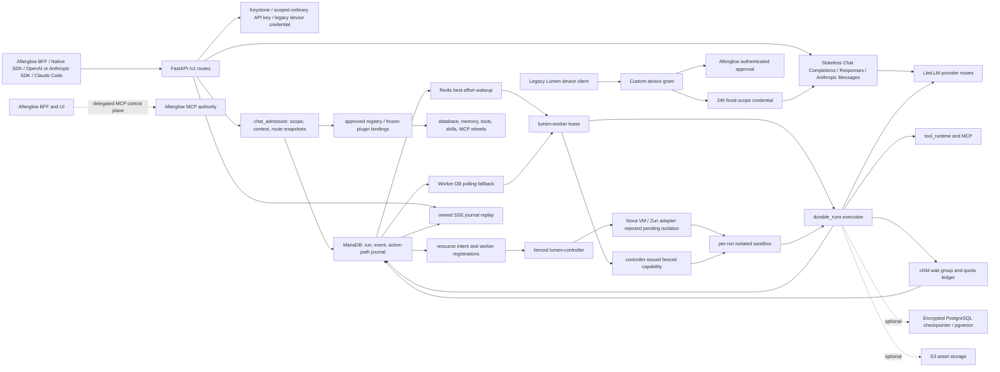

# Lumen Architecture

## Overview

Lumen은 LiteLLM provider 실행, LangGraph/LangChain agent runtime, 대화·durable run journal, server-managed tool/skill/memory, usage ledger와 provider secret을 소유하는 독립 AI 채팅 서비스다. Afterglow는 제품 UI와 인증된 BFF를 소유하고, Lumen은 `/v1` API와 실제 실행·영속성을 소유한다.

- Repository: https://github.com/openstack-afterglow/lumen
- 분석 기준: `dev` branch, 현재 working tree source와 설정
- 버전: root `lumen` release source `0.6.7` (`pyproject.toml`, `lumen/__init__.py`, uv-generated `uv.lock`), 독립 `lumen-sdk` `0.2.1`, discovery/API contract `1.0.0`. Package-owned Kolla API/worker/controller image defaults는0.6.7이다. Published0.6.6(`2757a5df`) 이후 direct system assignment discovery를 수정하며 migration·dependency·SDK/plugins/sandbox/source-build/guest/OCI operator pins는 추가·변경하지 않는다. Final local contract3,069/SDK128/Ruff/integration284/process-system31 및 root+independent7 wheels를 검증했다. 실제 local Keystone owner의 native conversations/global provider reads200을 확인했으며 grant/provider mutation은 없다. 운영0.6.6 결함 보고와 owner의 release/rollout 승인은 유지하지만 publication·canonical `/etc/kolla/multinode` rollout·실제 운영 acceptance는 별도 receipt로만 완료한다. 기존 current scoped authority·new-I/O fencing·완료 checkpoint 정산과 additive migrations022–025 경계는 유지한다.
- 주요 실행 단위: FastAPI API(`lumen/main.py`), durable worker(`lumen/worker.py`), migration CLI(`lumen/scripts/migrate.py`), migration 이후 provider bootstrap CLI(`lumen/scripts/seed_providers.py`), 독립 `lumen-sdk`, 선택적 local Console(`lumen_console/`)

짧게 말하면 대부분의 HTTP route는 인증·scope·입력 검증과 journal 조회만 담당하고, `chat_admission`이 실행에 필요한 권한·context·provider/model·extension snapshot을 고정한다. `durable_runs`가 MariaDB transaction으로 intent/run/event를 기록하고, worker가 lease를 획득해 provider·tool을 실행한다. Redis는 일반 run wakeup 최적화지만 realtime 한 번 쓰는 connect ticket에는 필수다. Realtime 예외는 API WebSocket process가 직접 lease를 소유하며 양방향 provider audio를 relay/정산한다.

## Development status

| 기능 범위 | Implementation | Verification evidence | Current limit | Source |
| --- | --- | --- | --- | --- |
| Scoped service authority | implemented; direct-system repair in0.6.7 source | Final frozen service contract3,069, SDK128, root/SDK Ruff, real disposable integration284 and process-system31 passed; actual local Keystone owner native conversations/global provider reads200 | Direct system rows are read without effective expansion and expanded through the current validated role-ID DAG; effective project/group membership and key attenuation retained. Publication and canonical production rollout/acceptance are separate pending receipts; no new grants, migration or paid-provider execution | `lumen/service_authority.py`, `lumen/auth.py`, `lumen/services/{api_key_store,inference_authority}.py`, `tests/test_native_keystone_authority.py`, `tests/system/test_service_role_authority.py` |
| Native conversation/temp durable run admission | implemented | 1283 core contract, 40 real MariaDB/Redis integration and 9 container system tests passed (2026-09-24); cloud-backed plan/code E2E pending | persistent native plan/code는 v2 checkpointer, 명시적 agent budget, operator quota를 요구하며 code는 enabled sandbox pool도 요구한다. API/SSE가 실행 수명을 소유하지 않는다 | `lumen/api/completions.py`, `lumen/services/chat_admission.py`, `lumen/services/durable_runs/admission.py` |
| MariaDB journal과 SSE replay | implemented | source-reviewed, test-defined | retention 밖 cursor는 410이며 webhook push는 제공하지 않는다 | `lumen/models/chat_runs.py`, `lumen/services/durable_runs/queries.py`, `lumen/api/completions.py` |
| OpenAI/Anthropic compatibility | implemented | contract/system gates plus installed Codex CLI 0.154.0 and Claude Code 2.1.278 text/local-tool continuations passed (2026-09-20); installed Claude Code 2.1.287/2.1.292 auto mode completed `safeguards` 400→retry→local classifier→`Bash` continuation against a synthetic upstream (2026-10-07) | `/v1/responses`는 stateless·non-stored subset이고 `/v1/messages`/`count_tokens`는 Anthropic-native wire/SSE다. Responses는 Codex `prompt_cache_key`를 provider에 전달하지만 local thread/session의 `client_metadata`는 제거한다. Anthropic transport는 current Claude Code의 `context_management`, `output_config`, native tool/thinking blocks와 `anthropic-*` protocol headers를 보존하되 caller auth credential은 provider로 전달하지 않는다. Explicit output budget은 legacy 4096 cap으로 자르지 않고 provider selector ambiguity는 409다. Anthropic Messages 계열의 request schema 위반은 필드를 명시한 Anthropic 400 `invalid_request_error`이며 입력을 echo하지 않는다; transport가 전달할 수 없는 Claude Code auto mode `safeguards`도 이 400으로 거부해 client의 local classifier fallback을 유도한다. | `lumen/main.py`, `lumen/api/compat/openai.py`, `lumen/api/compat/responses.py`, `lumen/api/compat/anthropic.py`, `lumen/services/completion_api.py`, `lumen/services/litellm_client.py`, `tests/system/fake_openai.py` |
| Coding CLI catalog and exact route IDs | implemented; published 0.6.6; production version reported by owner, catalog acceptance not recorded here | 2026-10-07 `tests/test_cli_model_catalog.py` with compat/routing/OpenAPI/Batch/subscription/LiteLLM targets 358 passed and Ruff; real local HTTPS API, online worker and MariaDB/Redis with synthetic Keystone/upstream ran installed Codex 0.160 (Sol/Luna on duplicate public IDs at different providers, `exec_command` continuation) and Claude Code 2.1.292 (Opus `Bash`→`tool_result`, Sonnet/Haiku cross-protocol), each billed at the selected provider's prices | `GET /v1/cli/models` is API-key `models:read`, host-gated and no-store; rows keep server order with exact decimal prices, unusable rows carry a reason (subscription protocol, credentials, pricing, text, tools) and empty protocols. `lumen/<provider_id>/<model_id>` resolves to that active pair only, never by rank/name, and keeps supplied provider/type/kind selectors; `count_tokens` stays authoritative only on Anthropic API-key routes | `lumen/api/compat/cli.py`, `lumen/services/providers/routing.py`, `lumen/services/providers/errors.py`, `tests/test_cli_model_catalog.py` |
| Official OpenAI chat-shaped execution through Responses | implemented; deployed in 0.5.0 (2026-10-01) | installed LiteLLM model-prefix bridge text/tool/usage/unknown-model native SSE/truncated stream and third-party base isolation exercised locally (2026-09-30); after the 0.5.0 Kolla rollout, public compat calls and native temporary runs on official direct OpenAI `gpt-4o-mini` and `gpt-5.5` completed with usage records and worker claim/terminal log correlation | `chat_conversation.completions` is a durable action label, not a provider protocol. Official direct OpenAI requests use `/v1/responses`; third-party OpenAI-compatible bases remain Chat Completions and ChatGPT subscription remains separate. Afterglow dashboard runs and the root cause of the 2026-09-27 `provider_result_unknown` runs were not re-examined. | `lumen/services/{litellm_client,graph}.py`, `tests/test_chat_{litellm_client,graph}.py` |
| OpenAI virtual `model="lumen"` | implemented | focused compatibility suite passed (2026-09-19) | text transcript만 허용하며 caller tool, memory, MCP와 native tool 실행은 비활성화된다 | `lumen/api/compat/openai.py`, `lumen/services/openai_compat.py` |
| Shared conversation graph and latest-first active history | implemented; graph deployed at `e2b2263`, combined release pending | Production Lumen API OCI revision `e2b2263` and MariaDB ledger `019-shared-message-membership` checksum `c4a883c6...` verified; earlier isolated migration 019 applied twice, 70 MariaDB/Redis integration tests, 1,369 service contracts + 125 SDK and Ruff, 9 fake-provider system tests, direct graph smoke and restored-backup integrity passed (2026-09-27). Real provider/Keystone graph acceptance remains unverified | Owner-scoped graph carries immutable encrypted message bodies and attachment links; each conversation retains a separate title, active leaf, projection/revision and explicit message memberships. Fork copies only IDs/positions, not bodies. Origin FK is nullable provenance; last mapping deletion cascades graph/messages/asset links. Opaque cursor is revision-fenced; pre-cutover copied forks remain distinct graphs. Do not run old API/worker with new schema. | `lumen/migrations/019_shared_message_membership.sql`, `lumen/models/chat_db.py`, `lumen/services/message_graph.py`, `lumen/services/conversation_store.py`, `lumen/services/durable_runs/`, `lumen/scripts/migrate.py` |
| Legacy Lumen device authorization | implemented | full contract, real MariaDB/Redis lifecycle, and Docker issue→approve→token→inference path passed (2026-09-20) | one-time fixed-scope 24시간 custom credential, Redis/MariaDB fail-closed 계약이다. Refresh와 official `/protocol`이 없으므로 current Claude Apps Gateway login과 호환된다고 advertise하지 않는다. | `lumen/migrations/013_claude_gateway_device_auth.sql`, `lumen/api/claude_gateway.py`, `lumen/services/claude_gateway.py`, `lumen/auth.py` |
| Provider/model routing, credentials, billing | implemented | focused billing/admin-key/migration tests passed (2026-09-13); billing/admin/routing/migration/cache-pricing tests re-run after the token breakdown (96 passed, 2026-09-23) | 공개 `api_model_name`/`api_provider`와 내부 LiteLLM route key를 분리한다. Bulk 관리자 projection은 모든 provider의 Lumen 귀속 일·주·월·누적 ledger usage와 고정 공식 console 링크를 반환한다. OpenRouter/DeepSeek는 inference key 기반 live 잔액을, direct OpenAI/Anthropic은 별도 암호화 administrator key 기반 현재 UTC 일·주·월 조직 cost/usage를 제공한다. Gemini는 console-only이고 Perplexity Computer Analytics는 API Platform billing과 범위가 달라 호출하지 않는다. Local ledger와 Anthropic 조직 report는 추가로 `uncached_input`/`cache_read`/`cache_creation_5m`/`cache_creation_1h`/`output` 범주별 token breakdown을 반환한다(OpenAI report는 분할이 없어 `null`). Provider/report 실패는 fail-soft로 격리한다. | `lumen/services/providers/repository.py`, `lumen/services/providers/routing.py`, `lumen/services/providers/credentials.py`, `lumen/services/providers/billing.py`, `lumen/api/models.py`, `lumen/migrations/011_provider_billing_admin_key.sql` |
| Environment-backed OpenAI/Gemini provider bootstrap | implemented in source; Kolla rollout pending | Focused provider/local/Kolla tests 57 passed; service contract 1,392, MariaDB/Redis integration 43, fake-provider container system 9 passed. Isolated local Compose `/v1/chat/completions` live OpenAI 13 tokens and Gemini 14 tokens; linux/arm64 and linux/amd64 API/worker built and executed seed module import | Migration → one-shot bootstrap → API/worker: process env credential 이름만 DB에 저장하고 기존 관리자 DB key/binding/base/가격은 보존한다. Media models require explicit supported IDs and exact pricing; text smoke is not media/live invoice proof. Kolla Ansible/production rollout not exercised and old source-build pin lacks this CLI | `lumen/scripts/{seed_providers,seed_local}.py`, `docker-compose*.yml`, `deploy/kolla/ansible/roles/lumen/{defaults/main.yml,tasks/bootstrap_service.yml}` |
| Media model registry, image, finite audio, realtime voice | implemented in source; isolated real-provider finite-media HTTP acceptance passed, production/realtime pending | Service contract 1,392, SDK 125, real MariaDB/Redis integration 43 (image/audio/realtime), fake-provider container system 9, Afterglow BFF contract 136 and frontend 1,656 passed before live smoke. OpenAI/Gemini direct image generation/edit, TTS and STT passed. Isolated Compose API+worker+MariaDB+Redis+TLS MinIO+ClamAV completed eight real-provider `/v1/images/{generations,edits}` and `/v1/audio/{speech,transcriptions}` calls: four decodable 1024×1024 images, two decodable 24 kHz WAV files and two transcriptions matching “blue lantern”; MariaDB shows eight completed runs, eight usage rows, eight settled credit holds and ten clean assets | Migration 020의 kind별 가격/route gate, scanned owner assets, durable segment reservations/account credit holds 및 exact PCM seconds ledger. HTTP Gemini STT used `gemini-2.5-pro` because an existing `gemini-2.5-flash` text route is preserved; direct Gemini STT tested `gemini-2.5-flash`. Local test DB prices were nominal, not vendor-verified; provider invoice, production deployment, Live WS and Afterglow browser/microphone remain unverified. Finite image/audio는 worker, realtime는 API WS lease/Redis one-use ticket; raw realtime PCM/transcript는 저장하지 않는다 | `lumen/migrations/020_media_model_registry.sql`, `lumen/api/{images,audio,realtime}.py`, `lumen/services/{assets,asset_inspector}.py`, `lumen/services/durable_runs/{images,audio,realtime}.py`, `lumen/services/providers/{image_transport,audio_transport,realtime_transport,realtime_protocol}.py` |
| Provider-native Web Search and citations | implemented | current integrated chat regression: 265 passed; installed transport exercised with synthetic provider responses, not live provider confirmation | Native mode is executor-bound. Lumen opts into strict function mode only for compatible closed schemas, preserves explicit compatibility-client choices, and always validates server-executed arguments. Agent Sonar has intrinsic search without a duplicate hosted tool; explicit hosted search coexists with function tools. Only provider-returned citations/search-result events prove source production. The pinned `/v1/responses` transport versus the official Agent endpoint still needs live confirmation. Native request/tool surcharges remain outside token-credit accounting. | `lumen/models/chat_contracts.py`, `lumen/services/{capabilities,chat_admission,engine,litellm_client,graph}.py`, `lumen/services/durable_runs/execution.py` |
| 사용자 quota policy와 usage ledger | implemented | focused tests passed (2026-09-11); combined-release 77 real MariaDB/Redis integration cases include concurrent media holds and cross-user text insertion under both InnoDB snapshot modes (2026-09-29) | runtime 기본 월 한도와 개인 상속/override를 분리하고, 주간 무제한이어도 월 ceiling을 강제한다. 일반 text completion의 동시 overshoot 가능성은 유지되지만 media segment-start는 첫 SQL 이전 READ COMMITTED, I/O 전 wallet row lock, 이후 nonlocking hold/ledger 합산으로 제한한다. | `lumen/services/quota_policy.py`, `lumen/services/credit.py`, `lumen/services/durable_runs/{images,audio,realtime}.py`, `lumen/services/stats.py`, `lumen/api/quotas.py`, `lumen/api/stats.py` |
| Native managed tools, skills, MCP | implemented (default plugin providers) | full core contract suite 1283 passed plus 88 standalone plugin conformance tests passed and 1 skipped, 2026-09-24 | 다섯 관리자 설치 wheel은 실행 프로세스 안에서 신뢰된 코드다. 사용자 업로드 Python의 동적 설치는 제공하지 않는다; 실제 외부 MCP/플러그인 권한 서비스는 live로 확인하지 않았다 | `lumen/plugins/`, `plugins/`, `lumen/services/tool_runtime/`, `docs/agent-platform.md` |
| Built-in MCP connector bundles (Notion, GitHub) | implemented | focused bundle/admission tests passed (29 passed, 2026-09-22); live Notion/GitHub MCP authorization not exercised | Declarative `scope="global"` presets installed by an administrator; per-user OAuth only, no bundle-carried credential. Install is idempotent by destination so a shared row is never rewritten and no user's connection is revoked. Unconnected connectors are dropped from implicit selection instead of warning on every run. | `lumen/services/mcp_bundles.py`, `lumen/services/chat_admission.py`, `lumen/api/extensions.py` |
| Provider-native server-side compaction | implemented | focused compaction tests passed (78 passed, 2026-09-22); synthetic provider payloads only — no live Anthropic or OpenAI compaction observed | Anthropic on the chat path, Anthropic and OpenAI Responses on the stateless proxies, because those are the transports whose pinned LiteLLM surface forwards `context_management`. Trigger is absolute with a per-protocol floor (50,000 Anthropic, 1,000 Responses) and is left unarmed when the window cannot express the ratio. Compaction blocks round-trip within a run. A proxy caller that sent its own `context_management` is never overridden. Billing of the compaction iteration, including its cache read/creation counters, is summed per iteration the same way on the chat path (LiteLLM `calculate_usage`) and the `/v1/messages` passthrough (`usage_iteration_breakdown`); see the prompt-cache row for how those counters are priced. | `lumen/services/native_compaction.py`, `lumen/services/graph.py`, `lumen/services/durable_runs/execution.py`, `lumen/services/completion_api.py` |
| Provider prompt caching, usage, pricing and ledger | implemented; direct OpenAI/Anthropic live acceptance pending | Focused cache/accounting and installed LiteLLM Anthropic wire-transform tests passed; contract 1270 passed, SDK 125 passed, real MariaDB/Redis integration 27 passed (2026-09-24). Two live Gemini 2.5 Flash-Lite calls returned 2,806 input tokens each, then 2,038 cache-read tokens and an estimated $0.00009798 on the hit (not a provider invoice). No OpenAI/Anthropic live inference credentials were available | Provider `usage` supplies observed total input/output and cache read/creation counters; missing streaming usage falls back to local token counting without claiming a hit. OpenAI and Gemini 2.5+ use provider implicit caching; direct Anthropic Chat Completions attaches a 5-minute breakpoint to a stable system block only for supported models, preserves explicit client breakpoints and skips custom bases/subscriptions. Anthropic `/v1/messages` keeps caller cache markers. Admin-set per-model cache prices take priority; missing direct-provider cache categories use an exact-ID LiteLLM bundled rate, never a guessed family alias, while custom bases require manual prices. Missing cache rates remain 0 USD and `partial`; LiteLLM-derived amounts are estimates, not provider-reported charges. Resolved rates and provenance freeze into durable run/summary/advisor snapshots, preserving old admitted prices. `chat_usage_logs` records uncached/read/creation-5m/creation-1h/output categories; owner `/v1/usage/records` exposes counters and credited cost, admin user detail exposes execution-model categorized cache USD and provenance (excluding advisor managed-component cost), `/v1/chat/completions` adds `usage.prompt_tokens_details.cached_tokens`, native `usage.updated` already carries cache components. Historical rows remain unsplittable; backend tier/surcharge differences need provider organization report reconciliation. Strict Afterglow SSE consumers must accept the previously introduced cache usage kinds before deployment. | `lumen/services/{usage_breakdown,litellm_client,completion_api,credit,chat_admission,stats,usage}.py`, `lumen/services/providers/{pricing,routing}.py`, `lumen/services/durable_runs/execution.py`, `lumen/api/compat/openai.py`, `lumen/migrations/014_prompt_cache_pricing.sql`, `docs/api-reference.md` |
| Memory and semantic store | partial | source-reviewed, test-defined | authoritative memory는 MariaDB이며 PostgreSQL/pgvector는 선택 기능이고 protocol v2에는 encrypted PostgreSQL checkpointer가 필수다 | `lumen/models/chat_db.py`, `lumen/services/semantic_memory.py`, `lumen/services/checkpointer.py` |
| API-key and Keystone SDK transports | implemented | source-reviewed, test-defined | SDK는 native API surface를 호출하며 provider credentials를 소유하거나 직접 노출하지 않는다 | `sdk/lumen_sdk/client.py`, `sdk/lumen_sdk/proxy.py`, `lumen/auth.py` |
| Local Console | partial | source-reviewed, test-defined | Afterglow 제품 UI가 아닌 localhost 개발자/운영자 tooling이며 Lumen auth/scope를 우회하지 않는다 | `lumen_console/app.py`, `docs/local-console.md` |
| Kolla/Compose deployment | partial (cloud rollout unverified) | 7 workspace wheels built, SDK 125 passed; linux/amd64 and linux/arm64 API/worker/controller/test/sandbox images built and executed; 9 Compose system tests passed | 로컬 Compose API/worker/MariaDB/Redis/PostgreSQL은 검증되었다. Controller/Nova/Octavia/KVM guest의 실환경 배포와 접근통제는 아직 별도 검증이 필요하다 | `pyproject.toml`, `docker/Dockerfile`, `docker-compose*.yml`, `deploy/kolla/ansible/roles/lumen/`, `docs/operations.md` |
| Plugin wheel / registry / owner binding | implemented in source | seven workspace wheels built; five independent plugin conformance suites passed (88 passed, 1 skipped, 2026-09-24); isolated wheel-only registry installation exercised | `lumen_plugin_api`와 다섯 default 구현은 entry point와 operator allowlist로 선택된다. Frozen binding/config와 worker plugin digest는 MariaDB run/registration에 묶여 새 claim 시 재검증한다. 외부 plugin/provider live 서비스는 관찰하지 않았다 | `packages/lumen-plugin-api/`, `plugins/`, `lumen/plugins/`, migrations 015 |
| Resource intent, autoscaling controller, Nova | implemented in source; cloud acceptance unverified | 2026-10-06 service contract 2,588 and SDK 128 passed; real MariaDB/Redis integration initially 251 passed/5 failed, then all five corrected paths passed (snapshot isolation ON/OFF ingress takeover included) | API HTTP/SSE/WS counters and reservations remain occupied through ASGI/provider/billing cleanup. Four pool loops use partial DB/PG clamps, separate replacement surge, fresh registration capacity and durable drain/auxiliary guards. Octavia weight-zero/member-and-pool ACTIVE proof precedes fresh-zero counters and member-before-Nova deletion; unknown creates retain occupancy. Real Nova/Octavia, qcow2 and production activation remain separate gates | `lumen/services/infrastructure/`, `lumen/main.py`, `lumen/controller.py`, migrations 016·018·022·023 |
| Per-run sandbox and durable child runs | implemented in source; cloud acceptance unverified | 40 real MariaDB/Redis integration tests passed including child budget/cancel/replay, repeated code-root slot/credit reuse across terminal paths, and claim/lease-takeover races committed between an unlocked read and the row lock under both `innodb_snapshot_isolation` modes (2026-09-24); linux/arm64 disposable Docker 21 sandbox tests passed with actual cgroup/tmpfs/netns/network/oom (re-run 2026-09-24); local arm64 daemon HTTPS bootstrap, mTLS readiness/no-cert denial and HMAC Python execution observed; linux/amd64 image built and 14 non-workload contracts passed | Effective `cgroup.subtree_control` delegation and exact one-rule default-drop nft policy required before workload/serving. amd64 real namespace tests require native runner (local emulation `bwrap` fails ENOSYS). v2 PostgreSQL checkpointer, project quota, explicit root budget, Nova pool and independent TLS required. Capabilities remain valid up to 15 seconds after lease revoke. Lock helpers refresh identity-mapped rows and the terminal barriers retry MariaDB 1020/1205/1213, but credit-segment start/settle transactions (`_credit_lineage`) are not retried and can surface 1020 under snapshot isolation when a sibling commits quota/root changes between their first read and lock. No Nova guest/KVM isolation, real controller/provider/Keystone or cloud child E2E was observed. | `packages/lumen-sandbox/`, `lumen/services/durable_runs/{children,budgets}.py`, `lumen/services/sandbox_binding.py` |
| Native mixed Batch and OpenAI-compatible Files/Batch | implemented in source; disabled by default (`batch_enabled=false`); fake-provider process acceptance passed, real provider/production pending | 2026-10-06 contract 1,983, SDK 128, real MariaDB/Redis integration 171(snapshot isolation ON/OFF coordinator/file GC), Docker system 14. The system run used real API, online and batch-only workers, HTTPS MinIO, ClamAV, Lumen SDK sync/async and the OpenAI Python SDK | Compat endpoint는 chat/Responses/image generation 3개이며 native는 6 operation을 섞는다. 항목은 기존 durable run·hold·ledger로 한 번만 실행한다. Upstream provider Batch/할인은 쓰지 않고 frozen Lumen 가격으로 정산한다. 실제 provider 결과, managed batch pool과 CI timing은 미검증이다 | `lumen/services/{batches,batch_files}.py`, `lumen/api/batches.py`, `lumen/api/compat/{batches,files}.py`, `sdk/lumen_sdk/` |

CLI protocol eligibility review (2026-10-08): custom OpenAI-compatible API bases are offered for Messages only because current config does not prove native Responses availability. Official direct OpenAI stays eligible for both. Existing native `/v1/responses` and Batch Responses calls are untouched; a global Chat Completions bridge would change Responses-only tool and exactly-once consumer boundaries, so it is not used to repair a catalog advertisement. The new HTTP catalog regressions passed in the 2026-10-08 integrated contract gate (service 3,067; integration 284; system 31). The historical 358/CLI receipts above predate this correction, and real installed-CLI acceptance on the corrected catalog remains pending.


2026-10-06 Step 5 canonical Docker system gate는 14 passed였다(45.60초, build/teardown 포함 119.81초). 별도 실제 두 Lumen/Uvicorn backend와 HAProxy TCP smoke는 private fence=7 drain 뒤 신규 HTTP 10건 모두 surviving backend로 이동하고 기존 HTTP/SSE/WS를 유지했다. Source/provider cleanup이 막힌 동안 drained backend의 active/reserved HTTP=2/SSE=1/WS=1이 유지되고 cleanup 뒤 0이 됐다. Auth/DB/plugin/provider seam은 synthetic이며 Nova/Octavia/paid inference는 검증하지 않았다. `redis==5.0.0` shutdown은 지원되는 async `close()`를 사용하며 실제 Redis에서 두 cache close/reopen cycle의 own connection 1→0을 관찰했다. 전체 system run은 이 단일 cache 수정 전 source였고 cache proof는 별도다.

2026-10-07 로컬 수용(상세 [testing](docs/testing.md#local-acceptance-47-2026-10-07)): 실제 50,000행 JSONL은 validation 617–635초와 coordinator RSS +37.7 MB 이하였다. Batch/project window는 8/32였고 부하 중 online chat·TTS가 각자의 pool에서 완료됐다. 첫 cancel은 650초로 600초 grace를 넘었다. 원인은 materialize 전 항목도 step당 100개 개별 freeze한 것이다. Set-based 5,000개 page로 고친 뒤 68.4초였고 ON/OFF integration regression이 실패 후 통과했다. 실제 worker SIGKILL의 before-I/O, intent, response, checkpoint, ledger 경계와 late checkpoint, owner/scope/revoke, auxiliary drain을 검증했다. 설치 wheel의 Kolla role로 Ansible render와 HAProxy 3.0.29 `-c` 12/12, precheck CLI 14 case를 확인했다. Guest release policy/tamper 검증도 통과했다. Guest image build/boot, operator Kolla, Nova/Octavia와 paid provider는 미검증이다.

위 표의 `test-defined`는 해당 경계를 검사하는 테스트 코드와 명령이 정의되어 있다는 뜻이다. 2026-09-24 `uv run lumen-test contract -q`는 service 1283건을 통과하고 49건을 deselect했으며 root/SDK Ruff와 SDK 125건도 통과했다. `uv run lumen-test integration -q`는 일회용 실제 MariaDB/Redis에서 40건을 통과했다(active-path revision/branch, Gateway one-time expiring key lifecycle, child budget/cancel/replay, code-root slot/credit terminal release, 두 snapshot-isolation mode의 unlocked read→row lock claim/lease 경합 포함). `uv run lumen-test system -q`는 9건 모두 통과했으며 실제 API/worker/MariaDB/Redis process stack에서 fake provider를 상대로 Responses non-stream/SSE/function-call full-input continuation과 Gateway device authorization 및 Anthropic non-stream/SSE를 검증했다. 2026-09-20 별도의 isolated stack에서는 설치된 Codex CLI 0.154.0의 text turn과 실제 `exec_command` 후속 요청도 통과했다. 이는 외부 provider 호출, 실제 Keystone approval 또는 운영 배포 증거가 아니다.

현재 media/bootstrap 변경의 `uv run lumen-test contract`는 service 1,392건(52 deselected)·SDK 125건과 양쪽 Ruff를 통과했다. `uv run lumen-test integration`은 일회용 MariaDB/Redis에서 43건, `uv run lumen-test system`은 isolated Docker process HTTP stack에서 9건을 통과했다. System stack의 fake HTTP provider는 media WSS/실제 provider 음성을 검증하지 않는다. 별도 로컬 Compose는 사용자가 제공한 환경 키로 direct OpenAI `gpt-4.1-mini` 1건(총 13 tokens), Gemini `gemini-2.5-flash` 1건(총 14 tokens)의 HTTP 200과 usage를 실제 provider를 통해 확인했다. 이어 Lumen direct transport에서 두 공급자의 이미지 생성·편집, TTS WAV, STT를 실계정 호출했다. 별도 disposable HTTPS MinIO/ClamAV를 Compose에 붙여 OpenAI/Gemini 실계정 `/v1/images/generations`·`/v1/images/edits`·`/v1/audio/speech`·`/v1/audio/transcriptions`를 각각 실행했다. 여덟 HTTP media run이 완료되어 유효 이미지 4개, WAV 2개, 발화 확인 전사 2개를 반환했고, MariaDB 원장에는 사용량 8건·settled hold 8건, asset에는 clean 10건이 기록되었다. 단가는 격리된 DB의 임시 테스트 값이므로 실제 공급자 청구액/정가 검증이 아니다. Live WS, 운영 배포 및 Afterglow 브라우저/마이크 역시 미검증이다. Afterglow backend unit 3,275건, contract 136건, frontend 1,656건과 frontend scripts 9건이 통과했다.
2026-09-27 별도 `lumen-chat-graph-qa` MariaDB/Redis에 migration 019를 적용하고 재적용했다. `tests/integration` 전체 70건이 통과했으며, 독립 Python smoke가 message count/ciphertext 불변 fork, sibling 차단, source 삭제 뒤 nested fork 지속, before/after cursor, stale revision 거부, 마지막 mapping graph GC를 실 DB에서 확인했다. 같은 isolated database를 MariaDB dump로 백업하고 별도 `lumen_chat_graph_restore_omp` schema에 복원했으며 graph 82개와 message 23개의 수가 양쪽에서 일치하고 graph owner/membership/parent/projection/origin/orphan 감사 쿼리가 0행이었으며 복원본에 migration CLI 재실행도 통과했다. Local title manual-revision/fork-first-exchange와 durable run replay는 integration 증거이다. Public Lumen `/v1/health`·`/v1/ready`는 통과했지만 새 operator-owned GPT-5.5와 Claude-haiku-4-5 native run은 `provider_result_unknown`, 각 scoped compat inference는 upstream 502였다. Production worker upstream safe error/log, Kolla image digest와 backup/cutover 접근을 확보하지 못했으므로 원인 수정·live title completion·migration 배포가 완료됐다고 쓰지 않는다.

이 후보의 `lumen-api`, `lumen-worker`, `lumen-controller`, `lumen-test` OCI 이미지를 `linux/amd64`와 `linux/arm64`로 각각 빌드하고 로컬 Docker에 적재했다. 네 타깃의 두 architecture 컨테이너 모두에서 `lumen.main`·`lumen.worker`·`lumen.controller` import와 API route 164개가 확인됐고 `x86_64`/`aarch64`가 출력됐다. 이미지를 registry에 발행하거나 운영 worker/provider에 연결한 증거는 아니다.

Combined 0.4.0/source와 운영 중 shared graph 019 SQL을 통합한 2026-09-29 확인: `uv run lumen-test contract`는 service 1,451건(86 deselected), SDK 125건과 양쪽 Ruff를 통과했고, `uv run lumen-test integration`은 실제 MariaDB/Redis에서 77건을 통과했다. Media hold 간 경합과 다른 사용자의 text reservation insert를 `innodb_snapshot_isolation=OFF|ON` 양쪽에서 검증했다. 비교용으로 이전 `REPEATABLE READ` + 전체 예약 테이블 `FOR UPDATE`를 복원하면 text insert 시나리오는 양쪽 mode에서 timeout으로 실패한다. 최종 image/system/운영 smoke는 별도 gate이며 이 수치를 운영 배포의 증거로 보지 않는다.

최신 source 계약: direct Gemini/Anthropic exact LiteLLM catalog의 cache-read/5분 write/1시간 write `above_200k_tokens` 단가가 있으면 **단일 호출**의 provider-reported 총 prompt token이 200,000을 초과할 때만 해당 tier를 쓴다. 기본·고문맥 단가와 출처는 run/summary/advisor admission snapshot에 고정되며 수동 cache 가격이 우선한다. Advisor는 각 호출의 prompt 크기를 usage component에 동봉해 개별 tier로 정산한다. Frozen title job은 누락 입력/출력 가격에 public catalog를 적용하지 않는다. OpenAI virtual `lumen`의 cached tokens는 executor cache-read만 투영한다. Direct Anthropic의 자동 system breakpoint는 message뿐 아니라 명시적인 tool/request `cache_control`이 있는 경우에도 생략한다.

Text cache-write cascade: 수동값(명시적 0 포함)과 direct provider exact catalog 값이 우선하고, text 모델의 미설정 5분 write는 effective input, 1시간 write는 effective 5분 단가를 상속한다(`fallback_input:<source>`/`fallback_5m:<source>` provenance). Fallback 기본값과 실제 catalog >200k tier가 함께 있으면 tier 출처를 `<category>_above_200k`로 분리해 200,000 초과 청구의 component `source`가 실제 tier를 가리킨다. Cache-read와 media 모델은 상속하지 않는다. Route HMAC은 cascade 이전의 명시 단가만 hash하므로 상속값 도입이 변경 없는 legacy route hash를 바꾸지 않는다. 새 admission만 effective executor/summary/advisor 단가를 고정하며, cache key가 없는 기존 summary/advisor/title snapshot은 live route로 보충하지 않고 literal로 정산한다.

Subscription transport(`anthropic_subscription`)도 API-key 경로와 같이 `litellm.drop_params`를 켠 뒤 LiteLLM을 호출한다. 따라서 model이 거부하는 sampling 파라미터(예: `claude-opus-5-5`의 `temperature` ≠ 1, context compaction의 `temperature=0`)를 제거한다. `claude-opus-5-5`의 adaptive thinking/effort와 compat passthrough 제한은 `docs/operations.md`에 구분한다. Title 생성은 frozen route가 광고한 가장 낮은 effort만 선택하고 `acompletion`의 `extra`로 전달한다. 이전 top-level kwarg는 reasoning model에서 `TypeError`를 일으켰다. 테스트는 실제 wrapper를 거쳐 LiteLLM 경계의 요청을 확인하며 live provider 증거는 아니다.

한 provider 응답에 여러 native compaction iteration이 합산되고 iteration별 TTL split이 없으면 cache tier 판정도 그 합산 입력에 적용된다. 내부 호출별 가격과 동일하다는 증거가 아니며 organization invoice 대조가 필요하다.

플러그인 경계: `default-skills`는 DB skill ID가 선택된 경우에만 필요하며 다른 승인된 skills binding만 고른 요청은 해당 provider에서 resolve한다. Per-user custom HTTP는 기존 `/v1/custom-tools`의 선택/인가 경로를 유지하고 plugin catalogue export를 추가하지 않는다. Remote MCP snapshot은 provider-safe한 공개 tool 이름과 별도의 원래 RPC method를 묶어 dispatch에 재사용한다. 이는 기존 authority·MariaDB journal 및 API/worker 책임 분리를 바꾸지 않는다.

Ingress enable/create holds the pool lease row lock until the actual SDK thread settles, including cancellation, and renews the locked lease while waiting. Durable one-shot ingress intent survives response loss/restart; reconciliation adopts only exact resource/generation tags plus name/address/port/subnet identity. A known or just-observed member ID stays pinned through adoption/re-enable and requires a direct SDK read; disappearance cannot cause an unclaimed new create. A not-ACTIVE pool may defer a create intent only when no member write was submitted, under the same owner/fence with attempts=0. Submitted ambiguous creates retain quota and are never blindly resubmitted. Unavailable API guests with a recorded member can enter fenced drain, but VM deletion still requires applied weight zero, fresh zero counters/current-fence acknowledgment and confirmed member removal. Live cloud rollout remains unverified.

## System context


```mermaid
flowchart LR
    Client[Afterglow BFF / Native SDK / OpenAI or Anthropic SDK / Claude Code] --> API[FastAPI /v1 routes]
    API --> Auth[Keystone / scoped ordinary API key / legacy device credential]
    API --> Admission[chat_admission: scope, context, route snapshots]
    API --> Compat[Stateless Chat Completions / Responses / Anthropic Messages]
    Admission --> Journal[MariaDB: run, event, active-path journal]
    Compat --> Providers
    Journal --> Wake[Redis best-effort wakeup]
    Journal --> Poll[Worker DB polling fallback]
    Wake --> Worker[lumen-worker lease]
    Poll --> Worker
    Worker --> Execute[durable_runs execution]
    Execute --> Providers[LiteLLM provider routes]
    Execute --> Tools[tool_runtime and MCP]
    Execute --> Journal
    Admission --> PluginHost[approved registry / frozen plugin bindings]
    PluginHost --> Wheels[database, memory, tools, skills, MCP wheels]
    Execute --> Child[child wait group and quota ledger]
    Child --> Journal
    Journal --> Intent[resource intent and worker registrations]
    Intent --> Controller[fenced lumen-controller]
    Controller --> Cloud[Nova VM / Zun adapter rejected pending isolation]
    Cloud --> Sandbox[per-run isolated sandbox]
    Worker --> Dispatch[controller-issued fenced capability]
    Dispatch --> Sandbox
    Sandbox --> Execute
    API --> SSE[owned SSE journal replay]
    Journal --> SSE
    Execute -. optional .-> PG[Encrypted PostgreSQL checkpointer / pgvector]
    Execute -. optional .-> S3[S3 asset storage]
    Afterglow[Afterglow BFF and UI] -. delegated MCP control plane .-> MCP[Afterglow MCP authority]
    CustomDeviceClient[Legacy Lumen device client] --> Device[Custom device grant]
    Device --> AfterglowAuth[Afterglow authenticated approval]
    Device --> GatewayKey[24h fixed-scope credential]
    GatewayKey --> Compat
```

텍스트 흐름은 다음과 같다. 요청은 Lumen이 직접 받은 `/v1` 요청이거나 Afterglow의 인증 BFF forwarding이다. route가 principal과 least-privilege scope를 확인하면 admission이 project ownership, capability, provider/model, context, tool/skill/MCP 선택을 계산하고 immutable snapshot을 만든다. `durable_runs.admission`은 MariaDB transaction 안에서 user turn, run, 첫 journal event를 함께 commit한 뒤 Redis에 best-effort wakeup을 발행한다. worker는 Redis 신호를 우선 사용하지만 누락·장애 시 MariaDB의 queued run을 polling하고 lease를 획득한다. provider/tool I/O와 각 단계의 결과는 worker가 journal에 기록하며, 클라이언트는 HTTP/SSE 연결이 끊겨도 run ID와 cursor로 journal을 replay한다.

## Code map

| 경로 | 핵심 심볼/책임 | 의존 방향 |
| --- | --- | --- |
| `lumen/main.py`, `lumen/services/infrastructure/api_load.py` | FastAPI lifespan/discovery/health, HTTP entry/body admission, auth/schema-ordered SSE admission, pre-token WS admission and HTTP/SSE/WS lifetime meters | Reservations and counters survive ASGI/provider/billing cleanup; loopback detail → mTLS guest readiness; route-independent policy |
| `lumen/main.py`, `lumen/request_logging.py`, `lumen/logging_config.py`, `lumen/worker.py`, `lumen/controller.py`, `lumen/services/durable_runs/execution.py`, `deploy/kolla/ansible/roles/lumen/` | 공통 `LOG_LEVEL`과 stderr·선택적 Kolla 프로세스별 회전 파일; API/worker/controller 수명 INFO, 실제 URL·인증·본문 없는 HTTP method·route template·status INFO, journal commit 후 durable terminal status/error code INFO, guard된 DEBUG에는 안전한 query/state/result 메타데이터만 기록 | ASGI send → root logger → opt-in Kolla file; worker journal commit → worker file; 202는 접수만 의미 |
| `lumen/auth.py`, `lumen/service_authority.py` | `Principal`, current effective project assignments, actual system assignments and validated role-ID DAG, exact leaf-to-action mapping, scope attenuation and project/target-project boundaries | route → auth; native member required for nonreader leaves; system admin reads system rows without effective expansion and expands IDs locally; keys never become global admin |
| `lumen/api/completions.py` | native completion/temp completion, idempotency, run 조회·cancel·approval·SSE | route → `chat_admission`, `durable_runs` |
| `lumen/services/chat_admission.py` | capability/feature gate, context·memory·skill·extension/model snapshot | API-independent preparation → stores/providers/tool runtime |
| `lumen/services/durable_runs/admission.py` | idempotency, ownership/active-run lock, atomic user turn/run/event persistence | admission → MariaDB ORM; commit 후 wakeup |
| `lumen/services/durable_runs/common.py` | fingerprint, descriptor, protocol validation, `wake_run` | durable admission/execution 공통 |
| `lumen/services/durable_runs/execution.py` | lease owner가 graph/provider/tool output을 journal에 append하고 usage/terminal 상태를 기록 | worker → graph/engine/stores |
| `lumen/services/durable_runs/queries.py` | owner-scoped run/event read와 cursor replay | API → MariaDB |
| `lumen/worker.py`, `lumen/services/run_store.py`, `lumen/services/worker_routing.py` | 명시적 `worker_workload_classes` registration, class/pool hint와 registration-scoped DB polling, batch→trusted resource→registration→run claim, live DB lease capacity, durable drain fence/ack | worker → durable runs/checkpointer/memory/resource store; realtime만 registration 없는 API-owned claim |
| `lumen/services/auxiliary.py`, `lumen/services/{title_jobs,memory_jobs,memory_outbox}.py` | online_text registration UUID owner의 resource→registration→job admission, exact lease renewal, DB lease count, 실행 중 provider/S3 step의 finish-inflight | worker maintenance → MariaDB lease; batch/media-only worker는 auxiliary queue를 소비하지 않음 |
| `lumen/services/inference_authority.py`, `lumen/services/durable_runs/{api_completion,media}.py` | Request-derived independent text/media/tools actions and current owner/key reauthorization before every new I/O; finite caller-transaction persistence and Batch accepted source pin | API/worker → current directory and active stored key → provider-start intent → checkpoint → exactly-once settlement; completed replay/committed I/O is preserved |
| `lumen/api/compat/openai.py`, `responses.py`, `anthropic.py`, `streaming.py`, `cli.py` | Chat Completions/Responses/Anthropic-native stateless route, 공개 ID/provider 선택 또는 exact CLI route ID, API-key coding CLI catalog, SSE ping/drain, virtual `lumen` durable bridge | API-key auth → `openai_compat` 또는 `completion_api`; catalog → `providers.routing` read-only projection |
| `lumen/api/{images,audio,realtime}.py`, `lumen/api/compat/{images,audio,realtime}.py` | owner-scoped media admission, OpenAI binary/multipart contract, native/compat one-use realtime WS | API key/Keystone → durable runs → scanned owned assets/provider WS |
| `lumen/api/claude_gateway.py`, `lumen/services/claude_gateway.py` | legacy Lumen custom OAuth device issuance/poll, authenticated human approval, one-time 24h credential, models/settings/Messages surface | public custom device route + Afterglow Keystone BFF → MariaDB/Redis/API-key store; current Claude Apps Gateway login 아님 |
| `lumen/services/completion_api.py`, `lumen/services/litellm_client.py`, `lumen/services/graph.py` | 공개 route resolve, quota precheck, `invoke_chat_once`/`invoke_responses_once` provider 호출·정규화와 online request-scoped UUID billing wrapper 분리, Batch `provider_once` retry 0 transport, official OpenAI direct chat-shaped calls의 LiteLLM Responses bridge와 durable graph stream terminal 확인 | compat/Gateway/native/Batch worker → frozen provider route; custom OpenAI-compatible URL은 Chat Completions 유지 |
| `lumen/services/message_graph.py`, `lumen/services/conversation_store.py`, `lumen/scripts/migrate.py` | owner-scoped graph/membership, immutable ancestry, per-mapping active-path append/replace/page/branch, additive legacy backfill and integrity guard | native admission/execution/API → MariaDB lock and transaction; origin ID is not reachability |
| `lumen/api/api_keys.py`, `lumen/services/api_key_store.py` | Keystone-only keys-editor issue/read/config, resources-admin revoke, requested scope subset and live current-owner attenuation, expiring Gateway verification, owner/admin limit projection | Keystone/Gateway → current owner role graph → hashed key MariaDB row; limits remain bounded by user wallet quota |
| `lumen/api/quotas.py`, `lumen/services/credit.py`, `lumen/services/quota_policy.py`, `lumen/services/quota_periods.py` | runtime 기본 월 quota, 사용자 `NULL` 상속/양수 override/`0` 무제한, reset, 월·주간 ledger admission, `call_credit_bound`와 media/realtime/Batch text 공통 `reserve_call_credit_in_transaction` hold | admin route → MariaDB policy/wallet/usage ledger |
| `lumen/api/stats.py`, `lumen/services/stats.py` | 관리자 aggregate와 사용자별 기간·model·web/API·timestamp/token/cost ledger drill-down | admin route → immutable MariaDB usage ledger |
| `lumen/services/providers/` | provider/model CRUD, 공개 ID projection, CLI catalog projection과 exact `lumen/<provider>/<model>` route 해석, route/credential policy, 모든 provider의 grouped local usage 및 공식 portal을 포함한 bulk billing projection, OpenRouter/DeepSeek inference-key snapshot, direct OpenAI/Anthropic administrator-key organization reports | repository/billing → ORM grouped ledger query 및 capability별 고정 provider HTTPS endpoint; compat/worker snapshot 소비; catalog는 credential을 복호화하지 않는다 |
| `lumen/scripts/seed_providers.py`, `lumen/scripts/seed_local.py` | migration 이후 API/worker 기동 전 provider env binding과 운영자가 명시한 단위 가격의 모델만 idempotent 생성; local Console text 모델과 scoped key/manifest | operator env → repository → MariaDB variable-name reference; API/worker request-time env resolve; 기존 admin key 우선 |
| `lumen/services/model_discovery.py`, `lumen/api/models.py` | Anthropic/Gemini native 및 OpenAI-compatible read-only candidate discovery; typed provenance·safe error·bounded HTTP | admin route → 저장 credential → provider; 모델 저장·가격·기능 추정 없음 |
| `lumen/services/graph.py`, `lumen/services/engine.py` | LangGraph model/tool loop와 normalized stream boundary | durable execution → provider/tool/checkpointer |
| `lumen/services/tool_runtime/` | registry-backed builtin/custom HTTP/MCP/plugin binding, selection/schema/approval/dispatch | admission snapshot → worker-time plugin revalidation |
| `lumen/services/mcp_adapter.py` | Afterglow MCP control-plane snapshot/claim bridge | Lumen worker → configured Afterglow endpoint |
| `lumen/models/chat_db.py`, `lumen/models/chat_runs.py`, `lumen/models/chat_infrastructure.py` | catalog, run/event/lease, plugin binding, quota/child/resource intent/worker registration ORM | services → authoritative MariaDB |
| `lumen/cache.py`, `lumen/services/checkpointer.py`, `lumen/services/semantic_memory.py` | Redis cache/wakeup, optional PostgreSQL checkpointer/pgvector | optional/optimization 경계 |
| `sdk/lumen_sdk/client.py`, `sdk/lumen_sdk/proxy.py`, `sdk/lumen_sdk/_api.py` | 동일 native route mixin의 sync httpx `Client`, awaitable `AsyncClient`와 OpenStack SDK transport; Batch method 포함 | caller → `/v1` |
| `lumen/services/batches.py`, `lumen/services/batch_files.py` | Batch admission/idempotency, bounded validation, project/batch window materialization, projection, cancel/expiry/finalization coordinator; JSONL upload/scan/S3 object, range-streamed input chunk, deterministic result multipart writer, pinned GC | API route와 online_text worker maintenance → MariaDB ledger, durable run persist, S3/ClamAV |
| `lumen/api/batches.py`, `lumen/api/compat/{batches,files}.py` | native mixed Batch와 OpenAI Files/Batch auth·scope·body limit·DTO mapping | route → `services.batches`/`services.batch_files`; 실행은 worker만 |
| `packages/lumen-plugin-api/`, `plugins/`, `lumen/plugins/` | versioned Protocol/DTO·conformance, five independently packaged defaults, approved registry/host capabilities | core → public plugin API/registry; plugin wheels → public API only |
| `lumen/services/durable_runs/{children,budgets}.py`, `lumen/services/sandbox_binding.py` | durable child wait/join/settlement와 per-run fenced sandbox tool | graph/worker → MariaDB ledger/resource assignment → internal capability |
| `lumen/services/infrastructure/`, `lumen/controller.py` | fenced pool/resource reconcile, Nova provider, disabled-until-isolated Zun adapter, guest mTLS readiness/dispatch, measured API scaling and Octavia ingress | controller → MariaDB intent + operator cloud credentials; public SSRF transport 별도 |
| `lumen/api/plugins.py`, `lumen/api/agent_runtime.py` | owner/admin plugin bindings, run children, admin quota/pool/resource inventory | authenticated route → binding/resource stores |
| `docker/Dockerfile`, `docker-compose*.yml`, `deploy/kolla/ansible/roles/lumen/` | root runtime와 controller/sandbox/test 이미지, opt-in runtime profile, Kolla role/shared data | operator → service processes; cloud profile IDs와 secret은 operator 소유 |
| `.github/workflows/docker-build.yml`, `.github/workflows/ci.yml`, `lumen/scripts/test_layers.py`, `docker-compose.system.yml` | CI 진입점과 이미지 게시, 재사용 test workflow, layered test CLI와 system process stack | push/PR → `docker-build.yml` → `ci.yml` → `test_layers` → compose stack |

## Runtime flows

### Current service authority and evidence

Authorization binds exact unique global role IDs from the current Keystone catalog and validates its inference DAG. Preset `lumen_reader|user|editor|admin` names carry no hardcoded bundle; retained parents lose capabilities when edges disappear. Native `member` enables nonreader service leaves; `reader` allows only inventory/history reader leaves. Same-name domain/global collisions, malformed/missing graph, disabled/deleted identities and nonverified `admin|manager` fail closed. Verified system admin is separate from tenant service authority: `role_assignments.list(user=user_id, system="all")` reads actual system rows without `effective=True` (Keystone's effective expansion omits direct system grants), filters `scope.system.all is True`, then expands IDs through the same current validated DAG to the exact global `admin` ID. Project membership still uses `role_assignments.list(user=user_id, project=project_id, effective=True)`, including group/inherited grants. Project/domain admin labels cannot establish system authority; a key remains tenant-bound even when its owner is a system admin. Directory-read credentials must enumerate roles, inference rules, enabled identities, effective project assignments and actual system assignments; deployment RBAC denial is not a stale-token fallback.

Direct-system repair source/test-vs-operating status: the existing SDK-over-HTTP fixture now models Keystone's omission of direct system grants under `effective=True`; regression coverage admits the direct-system administrator to native reads/global administration while denying project-only admins. The user reports 20 prior tests passed. This preparation does not rerun tests, lint, builds or runtime probes and does not refresh the architecture digest. Production 0.6.6 revision `2757a5df` remains defective; release/rollout is authorized but pending the parent final gate, revision stamping, publication and authenticated operating acceptance. Native OpenSpec change records this boundary without touching the separate credential-isolation change.


Issuance needs keys-editor and every requested action within current owner authority. Use does not require retaining issuer keys-editor. All native/compat actions combine current owner leaves with stored key attenuation: chat/images/audio/tools are independent; config/editor and destructive resources-admin are separate; automatic memory does not require history-editor. Selected and intrinsic provider search, client function schemas, plugin/skill/MCP/agent use require tools-user. Direct API, durable worker and auxiliary generation fence **new I/O** against current authority, including revocation/expiry/owner/project. Completed checkpoints and committed provider-start result recovery/settlement are not reauthorized or re-invoked. Cancellation loads ownership first and requires only the owned operation's primary generation scope, not unrelated chat/editor/source-asset/tools authority.

Credential-domain cutover (`openspec/changes/isolate-service-execution-credentials`): the unused tenant-rescoping service-password factory was removed from `auth.py`; reference inventory found no active consumers (ignored historical `.claude/worktrees` copies are independent old checkouts, not runtime imports). Directory-reading password credentials stay bound to their configured service project. `get_os_conn` continues to use the effective caller token and original connection project, including verified system-admin logical `X-Target-Project-Id`. Provider secrets and operator-owned Nova infrastructure application credentials remain separate from tenant authority; neither supplies missing original owner capability. Implementation introduced test-defined SDK/HTTP regressions without mid-flight checks; authorized follow-up verification receipts are reported separately to the parent. Native service graph, independent model prices, journal/settlement ownership and deployment configuration are unchanged; the unrelated architecture review stamp is deliberately preserved for scoped parent verification.

The configured Nova/Zun credential selection needs no cutover rewrite: installed openstacksdk 3.3.0 `Connection` disables YAML/environment loading for the existing `cloud=None` construction. Real SDK configuration/auth regressions in `test_runtime_scaling.py` supply hostile ambient cloud credentials and tenant selectors, prove the positive control loads them, and check that the operator app-credential payload contains only its configured ID/secret with no scope selectors. Profile `project_id` is operator bookkeeping, not caller-selected authentication scope. Authorized follow-up verification exposed an unrelated-to-scope real SDK startup failure: Keystone Session converts constructor timeout to float, so the former `(5, 15)` tuple raised TypeError before any request. `cloud_connection` now initializes with scalar `api_timeout=15` while its existing request wrapper retains `(5, 15)` connect/read timeouts and zero retry fencing. Credential/TLS/region contracts are unchanged; no production cloud was contacted.

The local change design records the actual caller map for native model/tool intents, finite media, realtime, Batch materialization/execution, managed advisor, compaction, title and memory extraction. All reviewed new-I/O gates derive current authority from original journal owner/project/key, not directory service-project roles, and completed checkpoint branches precede reauthorization. Existing behavior is retained. Installed-SDK tests cover four independent owner leaf losses while the directory identity stays privileged; a canonical system HTTP scenario covers system-admin target admission, non-admin foreign-target denial and tenant-bound keys using both supported credential headers. These were test-defined during implementation; follow-up verification receipts are a separate evidence level. Commands and runtime smoke plan are in `docs/testing.md#execution-credential-isolation-handoff-test-defined`.

The 2026-10-07 isolated `lumen-rolegrades-20261006` smoke used real current-source API, online/batch workers, MariaDB/Redis, TLS MinIO and ClamAV with synthetic Keystone/provider HTTP. Readiness returned database/plugins true. Seven authority source hashes matched the host and both running API/worker. **16 passed** covered requested scope subsets, graph edge removal, all four independent action families across native/compat, real native text/image worker completion and finite audio, eight revoked-key HTTP denials, persistent media-only owner/idempotent cancel, and two worker pre-I/O denials. The latter copy frozen data from a real HTTP-completed image into an offline-pool SQL queued fixture, then release after graph loss/key revoke; worker registration and failed journal persist with NULL provider start, zero reservations and unchanged upstream counts. This is not a second HTTP admission or production Keystone/provider/deployment proof. Focused unit/installed-SDK/regression execution was **722 passed**; full release-gate results are recorded in the active OpenSpec tasks and changelog.

Final frozen-source receipts: service contract **3,005 passed / 302 deselected / 21 dependency warnings** (37.96s), SDK **128 passed**, root/SDK Ruff passed, current inference-authority regression **55 passed**, canonical MariaDB/Redis integration **272 passed / 3,035 deselected** (33.60s), and canonical Compose system **30 passed** (56.97s), including all 16 authority scenarios. The integration gate caught and corrected a real worker overconstraint: built-in `agent_default` tools do not require extension-inventory scope without selected tool/MCP/skill/plugin snapshots; selected extensions and every tool I/O remain separately authorized. System consumers now explicitly request `compat:files:delete`, prove write-without-delete returns 403 without removing the file, and use an actual synthetic-directory owner for Gateway issuance. The Gateway's fixed key rejects client tools before upstream I/O; positive tool continuation uses the ordinary scoped-key Anthropic route. No seed-key destructive privilege was silently widened. Docker publication-target build/import is separate from this actual worker execution evidence.

Canonical `docker/Dockerfile` `lumen-api` and `lumen-worker` targets were rebuilt for **linux/arm64 and linux/amd64** with `--no-cache-filter lumen-builder,lumen-runtime`. Final offline containers reported `aarch64|x86_64`, Python **3.12.15**, runtime/distribution Lumen **0.6.3** and successful `lumen.main`/`lumen.worker` imports. Host/image SHA-256 matched for `auth.py`, `api_key_store.py`, `inference_authority.py` (final `342890853750306f6299bf952868deb11cc7dd22d4b1a159c8fd93a48536286d`), durable execution and local seed in all four images. Earlier image IDs were superseded after import ordering and narrow-tool authority changes. Network-disabled LiteLLM cost-map lookup warned and used its local backup; no warning was hidden. This proves canonical build/import and checked source parity only, not worker execution, API readiness, registry publication or production/provider acceptance; those local execution claims come from the separate Compose HTTP system gate above.


### Elastic workload and Batch storage contracts

`ChatRun.workload_class`는 `online_text|online_media|batch|realtime`를 구분한다. `worker_pool_id`와 실제 claim의 `worker_registration_id`는 sandbox 전용 `runtime_pool_id`와 별개다. Migration 022는 과거 image/TTS/STT를 `online_media`, realtime을 `realtime`, 나머지 graph/agent 작업을 `online_text`로 분류하며 이미 지정된 class/pool을 재적용 시 보존한다. Fixed worker의 기본 승인 class는 online text/media이며 batch-only 설정과 섞지 않는다. Managed worker는 설정된 단일 class/pool을 사용하고 realtime은 일반 worker class가 아니다.

Migration 023은 trusted guest의 current/pending/previous certificate 및 renewal/drain 상태를 저장한다. Migration 024는 owner-scoped `chat_batches`, encrypted `chat_batch_items`, 별도 JSONL policy의 `chat_batch_files`, project window lease/cursor의 `chat_batch_project_queues`를 추가한다. Item의 exact UTF-8 custom ID hash가 case-sensitive uniqueness를 보장하고 nullable unique run link 및 RESTRICT input pin이 별도 실행/과금 원장의 생성을 막는다. Migration 025는 이미 적용된 024 SQL/checksum을 변경하지 않고 MariaDB column-reference default의 zero-date 오류를 수정한다. SQL 생성 시 deadline은 동일 statement timestamp +24시간이고 application admission은 frozen created time +24시간을 명시한다.

2026-10-06 isolated MariaDB 11.8.9에서 migration 명령을 두 번 적용하고 historical 001–021 → 022–025 backfill/재적용·FK/uniqueness/암호화 경계를 `innodb_snapshot_isolation=ON|OFF`로 검사했다(2 passed). Request/DTO/config/기존 compat·media·cache 회귀 343건과 실제 OpenAPI/Chat response formatter smoke가 통과했다. 이 증거는 storage/config 계약이며 Nova/Octavia, 유료 provider, 공개 Batch workflow 또는 운영 활성화 증거가 아니다.

Step 2 실행 경계: admission은 `resolve_worker_route()`로 caller transaction 안에서 설정된 pool row를 deployment/name으로 찾는다. Runtime disabled는 fixed(`worker_pool_id IS NULL`)이며 registration 존재를 요구하지 않는다. Candidate/claim/demand는 같은 SQL predicate(정확한 class/pool, protocol/plugin, cancel 없음, Batch는 `in_progress`·미만료 또는 완료 checkpoint 재생)를 쓴다. Claim은 batch→resource→registration→run 순서로 잠그고 heartbeat 값이 아닌 live lease 수로 capacity를 확인한 뒤 `worker_registration_id`를 기록한다. Draining registration은 새 claim을 받지 않지만 소유 lease 갱신·checkpoint·settlement는 계속한다. `api_completion`은 Batch 전용이며 admission에서 stream/virtual model/built-in tool/context·가격 누락과 provider-once 미지원 adapter를 거부하고 출력 생략 시 4096을 snapshot과 요청에 함께 고정한다. Worker는 READ COMMITTED에서 key/scope/config를 재검증하고 hold와 `provider_started` 의도를 먼저 commit한 뒤 정확히 한 번 호출한다. 응답은 terminal envelope checkpoint 후 `run:<run_id>`로 한 번 정산하며 불명확한 결과는 `unknown` hold로 남기고 재호출하지 않는다. Media prepare/persist는 같은 caller transaction 경계를 쓰고 online wrapper가 같은 core를 사용한다. Wallet hold는 persist가 아니라 provider-start transaction에서 잡는다.

Controller-requested worker drain is observed through the persisted heartbeat state (`accepting|draining|identity lost`), not merely loss of new claims. `WorkerLoop` starts its local drain on `draining`, keeps renewing already admitted run/auxiliary leases, and acknowledges only after those leases clear before exit. Claude gateway Messages SSE shares the same capacity/TTFT measurement and request-owned iterator cleanup as other compatibility streams; it cannot bypass API drain reservations.

Sandbox dispatch authorization binds the live trusted worker/resource/generation/pin to `run.worker_registration_id` exactly. The host/PID-shaped lease-owner prefix is still checked, but is not sufficient authority when another guest or boot registers the same string. This consumes the new persisted registration claim rather than introducing a second identity mechanism.

Batch frozen authority includes the endpoint's batch-write scope as well as operation/asset scopes. Revalidation gates only new external work, so completed checkpoints still settle after authority removal. Output retention is measured from the atomically published result files. Confirmed text/media Batch pre-inference refusals settle a reserved hold at zero; media carries only sanitized HTTP status to this Batch-only branch, and transport ambiguity or online media retains the existing unknown-result policy.

Compatibility SSE eagerly validated Responses/Anthropic streams are explicit request-owned resources in addition to the body iterator. Both the reserved response owner and outer admission middleware close them under cancellation shielding before reporting zero load, including a response-start failure before body iteration. Idempotent service stream ownership closes LiteLLM Responses' underlying response when no `aclose` exists. Anthropic primes its first upstream event before returning so LiteLLM acquires/relinquishes the real connection; a first-event upstream failure is an HTTP error before SSE headers rather than an already-started SSE error. Started text streams close upstream and bill partial text once under a shielded finalizer with the same usage event ID.

2026-10-06 integration 후 ruff(사용자 기존 미실행 reorder test의 UP017 1건 제외), contract 1,855건, 실제 MariaDB 11.8.9/Redis integration 141건이 통과했다. 별도 DB의 실제 API·fixed online worker·batch-only worker와 loopback synthetic provider에서 native temp run과 compat chat은 online registration에서, Batch chat/Responses 두 항목은 batch registration에서 provider 호출 2회·각 ledger 1행·settled hold로 완료됐다. 실제 설치된 LiteLLM/OpenAI SDK 경로에서 Batch chat/Responses의 HTTP 500과 응답 없는 연결 종료는 각각 upstream 요청 1회였고 `unknown` hold·ledger 0행으로 끝났다. 진행 중 run이 있는 online worker에 SIGTERM을 보내자 그 run은 완료됐고 drain 뒤 제출한 run은 claim되지 않은 채 남았다. Drain ack 뒤 process가 종료됐고 대체 online worker가 그 run을 완료했다. 공개 Batch API와 실제 Nova/provider는 아직 증명하지 않았다.

2026-10-07 통합 `0.6.3` 후보의 `uv run --frozen lumen-test contract -q`는 service 2,645·SDK 128과 양쪽 Ruff를 통과했다. 실제 MariaDB/Redis isolated integration 272, canonical Compose process-system 14, 독립 plugin conformance 88(1 skip)가 통과했다. 최초 gate에서 드러난 S3 TOML escaping 7필드 누락 및 새 회귀의 잘못된 run error field/FK teardown은 수정 후 관련 full gate를 다시 통과했다. macOS standalone sandbox 21 skip은 Linux isolation 수용이 아니다. Clean root-wheel `--no-deps` 설치에서 packaged Kolla role/helper와 migration SQL 25개·manifest를 확인했고 Nova artifact builder는 wheel이 아닌 exact source checkout으로 남긴다. 이는 fake-provider/local 증거이며 live provider, 실제 cloud artifact/scale-in, release tag 또는 운영 배포를 증명하지 않는다.

같은 후보에서 publication Dockerfile의 API/worker/controller/sandbox를 `linux/arm64`·`linux/amd64` 각각 실제 build했다(총 8개 local image). `--network none` 실행에서 양 architecture의 API/worker/controller import, root 0.6.3와 독립 plugin distribution, checksum-verified migration manifest 25개 및 migration CLI `--help`를 확인했다. Sandbox는 Python 3.12.15·Node v24.21.0과 독립 wheel 0.1.0 import를 확인했다. 이 offline import/CLI smoke는 privileged Linux sandbox isolation 또는 Nova/qcow2 수용을 대체하지 않으며 local image ID는 향후 GHCR tag digest와 별개다.

### Trusted Nova guest identity and lifecycle

`deploy/nova/`는 pinned Ubuntu 24.04 squashfs/snapshot·Docker package lock·digest-only OCI를 검증해 preload하는 DIB qcow2 builder와 systemd foreground launcher를 제공한다. Guest boot는 image pull을 하지 않는다. Cloud-init은 bootstrap token/CA와 role/profile ID·digest/image를 전달하며 controller는 resource 생성 때 profile을 동결한다. 내부 `GET /v1/runtime/guest-config`는 root-owned regular 0600 config hash와 allowlist를 검증해 service config/secret만 제공한다. Root supervisor는 root:appuser 0750/0440 versioned identity와 atomic current symlink를 관리하고 appuser child를 시작한다.

Renew/activate는 MariaDB resource→registration lock으로 pending/current/previous pin과 registration fingerprint를 전환한다. UUID/key/CSR와 pending identity를 activation 전에 저장하며 같은 요청 재시도와 activation replay로 응답 유실을 복구한다. Current와 overlap 안의 previous만 guest-config/renew/dispatch/probe에 허용하고 pending은 activation에만 쓴다. 기본 leaf 1시간/갱신 20분/overlap 120초다. Supervisor TLS context와 새 internal connection의 identity를 갱신하되 child PID와 기존 연결은 유지한다. Leaf/CA cutoff는 fail-closed이며 sandbox deadline 계약은 별도다.

API private drain은 allowlisted operator mTLS·resource/generation·monotonic persisted fence를 확인한 뒤 per-boot token의 loopback-only child drain으로 전달한다. 재시작/renewal 뒤에도 drain을 유지한다. Private readiness는 fresh HTTP/SSE/WS load와 drain acknowledgement를 검증하며 missing/stale 값을 zero로 대신하지 않는다. Public readiness는 drain 시 503이다. 이 primitive와 실제 admission capacity/Octavia scale-in 순서를 구분한다.

Step 4 통합 후 contract 2,216건과 실제 MariaDB/Redis integration 195건이 통과했다. Real-socket guest smoke는 두 rotation·renew/activate 응답 유실 복구·새 handshake pin 전환·unchanged child PID와 persisted drain을 검사했다. Previous overlap/expiry는 DB integration 증거다. 이 socket smoke의 controller와 ownership metadata는 test harness이며 장기 연결 유지 자체는 측정하지 않았다. 실제 qcow2 build·양 architecture 실행·Nova boot·운영 활성화는 아직 증명하지 않았다.

별도 native arm64 Docker smoke는 실제 controller internal listener와 MariaDB store, root supervisor/appuser worker child의 profile 전달·token 제거·registration/heartbeat를 증명했다. 60초 renewal/10초 overlap 설정에서 두 rotation 뒤 같은 child PID, current=registration pin, previous guest-config 200→403을 관찰했다. Mode/hash 실패는 503/exit 1이며 child를 시작하지 않았다. Secret log audit와 disposable cleanup도 완료했다. 전체 VM boot, inference, amd64 또는 장기 API socket 유지는 포함하지 않는다. Individual cancel은 recovered queued single-call의 completed checkpoint를 정산 가능 상태로 보존하며, 미시작 cancel 경계는 그대로다.


### Native durable admission and replay

1. `POST /v1/conversations/{conversation_id}/completions` 또는 `/v1/temp-completions`가 UUID `Idempotency-Key`, owner project, required scopes를 확인한다.
2. `prepare_context_input()`이 모델 capability, workspace/memory, agent/skill, extension selection, execution protocol과 tool schema를 계산한다. protocol v2는 encrypted PostgreSQL checkpointer 설정 없이는 admission되지 않는다.
3. `durable_runs.admission.create_persistent_run()` 또는 `create_temp_run()`이 idempotency fingerprint, active-run 및 revision fence를 잠근 뒤 user message, active-path append, `active_leaf_id`, encrypted request payload, run/provider rows, `run.started`/queued event를 하나의 MariaDB transaction으로 저장한다.
4. commit 이후 `wake_run()`이 run의 class/pool hint key `afterglow:chat:runs:{workload_class}:{pool_id|fixed}`에 ID를 넣는다. Realtime은 hint하지 않는다. Redis가 없거나 publish가 유실되면 worker의 registration-scoped `queued_run_ids(registration_id=...)` polling이 queued state를 발견한다.
5. worker가 run lease를 소유한 뒤 graph/engine을 호출한다. provider call, tool call, delta, usage, approval/interaction, terminal result를 journal에 기록한다. lease owner/expiry가 맞지 않으면 write를 중단하고 stale recovery가 재시도 또는 fail-closed한다.
6. `GET /v1/runs/{run_id}/events`는 owner-scoped MariaDB journal을 cursor 이후 읽고, terminal event까지 polling SSE와 keepalive를 제공한다. HTTP request나 SSE 연결은 실행을 취소하거나 실행 lifetime을 소유하지 않는다.

로그 수명은 요청과 실행을 분리한다. API의 HTTP `202`는 journal에 접수된 요청 상태이고 성공 판정이 아니다. Worker의 claim/상태 변경과 terminal INFO는 durable journal transaction의 commit 이후에만 해당 run의 결과로 해석한다. DEBUG는 활성화 검사를 통과한 안전한 query/state/result 메타데이터(상태·유형·개수·식별자 등)만 허용하며 SQL/bind 값, 원문 prompt·tool 인자·provider 응답·예외 문자열은 기록하지 않는다.

Native Search는 `chat_admission`이 고정한 feature options를 `durable_runs.execution` → `engine.stream` → `graph.stream` → provider transport까지 전달한다. 저장된 capability override나 subscription credential은 실제 native 지원 범위를 늘릴 수 없고 capability는 검색 실행 증거가 아니다. Perplexity legacy Sonar는 Chat Completions `web_search_options`를 유지하고, Agent Responses의 non-Sonar native opt-in은 hosted `web_search` tool을 function tools와 함께 보낸다. Agent Sonar에는 중복 hosted tool을 보내지 않는다. Lumen의 자동 `strict=true`는 지원하는 recursively closed schema에만 적용하며, compatibility client의 명시적 strict 선택과 선택적인 description/parameters는 보존한다. 서버 도구 실행은 strict 여부와 무관하게 JSON/schema를 검증하고 실패 시 dispatch하지 않는다. Provider-returned URL citations/search-result items만 canonical durable citation parts로 저장한다. Native 모델의 token 가격이 있어도 managed 검색의 별도 component 가격이 없으면 admission을 거부한다. Perplexity Agent Sonar와 legacy Sonar의 서로 다른 가격은 API base로 구분하고, exact Agent Sonar/GLM-5.3 공식 가격의 provenance를 admission snapshot과 관리자 model projection에 유지한다.

### Batch admission, coordination and publication

1. Route는 auth/scope, `batch_enabled`, parse 전 body 상한만 처리하고 `services.batches`를 호출한다. Native create는 owner+contract 범위 idempotency hash와 canonical fingerprint로 batch와 encrypted pending item을 한 transaction에 저장한다. OpenAI create는 owner의 `processed` input file을 pin한다. 두 경우 모두 project queue를 batch보다 먼저 잠근다.
2. `online_text` worker의 `batch_coordinator` maintenance가 registration UUID 소유 lease로 한 step씩 실행한다. Step은 `auxiliary.step`/`finish_inflight` 안에서 돌아 drain이 기다린다. Validation은 최대 100행/1 MiB chunk로 schema·scope·route·가격·asset pin을 동결하며 provider 호출은 없다. API key는 저장된 key ID로 현재 권한을 다시 확인한다. 하나라도 틀리면 batch는 `failed`이고 run은 0건이다.
3. Materialization은 project queue → batch → item → 새 run 순서로 잠근다. Batch당 8, project당 32의 queued+running window 안에서 `persist_*_run_in_transaction`(`workload_class=batch`, `batch_id`, `uuid5(batch_id, custom_id)`)을 호출한다. Run row를 flush한 뒤 item에 연결하고, commit 후 class/pool hint를 보낸다. 실행은 Step 2의 batch-only worker claim과 provider-once executor가 맡는다.
4. Projection은 run 상태와 `{run_kind}:1` hold를 item 상태와 encrypted `result_ciphertext`로 동결한다. Cancel/expiry는 새 materialization과 claim을 막는다. Checkpoint 없는 queued run만 `request_cancelled`로 끝내고, checkpoint가 있는 run은 provider I/O 없이 정산되게 둔다. Running 호출은 600초 grace 뒤에도 끝나지 않으면 hold를 유지한 `unknown`이 된다.
5. Finalization은 epoch를 올리고 frozen 결과를 ordinal 순서로 내보낸다. OpenAI output/error JSONL은 deterministic key와 8 MiB multipart part로 쓰고, file row 생성과 `output_file_id`/`error_file_id`·terminal status 발행을 한 transaction으로 묶는다. 결과 파일은 scan하지 않는다. 저장 실패는 `result_storage_unavailable`의 `failed`이며 item/run/ledger를 보존한다. Native는 item page가 frozen 결과를 제공한다.

### Durable media and API-owned realtime

1. Admin은 기존 migration 020의 `model_kind`·`media_pricing`에 명시 `unit|duration|characters|session|tokens` 기준을 저장한다; 새 migration은 없다. Text 단가는 기존 열, image/audio input/cache/output USD/1M 단가는 JSON `token_rates`에 독립 저장한다. 기준 omission은 legacy 단위 과금이며 다른 기준 가격을 합산하지 않는다. `providers.pricing`이 applicable text 방향·정확한 시간 alias·공식 direct transport readiness를 공통 검증한다. Discovery kind는 exact operation hint일 뿐 실행 보장이 아니다.
   관리자 schema·repository는 모든 종류에서 text input/output을 독립적인 nullable 단가로 저장한다. PATCH omission은 보존, `null`은 해당 수동 단가만 해제, explicit 0은 무료다. Text 수동값이 한 방향이라도 남으면 `manual`; text key 변경만 models.dev metadata를 해제하며 cache/media-only 변경은 보존한다. 기존 text-kind media도 종류 추정 없이 저장하고 native text의 effective 가격 쌍·media applicable 방향 readiness는 유지한다. 기존 nullable 열과 JSON을 사용하며 API·DB·서비스·권한·배포 구조 영향은 없는 저장 검증 bugfix다.
2. Image/TTS/STT admission은 UUID idempotency·owner·scanned input을 검증해 route와 모든 적용 가격을 고정한다. Wallet lock과 기존 READ COMMITTED transaction 아래 whole-request hold와 provider-start fence를 I/O 전에 commit한다. Tokens는 양수 `reservation_usd` envelope를 쓰고 실제 modality/cache 사용량을 canonical `UsageBreakdown`으로 한 번 분리한다. Image/TTS는 asset ingestion 전에 public `run_store.record_segment_usage`로 bounded encrypted usage를 기록한다; checkpoint는 provider-started 상태를 유지한다. 누락·malformed·over-envelope usage 또는 저장 실패는 unknown hold와 evidence를 보존하고 재호출하지 않는다.
   Native STT의 명시 `timestamp_granularities=["segment"]`는 immutable intent/request payload와 fingerprint에 포함되며 생략·빈 목록은 기존 intent 그대로다. `audio_transport.validate_audio_request`가 admission과 worker 재검증에서 direct OpenAI `whisper-1` 외 timing을 I/O 전에 거절하고, capability endpoint는 같은 판정으로 `available_timestamp_granularities`를 노출한다. Transport는 `verbose_json` 응답에서 유한·시간순·비중첩 provider segment의 start/end/text만 bounded `TranscriptionResult.segments`로 남기며, worker는 usage checkpoint 뒤 이를 `audio_stt` segment 결과(대형 provider-result 한도)에 함께 저장하고 settlement와 owned result projection에서 다시 검증한다. Timing 누락·위반은 추정하지 않고 unknown hold로 남는다. 새 table·migration은 없다.
3. Realtime admission은 PCM duration, 전체 upstream session 경과 시간, provider tokens를 구분한다. Session은 정확한 최대 시간 × rate를 예약하며 분 올림·PCM 합산이 없다; tokens는 session 전체 envelope다. API WS가 digest-only 60초 Redis ticket을 소비해 fenced lease/hold를 소유하고, usage checkpoint 후 한 번만 정산한다. Relay 실패는 부분 usage만 보존하며 불확실한 실행은 unknown이다. Legacy frozen per-minute snapshots도 유지한다. Raw audio/transcript는 저장하지 않고 worker queued polling은 realtime을 제외한다.
4. Afterglow BFF는 Keystone session에서 browser 전용 60초 one-use ticket만 반환하고 Lumen connect token/provider key를 browser에 반환하지 않는다. Browser microphone worklet/PCM playback/transcript는 logout/project switch/session close에서 해제한다. Provider가 오디오를 처리하므로 browser 메모리 보관만 주장하지 않는다.

Reasoning effort는 admission에서 모델 capability로 검증해 run snapshot에 고정한다(`chat_admission._validated_reasoning_effort`). 명시 `none`은 omission으로 바꾸지 않고, models.dev capability가 끄기를 광고할 때만 허용한다. 광고 방식은 effort 목록의 `none`, `toggle`, `budget_tokens.min == 0` 중 하나이며, thinking이 opt-in인 `anthropic` provider도 허용한다. 그렇지 않으면 422다. 판정은 `capabilities.reasoning_can_be_disabled` 하나이며 `GET /v1/chat/models`가 같은 값을 `reasoning_none_supported`로 노출해 client가 규칙을 복제하지 않게 한다. LiteLLM 1.93은 `none`을 OpenAI gpt-5/o3에 그대로 전달하고 Gemini에는 `thinkingBudget: 0`으로 바꾸기 때문이다. 이를 위해 `models_dev._model_capabilities`는 `budget_tokens`의 정수 `min`/`max`를 저장하고, LiteLLM probe capability(`reasoning_options=[]`)는 끄기 미확인으로 본다. GPT-5 도구 호환성 검사는 이 판정 뒤에 실행되므로 `none`을 계속 허용하고, 거절 안내에는 모델이 지원할 때만 "없음"을 넣는다. 이 규칙은 unit/API test(`tests/test_chat_completions.py`, `tests/test_chat_models_dev.py`, `tests/test_chat_conversations.py`, `tests/test_ai_compat.py`)로만 확인했고 live provider에서는 확인하지 않았다. Title job은 별도 규칙(광고된 effort 목록의 가장 싼 값 또는 omission, 아래 title 문단)을 따른다. 요청 의도가 없는 운영자 기본값 `chat_reasoning_effort="none"`(stateless `completion_api` streaming 경로)은 같은 판정으로 끌 수 없는 모델에서 effort를 생략한다(omission). `graph.py`가 GPT-5 도구 요청에 붙이는 암묵적 `none`은 admission이 아니라 worker가 같은 판정을 frozen route에 적용해 결정한다(다음 문단).

GPT-5 도구 요청의 암묵적 `reasoning_effort="none"`은 run의 frozen capability로 결정한다. Worker는 `ps.resolve_model_snapshot`의 route에서 `capabilities.reasoning_can_be_disabled`를 계산해 `execution` → `engine.stream` → `graph.stream`으로 넘긴다(기본값 `False`). Graph는 OpenAI provider, `gpt-5*` 이름, effort `auto`/미지정, tool schema가 있고 이 값이 참일 때만 추측으로 `none`을 먼저 보낸다. Provider가 `none` 자체를 거부하면 이후 같은 frozen route는 기본값을 쓰고, 기본값의 tool+reasoning 충돌을 관측한 route는 이후 명시 `none`을 쓴다. 학습은 항상 `provider_failed` boundary 전에 수행한다. Durable hook은 `provider_result_unknown`으로 현재 run을 중단하며 같은 라운드 재시도는 abort하지 않는 hookless 경로에만 있다. 암묵 `none`의 일반 연결 오류는 disable 거부로 기록하지 않는다. Child run도 같은 worker 경로를 쓴다. 새 persisted payload·migration·저장소는 없으며 provider 오류 문구는 live에서 미확인이다.

0.3.1 통합에서는 세 reasoning memo (`_REASONING_UNSUPPORTED`, `_TOOL_REASONING_EXPLICIT_NONE`, `_TOOL_REASONING_NONE_REJECTED`)의 key를 model 이름 대신 worker가 resolve한 `config_version_hash`로 제한한다. `reasoning_route_key`를 `execution` → `engine` → `graph`로 전달하며, frozen identity가 없는 직접 호출은 process-wide memo를 읽거나 쓰지 않는다. 같은 이름의 다른 provider/model row나 새 configuration은 이전 route의 실패를 상속하지 않는다. 검증된 명시 `none`은 stale LiteLLM probe나 generic fallback memo 때문에 생략하지 않으며, 실패를 provider-default reasoning 재시도로 바꾸지 않는다. 회귀 테스트는 다른 route/version, identity 부재와 명시 disable 보존을 정의하지만 이번 작업에서 실행하지 않았다.

Opaque OpenAI route의 명시 `none`은 `drop_params=True`인 LiteLLM의 generic whitelist에서도 유실되지 않도록 `allowed_openai_params`에 `reasoning_effort` 하나만 추가한다. 이 override는 OpenAI wire에만 적용하며 Anthropic/Gemini의 native parameter 변환을 덮어쓰지 않는다. Graph 회귀는 wrapper kwargs가 아니라 설치된 `get_optional_params` mapper의 결과를 검사한다(정의만 했으며 미실행).

0.4.0 후보에서 0.3.1 reasoning 수정과 media 경로를 합친 뒤 contract 1,448건·SDK 125건, 실제 MariaDB/Redis integration 43건, containerized API/worker system 9건을 통과했다. `lumen-api`, `lumen-worker`, `lumen-controller`, `lumen-sandbox` 각각 linux/amd64·linux/arm64 이미지를 빌드하고 두 플랫폼에서 실제 실행해 Python machine/version 및 sandbox Node v24.21.0을 확인했다. 이는 local build/runtime 증거이며 GHCR tag 게시·Kolla migration/배포 증거는 아니다.

### Plugin selection, managed resources and child joins

`lumen-plugin-api`는 실행 DTO/Protocol만 게시한다. 관리자 allowlist의 distribution/name/version이 실제 entry point와 일치해야 registry가 시작되고, host는 필요한 capability만 플러그인에 전달한다. Native 요청은 DB HTTP tool/skill/MCP와 별도의 UUID plugin binding을 owner-scope로 resolve하여 immutable identity/schema/config digest를 freeze한다. Worker는 실행·approval 경계에서 재인가하며 버전/권한 변경을 fail-closed한다. 다섯 wheel은 core ORM/private import 없이 독립 설치되는 신뢰된 서버 코드이며 사용자 코드 sandbox와 다르다.

`plan`/`code`와 child delegation은 persistent v2 run, PostgreSQL checkpointer, 명시적 root `agent_budget` 및 operator project quota를 요구한다. Code root와 모든 child는 MariaDB sandbox intent와 함께 `waiting_resource`로 시작하고, controller가 cloud observation·bootstrap 인증서·sandbox readiness를 확인한 뒤 `queued`로 옮긴다. API는 선택한 plugin wheel set digest를 run에 고정하고 worker는 새 claim에서 registration boot/resource generation·fingerprint, protocol, digest 및 readiness를 검증한다. Worker는 `owner#lease_fence` 토큰으로 claim하며 controller는 live lease·worker certificate·resource generation을 확인해 15초 이내의 per-call capability를 발급한다. Guest HTTPS는 같은 TLS socket에서 peer pin/SAN 확인 뒤 source/bearer를 보낸다. 이미 발급된 capability는 DB lease revoke 후 만료 전까지 사용 가능한 창이 남는다. `run_code`는 별도 internal mTLS 경로만 사용하고 artifact를 worker가 pull/ingest하며 public SSRF policy는 유지한다.

`delegate_agent`는 승인된 같은 owner agent, frozen parent authority와 budget의 부분집합만 고른다. 한 model response의 child calls는 한 MariaDB wait group/ordinal로 저장되고 parent는 checkpoint-compatible children interrupt 후 `waiting_children`로 내려간다. Child completion은 결과·reservation 정산·join marker를 기록하고 DB scan/Redis wakeup으로 parent를 재개한다. Replay는 기존 group/call identity를 재사용하며 cancel은 descendant를 terminal cleanup으로 보낸다. Nova create의 lost response는 unknown intent로 유지해 중복 생성·임의 삭제를 금지한다. Zun은 adapter 코드가 있지만 sandbox host isolation 강제가 없어서 pool config가 모든 Zun 역할을 거부한다. 외부 OpenStack 제공자의 안전성/격리는 cloud 검증 전까지 입증되지 않는다.

### Active-path history and branches

`chat_message_graphs(id,user_id,project_id)` owns encrypted immutable message bodies; `chat_conversations.graph_id` is an independently titled mapping with a selected leaf, `history_revision` and `chat_conversation_active_path(conversation_id,position,message_id)`. `chat_messages.graph_id` fixes ownership; `conversation_id` is nullable creation provenance only. `chat_conversation_messages` explicitly grants reachability to a conversation, including inherited ancestor IDs; a shared graph alone does not authorize a sibling branch. Writers and readers require conversation user/project plus graph owner, matching message graph and membership; changing an ancestor shared with a fork is refused. Fork creates mapping/membership/projection rows without copying message bodies, ciphertext or asset links; source deletion does not break a fork, and the final mapping deletion atomically removes graph, messages and message-asset links. Origin run/usage audit follows its existing retention/SET NULL rules.

`lumen-migrate --apply` applies additive migration 019 to each legacy conversation as its own graph; already copied forks are never content-deduplicated. It discovers the actual old origin FK name/collation, backfills graph IDs and all legacy origin memberships, checks owner/graph integrity before NOT NULL/FK/index DDL, projects any unready histories, and verifies contiguous/root-to-leaf/terminal/membership paths before recording the migration ledger. Partial DDL is resumable and a second application is inert. Stop writers, back up MariaDB and coordinate API/worker cutover; a mixed old/new deployment is unsafe.

The hot page path reads indexed active-path positions from the selected leaf backwards for `anchor=latest` or an exclusive before cursor, then reverses the bounded page into display order. A revision mismatch returns 409; malformed or cross-conversation opaque cursors return 422. `ChatMessage.conversation_id` is never used to authorize inherited messages, and `_msg_public` reports the requested view conversation. Inherited user messages cannot expose the source run as fork-local retry; title jobs snapshot the reachable first exchange under the selected conversation lock, with manual title revision CAS fencing later results.


### Compatibility paths

`POST /v1/chat/completions`에서 `model="lumen"`이면 `lumen/services/openai_compat.py`가 text-only transcript를 검증하고 durable temporary run을 만든다. Provider model ID는 `completion_api`가 active public route와 quota를 resolve해 stateless provider transport로 실행한다. `POST /v1/responses`는 Responses-native non-stream/SSE object를 relay하고 stateful storage/background options를 거부한다. Codex `prompt_cache_key`는 explicit provider option으로 전달하고 local `client_metadata`는 제거하며 full-input function continuation을 stateless하게 relay한다. `/v1/messages`와 `/v1/messages/count_tokens`는 Anthropic-native transport다. Current Claude Code의 native blocks, `context_management`, `output_config`, `anthropic-*` headers는 explicit request/header boundary를 통해 전달하고 caller `Authorization`/`x-api-key`는 전달하지 않는다. 이 route와 legacy gateway의 같은 route의 request schema 위반은 `lumen/main.py` validation handler가 Anthropic 400 `invalid_request_error`(`<field>: <reason>`)로 바꾸며 입력을 echo하지 않는다. Claude Code auto mode의 `safeguards` body·`dangerous-tool-use-*` beta·응답 `safeguard_results`는 pinned LiteLLM 1.93 Anthropic transport의 optional-param allowlist와 beta mapping 밖이라 pass-through할 수 없으므로 schema는 닫힌 채 이 400으로 거부한다. Client는 해당 세션에서 둘을 제거하고 자체 classifier를 일반 Messages 호출로 보낸다.

Responses의 `reasoning`과 `reasoning.*` include는 provider route의 저장된 `reasoning=false` 관리자 override 또는 exact LiteLLM catalog의 부정적 근거가 있을 때만 제거한다. `litellm_capabilities`의 probe 결과 `false`는 미등록 모델에서도 반환되므로 단독으로는 제거 근거가 아니다. `completion_api`는 해당 route의 명시적 근거로 요청 옵션을 조정하고 provider `BadRequestError`는 상세를 숨긴 400으로 매핑한다. 2026-09-29 분리된 local Compose에서 사용자 Codex CLI 0.159.0, scoped local key, 실제 OpenAI `gpt-4.1-mini`로 `/v1/responses` 200 두 번과 `exec_command`→`function_call_output` 후속 턴을 검증했다. 이 로컬 증거만으로 원격 배포를 주장하지 않는다.

이후 같은 격리 Compose에 `LUMEN_LOCAL_MODEL=gpt-6-luna`를 지정해 새 active OpenAI text route를 등록했다. 설치된 Codex CLI 0.159.0의 모델 override `-m gpt-6-luna`가 실제 OpenAI 계정까지 도달했고 `/v1/responses` HTTP 200 세 건, exit 0 `exec_command`와 후속 최종 응답, `gpt-6-luna` 사용량 원장 세 건을 관찰했다. 로컬 smoke 단가는 pinned LiteLLM catalog 값이며 vendor invoice 정확도는 검증하지 않았다. 이 로컬 증거와 별개로 원격 배포를 아래에서 직접 검사했다.

별도 원격 `lumen.dmslab.re.kr`의 health/ready와 배포 발급 key로 인증된 공개 모델/route를 조회해 `gpt-6-luna`·`gpt-6-sol` 등록 및 OpenAI key 구성을 확인했다. 인증된 Luna Responses non-stream/SSE와 실제 사용자 Codex CLI 0.159.0의 Luna `exec_command`→원격 후속 응답이 완료됐다. 이 macOS Codex의 기본 CA 경로는 원격 TLS 연결에 실패했으며 `CODEX_CA_CERTIFICATE=/private/etc/ssl/cert.pem` 지정 시 동일 CLI 턴이 완료됐다. 사용자 `config.toml`의 기본 provider `codex-lb`는 앱용으로 보존하고, CLI 전용 `lumen.config.toml` 프로필과 대화형 zsh의 CA export·`codex` 함수로 별도 옵션 없는 터미널 `codex exec`의 원격 Responses 200/도구 후속 응답 및 `codex` TUI의 Luna 텍스트 응답까지 확인했다. 이 설정은 다른 셸·데스크톱 앱에 적용되지 않는다. 기존 기본 모델 `gpt-6-sol`의 원격 Codex text 턴도 완료됐지만 Sol tool continuation은 미검증이다. 원격 key는 `usage:read`가 없어 운영 사용량 원장은 미검증이며 배포 revision·invoice도 확인하지 않았다.

같은 원격 배포에서 ordinary key의 `/v1/models`, `/v1/chat/models`, `POST /v1/messages`가 HTTP 200이고 활성 Anthropic 호환 `claude-haiku-4-5` text completion을 확인했다. 사용자 로그인 설정을 읽지 않는 빈 임시 `HOME`·`CLAUDE_CONFIG_DIR`의 Claude Code 2.1.280에 origin·모델·`ANTHROPIC_AUTH_TOKEN`만 전달해 실제 local `Bash` tool result와 후속 최종 응답(exit 0)을 완료했다. 원격 usage ledger·새 0.4.0 이미지의 배포 revision·Afterglow 실제 브라우저의 호출 성공은 이 증거에 포함되지 않는다.

Compat route는 API-key 전용이고 native server-managed tool/memory/approval contract를 제공하지 않는다. OpenAI path가 output budget을 생략하면 4096 default를 적용하지만 explicit positive `max_tokens`/`max_output_tokens`는 cap하지 않는다. Anthropic `max_tokens`는 필수 양수다. Native durable admission의 별도 4096 cap, worker 45초 lease, durable execution semaphore 4, custom HTTP/MCP 64 KiB/4000자 boundary와 temporary thread 30일 retention은 유지된다.

Configured `/v1/claude-gateway`는 legacy Lumen custom metadata/device/token과 credential-kind-guarded models/settings/Messages/count_tokens를 노출한다. Device/user/client code는 hash로 저장되고 Redis rate limit은 fail-closed다. Afterglow approval 뒤 interval-valid poll이 grant를 한 번 consume해 fixed-scope API key를 24시간 발급한다. Ordinary key는 custom route를 사용할 수 없고 refresh credential과 official `/protocol`은 없다. Current Claude Code는 ordinary key로 direct Anthropic `/v1/messages`를 사용하며 이 custom flow를 native Apps Gateway login으로 discover하지 않는다.

### Worker recovery and background work

`lumen/worker.py`는 `worker_workload_classes`로 registration을 만들고 capacity만큼 active task를 유지하면서 빈 slot을 즉시 채운다. 기본 fixed worker는 `online_text`/`online_media`, batch worker는 단독 `batch` class다. 모든 worker는 stale run recovery를 수행하되 자기 registration이 claim할 수 있는 run만 launch한다. Pending input/approval expiry, temporary thread purge, title/memory/outbox/background workspace jobs는 online_text worker에서만 registration UUID owner로 실행한다. Managed worker 등록은 bootstrap-issued generation/certificate fingerprint, plugin digest와 pool class를 DB에 고정한다. 새 claim은 현재 resource readiness·protocol·plugin digest·20초 이내 heartbeat·accepting·live lease capacity를 검증한다. SIGTERM은 durable drain fence를 먼저 commit해 run/auxiliary 새 claim을 막는다. 기존 run과 이미 admitted auxiliary step은 cancel하지 않고 완료한다. Live run/auxiliary lease가 0이 된 뒤에만 drain ack를 기록하고 종료한다. API guest의 독립 mTLS `/v1/ready`는 public process의 DB/plugin/checkpointer와 loopback-only active/SSE count·streaming 첫 text p95를 보고한다. Controller는 probe 실패 시 ingress를 disable하고 freshness 없는 telemetry로 scale-down하지 않는다. Redis wakeup은 최적화이고 MariaDB queued state·lease·journal이 복구 기준이다.

Title recovery reuses the durable first-title job rather than doing model work in a GET. Once per idle minute it selects an active, titleless `auto/idle/revision=0` conversation with a completed persistent root exchange and no title job; empty conversations cannot starve later candidates. The selected mapping's reachable first user/assistant exchange (including inherited user IDs) is snapshotted into its title job under its lock. Unusable route/source candidates become `unavailable`. Manual updates atomically mark the title explicit/ready and advance its revision; late title results fail the revision CAS. Legacy/manual/failed/deleted rows and ambiguous provider calls are not replayed.

The title call (`lumen/services/title_summary.py`) sends a reasoning effort only when the frozen route's `capabilities.reasoning_options` advertises an `effort` list. It picks the cheapest listed value in the order `none → minimal → low → medium → high → xhigh → max`, so gpt-5 gets `minimal`, o3 gets `low`, gpt-5.1 gets `none`, and claude-opus-5-5 gets `low`. Routes with only `budget_tokens`/`toggle` options, empty options (LiteLLM/ChatGPT fallback capabilities), `reasoning=false`, or no capabilities omit the effort and keep the provider default. `_reasoning_params` preserves advertised `none` even when the provider catalogue probe is stale; other chosen efforts still require the provider probe. Options enter the real `acompletion` wrapper through `extra`, not unsupported top-level keywords. Integrated-tree contract 1,369 and MariaDB integration 70 passed (2026-09-27), including fork first-title snapshot and manual revision fence; this does not prove a live title-model response, storage on production, or sidebar rendering against production. No service, store, or ownership boundary is added by the title parameter change.

Context capacity resolves exact catalog input windows, including the stored Perplexity route alias, while explicit reviewed overrides retain precedence. Unknown limits, uncountable input and invalid budgets have distinct reason codes and never project a fabricated percentage. Text counter failure retains a labeled estimate. Both manual compaction endpoints return the actual unavailable reason. Agent search-result events/output items (including `response.output_item.added`) survive LiteLLM's empty-chunk filtering through provider-specific delta metadata, then join URL annotations in the canonical citation projection without losing inline ranges. A failed tool-schema validation is persisted and emitted with failed tool status rather than being projected as a completed task. These changes add no service, database schema or ownership boundary.

Provider-native compaction layers under, not over, that fence. `native_compaction.py` resolves an Anthropic `context_management` edit at the same 0.80 occupancy ratio, but the provider trigger is an absolute input-token count against the raw window while the Lumen fence divides by `input_budget`, so the Lumen fence always trips first and stays the durable, provider-neutral mechanism. The edit is armed only where the pinned LiteLLM chat transport forwards `context_management` — Anthropic today; every other route resolves to `None` rather than sending a parameter `drop_params` would silently discard. A window that cannot express the ratio above the documented 50,000-token floor is left unarmed rather than clamped to a trigger that can never fire. `chat_native_compaction_enabled` disables it without touching Lumen's own compaction. Returned `compaction` blocks are carried on every later assistant turn of the run, including replayed turns, because a dropped block makes the provider re-compact and re-bill the same prefix; blocks are bounded and re-validated before they are sent back. On the Anthropic passthrough surface the per-iteration `usage.iterations` breakdown now drives billing, since the top-level counters exclude the compaction iteration entirely. Compaction blocks are carried within a run, not across conversation turns — cross-turn continuity remains Lumen's encrypted summary checkpoint. This adds no service, database schema or ownership boundary.

The stateless compatibility proxies (`/v1/messages`, `/v1/responses`, and the Claude gateway) carry no durable run, so Lumen's own fence never sees them and the provider's compaction is the only thing between a long client session and a hard context-length error. `complete_anthropic` and `complete_responses` therefore supply a resolved `context_management` value when — and only when — the caller sent none; a caller that sent its own configuration keeps it untouched, because overriding it would silently change a compatibility client's contract. The two protocols share neither a wire shape nor a floor: Anthropic takes `{"edits": [...]}` with a 50,000-token minimum while the Responses API takes `[{"type": "compaction", "compact_threshold": N}]` with a 1,000-token minimum, so they are resolved separately instead of being translated at the transport. `chat_native_compaction_passthrough_enabled` gates the proxies independently of the chat path because their blast radius differs: a proxy client that does not replay the compaction block pays for a fresh compaction each turn rather than reusing the previous one.

Built-in remote MCP connector bundles (`mcp_bundles.py`) are declarative presets for `scope="global"` rows in `chat_mcp_servers`: Notion and GitHub, both `auth_mode="oauth"` and `load_policy="on_demand"`. Neither product is an Anthropic-executed server tool, so the MCP connector path is the only mechanism; the bundles therefore reuse the existing per-user PKCE OAuth flow and carry no credential material of their own. Installation is additive and idempotent by destination because rewriting a shared global row bumps `config_version` and revokes every user's connection to it. Because an active global row is implicitly selected for every user, admission now excludes an OAuth connector with no usable connection from an *implicit* selection instead of freezing it and having the worker reject it with a credential warning on every run; an explicitly selected or agent-allowlisted connector still surfaces that warning.

`ContextState.breakdown`은 preview와 request scope에서 메시지·system prompt·workspace·memory·skills·agent·summary·attachment·function/MCP schema와 framing의 안전한 이름, 개수, token measurement를 제공한다. `context_inspector.py`는 실제 카운팅 입력의 marginal 비용을 배분하며 complete이면 included component 합계가 `input_tokens`와 같다. Shared custom-tool schema builder가 admission과 runtime schema 차이를 방지한다. On-demand 도구는 deferred로 분리하고, 아직 발견하지 못한 MCP schema나 읽지 못한 attachment는 uncounted로 표시하여 거짓 잔여 비율을 막는다. 실제 노출된 도구는 모든 내부 identity를 비교해 deferred에서 제거하며 공개 이름 목록만 bounded 처리한다. 모델 입력 한도가 unknown이어도 구성 이름과 개수를 유지하고, 기존 journal에는 optional breakdown의 부재를 허용한다.

## Data and contracts

- **Authoritative MariaDB**: provider/model catalog, owner/project-bound `chat_message_graphs`, immutable encrypted `chat_messages`, per-conversation explicit `chat_conversation_messages` reachability, separately owned `chat_conversation_active_path` projection/revision/title, run/event/turn/segment/lease journal, ordinary/expiring legacy-device API-key hash·scope·owner/admin 한도, hashed one-time custom device grants, quota policy/wallet, encrypted provider credentials, extension/skill/memory metadata와 immutable usage ledger가 정본이다. Indexed projection은 normal read path이고 graph parent는 audit/branch operation을 보존한다. A nullable origin conversation ID is provenance, never an authorization predicate. Secret-bearing content crosses the encryption boundary; do not copy ciphertext or raw secrets into response.
- **Agent-platform migrations 015/016**: `chat_plugin_bindings`는 owner/global export·암호화 config·version의 정본이고 `chat_runtime_*`, `chat_worker_registrations`, `chat_agent_reservations`, `chat_delegation_*`는 quota/resource generation/child join의 정본이다. `chat_runs.lease_fence`는 stale worker를 차단한다. Controller와 worker는 같은 MariaDB schema/image/plugin 버전을 사용해야 하며 migration checksum은 manifest와 일치해야 한다.
- **Redis cache/queue/rate-limit roles**: cache와 run wakeup은 유실되어도 MariaDB 정합성을 바꾸지 않는다. Run wakeup은 class/pool별 hint key이며 worker는 매 loop에서 filtered DB polling을 수행한다. Legacy device brute-force/poll limiter와 realtime 60초 one-use WS ticket는 보안 경계이므로 Redis 장애 시 해당 operation만 fail-closed 503이다. Realtime run은 API socket이 직접 lease를 claim하므로 worker queued polling과 hint에서 제외된다.
- **PostgreSQL boundary**: configured encrypted LangGraph checkpointer는 protocol v2 admission prerequisite이며, `CHAT_MEMORY_PGVECTOR_URL`은 선택 semantic-memory index다. PostgreSQL은 MariaDB run/event/catalog의 대체 정본이 아니다. semantic ranking과 recency prompt hydration도 별도 경로다.
- **Other stores**: configured S3는 service-owned asset object store이고 finite image/TTS/STT media와 Batch Files에는 scanner와 함께 필수다. Batch 입력 JSONL은 업로드 시 scan하고, Lumen이 생성한 `batch_output`은 scan하지 않는다. Batch file은 기존 bucket/encryption policy의 private object이며 metadata/pin/TTL은 `chat_batch_files`가 정본이다. Realtime audio는 S3에 기록하지 않는다. Asset metadata/ownership은 MariaDB가 보유한다. ClamAV/sandbox/MCP는 해당 기능의 외부 boundary다.
- **Internal sandbox boundary**: sandbox의 per-call SQLite journal은 같은 resource의 idempotent local result만 보존하고 LangGraph checkpoint/Redis와 마찬가지로 Lumen의 run/event 정본을 대체하지 않는다. Operator cloud credential과 dispatch key는 controller 전용; worker에는 발급된 client identity만, sandbox에는 해당 resource/run/generation의 파생 key만 들어간다. Public custom HTTP/MCP SSRF restriction은 내부 private transport에 적용되지 않으며 서로 공유하지 않는다.
- **Organization usage windows**: OpenAI/Anthropic 조회는 UTC 월 시작과 현재 주 월요일 중 이른 시각부터 가져온 뒤 일·주·월로 따로 집계한다. 월초에도 전월에 속한 이번 주 사용량을 누락하지 않으며 31개 daily bucket 범위를 유지한다. Route·credential·schema 경계는 변경하지 않는다.
- **Package dependency boundary**: root `lumen` distribution has no base runtime dependency and ships Kolla role files as wheel shared data. Service code, service CLI, and root tests require the explicit `service` extra; development adds `dev`. Kolla-Ansible remains an operator-owned dependency, not a Lumen package dependency.
- **Media accounting/privacy**: 기존 `media_pricing` JSON의 explicit basis와 frozen text/modality rates가 정본이다. Text residual과 image/audio cache split을 중복 청구하지 않으며 optional modality 가격만으로 text-only 호출에 split을 요구하지 않는다. Image/audio worker와 API-owned realtime은 `reserved|unknown` hold를 wallet lock 아래 한도에 포함하고 확정 usage/hold를 같은 transaction에서 정산한다. Provider 상세 usage가 없거나 attribution이 불명확하면 추정·자동 release·재호출하지 않는다. Realtime raw PCM/transcript는 MariaDB/S3에 저장하지 않는다.
- **Priced chat rounds**: configured modality rates는 native/compat admission에서 실제 content part만 보고 preflight하고 provider I/O 전에 freeze한다. Native graph는 provider round·replay마다 required split을 검증한다. Compaction 뒤 text-only round의 알려진 media 부재는 합산에서 0으로 기여하되 checkpoint는 원래 reported usage를 보존한다; 요청한 media의 누락 split을 text fallback으로 바꾸지 않는다. Child call bound와 summary ledger도 같은 frozen modality 최대율/실제 구성요소를 사용한다.

- **API contracts**: native `/v1`은 run descriptor, UUID idempotency, active-path cursor, owner-scoped run/event, replay cursor와 terminal event를 계약으로 한다. Text compat의 OpenAI Chat Completions/Responses와 Anthropic Messages/count_tokens는 stateless지만 image/audio/realtime compat는 별도 durable media run/usage를 생성한다. Discovery의 `clients.claude_code`는 ordinary-key direct Anthropic base를 가리킨다. Legacy Lumen device surface는 custom OAuth grant와 24시간 fixed-scope credential이며 current Claude Apps Gateway compatibility를 주장하지 않는다. discovery/API contract version은 `1.0.0`; root package 후보 `0.6.7`와 SDK `0.2.1`은 별개 release value다.
- **SDK transports**: `lumen_sdk.Client`와 OpenStack SDK `Proxy`는 opaque history cursor를 변환하지 않고 같은 native page contract를 전달한다. 이 둘은 Lumen API transport이며 provider credential transport가 아니다.
- **Protocol invariant**: accepted durable run에는 admission snapshot, pricing/provenance, selected extension/config fingerprint가 있어야 하며 worker가 mutable configuration을 재검증한다. `model="lumen"` bridge는 tools/memory가 없는 text-only 입력만 accepted한다. Compat provider request는 Lumen conversation/active-path에 저장되지 않는다.
- **Release snapshot compatibility**: Migration 020의 기존 text model `model_kind=text`·`media_pricing=NULL`은 v0.3.1의 route HMAC 직렬화에 추가하지 않는다. 정지 시 남은 queued text run은 설정이 실제로 바뀌지 않았다면 기존 frozen hash로 재개하며, 이미지·오디오·realtime route는 kind와 media 가격을 hash에 포함해 변경을 차단한다. 고정된 v0.3.1 HMAC/실제 ORM 조회 회귀가 이 경계를 검증한다.
- **Provider catalog identity/order**: migration 021이 editable `api_provider`와 provider/model `sort_order`를 추가한다. 기존 selector는 transport에서 backfill하며 같은 model/selector의 중복을 rank로 해소하지 않는다. Public API는 selector, credential·reasoning·media·LiteLLM 실행은 `provider_type`, native/durable 선택은 stable provider/model ID를 사용한다. OpenAI Realtime/Gemini Live compat WebSocket은 selector를 받지 않고 wire가 고정한 `provider_type`만 `admit_realtime_session(provider_type=...)`과 `resolve_api_model(provider_type=...)`에 제약으로 전달한다. Catalog는 provider rank·provider ID·model rank·model ID 순이고 selector/rank는 frozen HMAC에 들어가지 않는다. Rank-only model PATCH는 legacy manual/media 가격 version으로 쓰는 `updated_at`을 유지해 queue snapshot을 무효화하지 않는다. 기존 route locks·active-run mutation fence·DB/credential 소유권은 유지한다.
- **Atomic provider model reorder**: 관리자 `POST /v1/admin/models/reorder`는 `{provider_id, expected_model_ids, model_ids}`의 strict positive unique bounded ID 목록을 받는다. Repository가 기존 `_lock_mutable_route`로 provider→전체 model ID 순서 잠금 및 provider 전체 active-run fence를 획득하고, 모든 종류·비활성 모델을 포함한 현재 `(sort_order,id)` 순서를 expected와 대조한다. Stale/membership/active-run 충돌은 409이며 변경 없이 rollback한다. 단일 transaction에서 바뀐 rank만 `0..N-1`로 쓰고 `updated_at`을 명시 보존해 legacy manual/media 가격 version 및 frozen HMAC을 유지한다. Provider/config/가격/flag는 변경하지 않는다. 성공은 no-store 204, provider 부재는 404; migration/dependency 변경은 없다. 실제 HTTP+SQLite 영속 회귀는 test-defined이며 이번 작업에서는 실행하지 않았다.
- **0.3.1 integration boundary**: `origin/dev`의 title/admission/operator/graph reasoning 수정과 기존 subscription sampling·operations 변경을 별도 worktree에서 통합했다. Legacy Perplexity Sonar의 정확한 bundled 가격 키를 synthetic Agent 중복 접두보다 우선해 서로 다른 tariff를 유지한다. Managed runtime guest 인증서의 Authority Key Identifier는 controller CA의 Subject Key Identifier가 있으면 그 값을 사용하고, 없으면 CA 공개키에서 유도한다. 기존 CA material·소유권은 변경하지 않는다. 서비스·schema·dependency·저장소 소유권 변경은 없으며 root/runtime/lock 및 packaged Kolla image default만 patch version으로 맞춘다. 기존 discovery는 변경하지 않았다. 0.3.1 candidate에서 contract 1,369건, SDK 125건, 실제 MariaDB/Redis integration 40건, local Compose fake-provider system 9건, Ruff와 wheel build, API/worker/controller/sandbox linux/amd64·linux/arm64 이미지 build 및 각 이미지의 offline import/platform smoke를 통과했다. `v0.3.1` package/image workflows와 네 tag image의 linux/amd64·linux/arm64 manifest/OCI revision은 게시 후 확인했다. live Anthropic/OpenAI provider·production rollout은 아직 검증하지 않았다.

### Provider model onboarding

관리자 discovery는 Anthropic `x-api-key`/`anthropic-version` + `after_id`, Gemini `x-goog-api-key` + `pageToken`, OpenAI-compatible Bearer `/models`로 계정별 후보를 조회한다. 기존 Perplexity router·custom base와 subscription namespace를 보존한다. HTTP client는 redirects/environment proxy를 사용하지 않고 전체 20초·25페이지·2,000 unique 모델·5MB streamed identity response로 제한한다. 정상 empty는 complete API 결과다. 오류나 중간 페이지 실패·한도 초과는 모델 목록 전체를 폐기하고 safe error로 반환하며 static fallback을 하지 않는다. Static 참고 목록은 live 미지원 provider/auth에만 제공한다.

`available-models`는 no-store와 `provider_id`, `fetched_at`, `source`, `live_status`, `complete`, `error`, `models`, `candidates`를 반환한다. Upstream 401/403은 caller session 오류와 구별되는 HTTP 200 structured discovery error다. 후보의 exact opaque ID·표시명·generation methods·token limits는 등록/가격/고급 기능/실제 추론 증거가 아니다. 신규 ID는 기존 CRUD와 request-time DB route를 사용하며 native admission은 가격 쌍과 별도 feature gate를 검사한다. LiteLLM 계산기가 unknown ID에 0을 반환해도 exact catalog entry의 명시 단가 없이는 free 가격으로 인정하지 않는다. 명시적 0 USD와 미확인 `null`을 구분한다.

`OPENAI_API_KEY`/`GEMINI_API_KEY`가 bootstrap process에 있으면 공식 direct `openai`/`gemini` provider를 자동 등록한다. DB는 key 값이 아닌 `api_key_env` 변수 이름만 갖는다. Existing DB key, admin env binding, custom base, margin, active flag는 bootstrap이 바꾸지 않으며 빈 키를 새 provider로 등록하지 않는다. `LUMEN_BOOTSTRAP_MODELS_JSON`은 관리자가 지원 모델의 단위 가격을 명시할 때만 새 model을 만든다. Media는 kind/variant/초당·분당 rate의 형식과 지원 transport를 검증하지만 공식 제공사 가격의 정확성까지 확인하지는 않는다. 키만으로 media capability·가격·모델을 생성하지 않으며 로컬 기본 text 모델은 별도 seed한다. 이미지/음성/Live 실증은 별도다.

## Deployment and operations

로컬 Compose(`docker-compose.yml`)는 MariaDB, Redis, migration/backfill, idempotent `seed-local`(공통 env provider bootstrap + text 모델 + scoped key), API, worker, opt-in connection helper와 localhost Console을 분리한다. API 기본은 `127.0.0.1:8012`다. `OPENAI_API_KEY`/`GEMINI_API_KEY`는 seed/API/worker에만 전달되고 `.env`는 Git과 Docker build context에서 제외한다. Provider key 없이 stack은 기동해도 completion은 실행되지 않는다. `lumen-migrate --apply`가 기존 projection/Gateway/cache/media migrations를 완료한 뒤 bootstrap이 실행되고 API/worker가 시작된다. Gateway local base는 loopback HTTP를 허용하지만 model/provider route가 없으면 inference는 503이다.

Migration 012의 active-path table은 기존 FK parent와 같은 database collation을 상속하도록 explicit charset/collation을 지정하지 않는다. MariaDB DDL autocommit 뒤 재실행해도 안전하도록 table, column, index 생성은 `IF NOT EXISTS`를 사용하며 integration datastore는 `utf8mb4_unicode_ci` database에서 이 계약을 검증한다.

Media migration의 역사적 identity 변경은 `lumen/scripts/migrate.py`가 좁게 처리한다. Pending `020-media-model-registry`에만 byte-identical `019-media-model-registry`의 파일명·고정 SHA-256과 기존 `model_kind`의 타입/기본값/NOT NULL 및 nullable `media_pricing` JSON 제약을 확인하고, 기존 ledger를 유지한 채 canonical row만 기록한다. Fresh DB는 원래 SQL을 실행하며 dry-run은 기록하지 않고 불일치는 fail-closed다. Schema·service ownership·immutable SQL·기존 checksum 계약은 변경하지 않는다. 경계와 데이터/이력 보존은 실제 격리 MariaDB의 `tests/integration/test_media_registry_migration.py`에서 검증한다; 운영 DB rollout 증거는 별도다.

Service 이미지는 root `service` extra의 workspace plugin distributions와 editable source 경로를 함께 보존한다. `docker/Dockerfile`은 workspace manifests를 먼저 복사하고 `uv sync --locked`로 manifest/lock 불일치를 build 단계에서 거부한다. 최종 API/worker/controller 공통 runtime은 `packages/lumen-plugin-api`와 `plugins/`를 포함하고 non-root 사용자로 실제 `python -m lumen.scripts.migrate --help`를 실행해 import 누락을 검출한다. 이 검사는 DB에 연결하거나 migration을 적용하지 않는다. Sandbox는 이 trusted runtime과 별도 stage이며 service workspace에 포함하지 않는다.

Kolla role은 API/worker를 별도 host-network container로 실행하고 MariaDB/Valkey, Keystone, encryption key, PostgreSQL mode와 `claude_gateway_base_url/model/provider`, Afterglow `frontend_base_url`을 주입한다. Vault-protected inventory `lumen_openai_api_key`, `lumen_gemini_api_key`, optional `lumen_bootstrap_models_json`은 migration 뒤 no_log one-shot CLI와 API/worker env에만 전달된다. Non-loopback Gateway base는 HTTPS와 exact `/v1/claude-gateway` path가 필수다. `deploy`, `upgrade`, `reconfigure` bootstrap은 migration/backfill→provider registration을 API/worker start 전에 실행한다. 현재 source-build pin `c561a155...`는 CLI보다 오래되었으므로 변경된 source/image로 operator가 pin을 갱신하기 전 Kolla 배포를 완료했다고 주장하지 않는다.

`GET /v1/health`와 Kolla healthcheck는 process HTTP response만 확인한다. Migration checksum/projection integrity, DB/Redis, worker, Gateway device login, provider inference readiness는 별도 검증한다. 운영 장애 시 journal, lease, provider snapshot, migration ledger/checksum, unready history count와 Gateway OAuth safe code를 함께 확인한다. Backup은 active-path/device/API-key metadata를 포함한 MariaDB, configured PostgreSQL, S3와 encryption key recovery를 일관되게 계획한다.

Cache teardown은 pinned Redis 5.0.0의 async `close()`를 사용해 소유 pool을 닫고 client 참조를 비운다. `tests/test_cache.py`의 실제 client API 회귀와 0.6.2 준비 당시 contract gate(service1,676·SDK125·Ruff)가 통과했다. 별도 Redis7에 연결한 canonical API image의 native arm64·emulated amd64 실행에서 서버 `CLIENT LIST`로 원래·재생성 TCP connection의 제거, 참조 초기화와 반복 종료를 확인했다. 이 수정은 published `v0.6.2`에 포함되며 API shutdown의 `aclose()` AttributeError에만 해당한다. DB readiness/driver closed-transport 복구는 별도 plugin 경계다.

Database pool pre-ping은 `lumen-database-mariadb` 0.1.1이 소유한다. aiomysql은 pool에서 쉬는 동안 닫힌 socket에 대해 uvloop의 `RuntimeError`(`TCPTransport closed=True … handler is closed`)를 DBAPI 예외로 바꾸지 않으므로, plugin은 이 정확한 signature만 SQLAlchemy pre-ping disconnect로 보고해 pooled connection을 새로 checkout한다. 다른 ping 오류는 그대로 전파되고 host의 availability circuit와 오류 분류는 바뀌지 않는다. 실제 MariaDB/aiomysql/uvloop의 `tests/integration/test_database_pool_recovery.py`는 수정 전 C2와 같은 readiness false를 재현하고 수정 후 갱신된 connection과 unrelated 오류 비은폐를 확인한다. 폐기되는 dead socket의 terminate traceback은 한 번 기록될 수 있다. 기본 allowlist는 database plugin 0.1.1을 승인하며 explicit allowlist는 image와 함께 갱신해야 한다. 상위 socket 종료 원인과 운영 rollout은 별도 증거다.

Published stable `v0.6.2`는 0.6.1의 Redis5·database plugin0.1.1 recovery를 포함한다. 당시 frozen contract(service1,676·SDK125·Ruff), plugin conformance88(1 skip), Linux sandbox14(7 privileged skip), Kolla asset15, real MariaDB/Redis integration107, canonical process-system9와 다중 architecture candidate build가 기록되어 있다. 이 역사적 결과를 0.6.3 통합 tree의 fresh gate로 사용하지 않는다. 0.6.3은 migration 022–025 전에 old API/worker/controller writers와 guest admission을 중지하고 stopped-writer backup을 확보해야 하며 mixed-version rolling cutover는 지원하지 않는다. Batch와 managed runtime은 기본 비활성이며 실제 Nova/Octavia/qcow2/provider 활성화는 별도 운영자 수용 gate다.

## Security boundaries

- **Principal**: Keystone token, scoped ordinary API key와 expiring legacy-device API key를 `Principal`로 정규화하고 current service authority를 검증한다. 여러 credential은 400이지만 동일 API key의 `X-API-Key` + Bearer 중복은 허용한다. Key는 project에 고정되고 verified system owner도 key를 global admin으로 만들지 않는다. Custom gateway는 credential kind와 fixed scope를 추가 검사한다. Key/admin management와 Gateway approval은 Keystone-only; 다른 native management는 service editor/destructive action과 ownership을 검사한다.
- **Authentication I/O scheduling**: async Keystone dependency는 동기 validation을 bounded Starlette thread pool에서 기다린다. Token rescope/target project/admin 판정은 유지하며 cache/fail-open을 추가하지 않는다.
- **Target project**: Keystone connection project와 logical target project를 분리하며 다른 target은 검증된 system admin만 지정할 수 있다. Gateway approval은 현재 authenticated user/project에 grant를 묶는다.
- **Secrets**: encryption key는 64 hex이며 domain separation으로 chat/provider/billing/extension content를 분리한다. Ordinary/Gateway API key와 device/user code는 hash만 저장하고 plaintext credential은 successful issuance response에서 한 번만 노출한다. Raw credential/provider/MCP/Git/S3/tool secret은 log/journal/response에 기록하지 않는다.
- **Kolla managed-runtime identity**: controller만 root-owned 서명 키·CA private key를 읽기 위해 컨테이너 root로 기동하며 Docker socket을 받지 않는다. Stock worker에는 별도 제한된 디렉터리의 public CA·client cert/key 세 파일만 group-readable read-only로 마운트하고, 동일한 container TLS 경로에서 operator key나 CA private key를 노출하지 않는다. Precheck가 파일 위치·소유권·모드·허용된 세 파일만 검증하며 Kolla TOML의 runtime JSON은 문자열로 escape한 뒤 설정 loader가 typed object로 복원한다. Source mode는 controller target도 빌드한다. Compose의 수동 controller profile은 격리/cloud acceptance가 아니다.
- **Network**: custom HTTP/MCP 경계의 SSRF/TLS 정책을 유지한다. Gateway public base는 non-loopback HTTPS만 허용하고 host gate를 적용한다. Device issuance/approval rate limiting은 Redis failure를 503으로 거부한다.
- **Execution trust**: immutable snapshot은 request/config와 committed I/O recovery 경계다. Direct/online/Batch/media/realtime/auxiliary 새 provider/tool I/O는 current owner graph와 key revoke/expiry/scope를 검사한다. 이미 provider-start를 commit한 결과 회수 및 완료 checkpoint 정산은 유지하며 재호출하지 않는다. Scope 감소를 snapshot으로 우회하지 않는다. Owned cancel은 primary operation에 한정한다. Custom Gateway fixed key는 tools scope가 없으므로 client tool schema도 403이다; ordinary scoped API가 별도 연동 경로다.
- **Console**: local Console SQLite는 local password hash/session hash만 저장하고 Lumen API key/Keystone token을 저장하지 않는다. seed volume과 one-shot connection output은 local development secret boundary이며 repository/CI log에 기록하지 않는다.

## Development and verification

2026-09-20의 Claude compatibility 변경은 `uv run lumen-test contract -q` (service 1051 passed, 1 skipped, 13 deselected; SDK 126 passed; 양쪽 Ruff 통과)와 `uv run lumen-test system -q` (8 passed; 실제 API/worker process와 fake OpenAI/Anthropic provider)을 완료했다. System proof에는 Responses text/function-call continuation, Anthropic current request fields/protocol headers, native tool lifecycle, legacy custom-device one-time exchange/replay rejection이 포함된다. 별도 isolated stack에서 설치된 Claude Code 2.1.278의 streaming text와 실제 local `Bash`→native `tool_result` continuation, Codex CLI 0.154.0 text/tool continuation도 통과했다. Current Claude Code는 direct ordinary-key Anthropic path로 검증했고 legacy custom device protocol은 current Apps Gateway login으로 claim하지 않는다. Provider는 합성이며 이번 변경 뒤 live provider/Keystone 배포와 integration tier는 재검증하지 않았다.

| 목적 | 명령 | 실제 전제와 경계 |
| --- | --- | --- |
| architecture freshness | `python3 scripts/check_architecture.py` | parent가 canonical guard를 vendor한 뒤 Python 3와 Git만 필요 |
| root service install | `uv sync --extra service --extra dev --frozen` | root service/test development dependencies; Kolla-Ansible은 설치하지 않는다 |
| contract | `uv run lumen-test contract` | MariaDB/Redis/provider/Keystone를 fake 또는 in-process 경계로 둔다 |
| integration | `uv run lumen-test integration` | MariaDB 11, Redis 7, migrations와 direct worker가 필요하다 |
| system | `uv run lumen-test system` | Docker Compose process stack(API, online/batch-only worker, HTTPS MinIO, ClamAV, test CA), fake OpenAI/Responses/Anthropic/media TLS provider와 generated local credentials를 사용한다 |
| native API-key durable path | `uv run pytest tests/integration/test_native_api_key_flow.py -q` | 실제 MariaDB/Redis가 필요하며 provider는 test-controlled path다 |
| process stack | `uv run pytest tests/system/test_process_stack.py -q` | Docker stack과 fake provider; 실제 외부 provider proof가 아니다 |
| SDK | `cd sdk && uv run pytest && uv run ruff check .` | SDK package 자체의 httpx/OpenStack transport contract |
| focused source tests | `uv run pytest -m "not integration and not system" tests` | in-process contract 범위; live deployment/provider 검증 아님 |

CI 형태(2026-10-07 source와 GitHub execution receipts 검토; 0.6.3 자체 실행은 별도):

- **진입점과 게이팅**
  - `.github/workflows/docker-build.yml`이 `main`/`dev` push·PR의 유일한 테스트 진입점이다.
  - 재사용 `ci.yml`은 `workflow_call`/`workflow_dispatch` 전용이며, `docker-build.yml`이 이벤트당 한 번 호출한다.
  - `v*` tag push에서는 `docker-build.yml`과 `.github/workflows/release.yml`이 각각 `ci.yml`을 호출해 테스트가 두 번 돈다(알려진 중복).
  - `build-and-push`는 `!cancelled() && needs.test.result == 'success'`로 전체 test workflow에 게이트된다.
  - `ci.yml`의 일곱 잡(`service`, `plugins`, `sandbox`, `sdk`, `kolla`, `integration`, `system`)은 모두 `if: ${{ !cancelled() }}`를 가지며 서로 `needs`가 없다. Plugin matrix를 포함해 현재 총 11개 test job이다. [0.6.2 dev 실행](https://github.com/openstack-afterglow/lumen/actions/runs/37315953627)은 11개 test와 네 GHCR publishing job을 모두 통과했다; pending 0.6.3의 실행 증거는 아니다.
- **PR 중복 제거**
  - PR 전용 `dedup` job(`contents: read`)은 다음 조건을 모두 충족할 때만 `test`/`build-and-push`를 건너뛴다.
    - head가 같은 저장소의 `dev`/`main`이다.
    - dependabot PR이 아니다.
    - merge 트리와 head 트리가 같다.
  - skipped·failed dedup은 테스트를 실행한다.
  - 중복 PR의 `pull_request` check는 skipped(=통과)로 보이므로 merge 전 head SHA의 push 실행 결과를 확인한다. 2026-09-24 읽기 전용 확인 시 `dev`·`main`에 required status check가 없다.
- **cache와 health-check**
  - GHA cache export(`mode=max`)는 `refs/heads/dev`·`refs/heads/main` 실행에서만 한다. PR·tag·feature branch dispatch 이미지 빌드는 읽기만 한다.
  - `Datastore integration` 서비스 health-check는 interval 2초, retries 50, start-period 5초다. 이 잡과 `lumen-test integration`은 root `tests/`만 수집하므로 독립 sandbox wheel tests는 `sandbox` 잡이 소유한다.
- **system 잡**
  - host venv 없이 stdlib-only `python3 -m lumen.scripts.test_layers system`을 실행한다.
  - `test_layers`는 모든 compose 이미지를 한 번의 병렬 `docker compose build`로 만든 뒤 `--build` 없이 `up --wait` 한다.
  - integration/system teardown은 `down -v --remove-orphans --timeout 1`이다.
- **이미지**
  - `docker/Dockerfile`은 uv를 `0.12.18` tag와 index digest로 고정해 apt layer 뒤에 복사하며, `lumen-sandbox-builder`도 같은 고정값을 쓴다.
  - runtime/test stage는 workspace member source(`packages/lumen-plugin-api`, `plugins/`)를 포함한 COPY 대상 디렉터리를 먼저 만들고 `COPY --chown=appuser:appuser`와 `appuser` compileall로 재귀 `chown -R` 없이 같은 소유권을 만든다. runtime stage는 그 뒤 `python -m lumen.scripts.migrate --help`로 plugin distribution import를 검사한다.
- **계약 테스트**: `tests/test_ci_shape.py`와 `tests/test_test_layers.py`가 이 형태를 고정한다.

변경 전 기준선(워크플로우별 최근 성공 20회):

- docker-build 테스트 구간(실행 생성부터 마지막 `test / *` 잡 종료, 2026-09-11~09-23): 중앙값 176초, p90 217초. [CI 성능 spec](openspec/specs/ci-performance/spec.md)의 회귀 기준이다.
- docker-build 전체(같은 20회): 중앙값 558초, p90 665초.
- 과거 지표인 독립 `ci.yml` 크리티컬 패스(2026-09-07~09-23)는 중앙값 171초, p90 194초였다. 이제 `ci.yml` 단독 push/PR 실행이 없어 다시 잴 수 없다.

2026-10-07에 최근 성공 non-deduplicated `docker-build.yml` 20회의 GitHub job timestamp를 다시 조회했다(2026-09-29~10-05). Created→마지막 test 완료 median **130.5초**, nearest-rank p90 **154초**, system job median **125.5초**다. 첫 dev push의 실제 test/publish와 초기 non-duplicate PR dedup queue/run `2/3`, `2/2`, `3/3`초도 확인했다. 전체 run ID·조회 명령은 [CI evidence tasks](openspec/changes/ci-review-round-1/tasks.md)의 2026-10-07 기록에 있다. 이것은 0.6.3 이전 baseline이며 확장된 Batch/runtime test의 post-push timing은 따로 실측한다.

docker 검증 상태:
- 2026-09-24 로컬 native arm64 `docker build --no-cache`로 origin/dev(merge 전 CI 변경만 포함) `lumen-api`/`lumen-worker`/`lumen-test`를 빌드했다. 세 이미지 모두 `/app`·`/data`·`/seed` 아래 전부 `appuser:appuser`이고 `import lumen.main`/`lumen.worker`가 성공했다. 기록은 진행 중 OpenSpec change `ci-review-round-1`의 `tasks.md`에 있다.
- 2026-09-25 통합 Dockerfile로 `lumen-api`·`lumen-worker`·`lumen-controller`·`lumen-test`·`lumen-sandbox`의 linux/amd64 및 linux/arm64 이미지를 빌드했다. 두 architecture에서 runtime package/ownership 및 Node·bubblewrap 실행을 확인했고, native arm64 sandbox 실제 격리 workload 21건을 통과했다. 통합 source의 contract 1,316건·SDK 125건, MariaDB/Redis integration 40건, Docker process-system 9건과 plugin conformance 88건(1 skip)을 통과했다. Afterglow dev Compose에서 migration과 API/worker 재배포 후 authenticated BFF를 확인했다. 이는 live provider inference, native amd64 sandbox isolation 또는 cloud sandbox lifecycle 검증이 아니다.

`tests/integration/test_native_api_key_flow.py`와 `tests/integration/test_history_gateway_flow.py`는 HTTP admission, MariaDB/Redis persistence, active-path revision fence, Gateway one-time credential, worker execution/replay와 usage attribution을 정의하지만 외부 provider live 검증은 아니다. `tests/system/test_process_stack.py`는 `tests/system/fake_openai.py`와 container stack을 사용해 Chat Completions, Responses의 function-call/full-input continuation과 `prompt_cache_key` 전달/`client_metadata` 차단, Anthropic Messages와 Gateway issue/token/inference를 검증하므로 fake-provider system evidence를 live provider evidence로 승격하지 않는다. 실제 Keystone/OpenStack 배포 검증은 Lumen 외부 배포/Afterglow 소유 범위다.

## Change guide

| 변경 | 먼저 읽을 코드/문서 | 함께 갱신할 계약·검증·문서 |
| --- | --- | --- |
| native completion, idempotency, SSE | `lumen/api/completions.py`, `lumen/services/chat_admission.py`, `lumen/services/durable_runs/` | `lumen/models/chat_runs.py`, native API docs, focused/integration tests, 이 문서의 Runtime flows/Data and contracts |
| shared graph/history/fork schema | `lumen/models/chat_db.py`, `lumen/services/{conversation_store,message_graph}.py`, `lumen/services/durable_runs/`, `lumen/scripts/migrate.py` | additive migration/checksum, owner+membership and branch checks, latest/before page, full MariaDB integration and isolated cutover/rollback rehearsal; API/SDK and `docs/operations.md` |
| provider/model/credential | `lumen/services/providers/`, `lumen/api/models.py`, `lumen/auth.py` | encrypted secret boundary, route snapshot/locking, provider tests, `docs/security.md`, `docs/operations.md` |
| OpenAI/Anthropic compatibility | `lumen/api/compat/`, `lumen/services/completion_api.py`, `lumen/services/openai_compat.py` | response/error/SSE contract, `tests/test_ai_compat.py`, `docs/afterglow-integration.md` |
| tool/MCP/skill | `lumen/services/tool_runtime/`, `lumen/services/mcp_adapter.py`, `lumen/services/extensions_store.py` | SSRF/owner/version/fingerprint contract, `docs/agent-platform.md`, tool tests; implementation status must remain honest |
| plugin authoring/selection | `packages/lumen-plugin-api/`, `plugins/`, `lumen/plugins/`, migrations 015 | independent wheel conformance와 operator allowlist, owner-scoped binding snapshot/revoke, plugin status/API/SDK, `docs/agent-platform.md` |
| child/agent quota and checkpoint | `lumen/services/durable_runs/{children,budgets,execution}.py`, `lumen/services/graph.py`, migrations 016 | MariaDB lock order·idempotent join/cancel/settlement, v2 encrypted checkpoint, owner child API, `docs/agent-platform.md` |
| Nova/Zun/runtime identity | `lumen/services/infrastructure/`, `lumen/controller.py`, `packages/lumen-sandbox/`, `docker/Dockerfile` | operator cloud project separation, bootstrap/TLS, real isolation and multiarch image, `docs/operations.md`/`docs/security.md`; mock != live |
| memory/checkpointer/assets | `lumen/services/semantic_memory.py`, `checkpointer.py`, `assets.py`, relevant models/migrations | MariaDB authority vs PostgreSQL/S3 optional boundary, migrations, operations/security docs |
| auth/project scope | `lumen/auth.py`, API dependencies, SDK proxy | Keystone/API-key matrix, target-project invariant, security docs and auth tests |
| deployment/config | `pyproject.toml`, `docker/Dockerfile`, `docker-compose*.yml`, `lumen/config.py`, `deploy/kolla/ansible/roles/lumen/` | root wheel shared data, service-extra boundary, root build context/stages, migration/bootstrap order, independent image defaults, operations docs and Kolla tests |
| SDK surface | `sdk/lumen_sdk/{client,proxy,_api}.py`, `sdk/pyproject.toml` | package version, route mixin/transport tests, `docs/sdk.md` and this Code map |
| CI workflow/test harness | `.github/workflows/docker-build.yml`, `.github/workflows/ci.yml`, `lumen/scripts/test_layers.py`, `docker/Dockerfile`, `docker-compose.system.yml` | [CI 성능 spec](openspec/specs/ci-performance/spec.md)의 전후 실측 median/p90, `tests/test_ci_shape.py`, `tests/test_test_layers.py`, `actionlint`, `docs/testing.md`, `docs/operations.md` |
| bugfix/refactor with no architecture change | actual source and affected tests | root architecture Maintenance marker summary must state why ownership/flow/store contracts are unchanged; still run guard before completion/commit |

## Maintenance

Architecture is a living snapshot, not a historical plan. 작업 전 이 파일을 읽고, code/config/schema/dependency/deploy/test 변경이 있으면 영향받는 본문과 해당 상세 문서를 같은 변경에서 갱신한다. 구조 영향이 없는 bugfix/refactor도 최신 review summary에 영향 없음의 근거를 남긴다. 실제 source와 tests를 읽은 뒤 architecture guard를 stamp하고, 완료/commit 전 working 또는 staged check를 통과시킨다. 문서와 source가 어긋나면 source가 정본이며 문서를 현재 구현에 맞춘다. 다른 checkout의 private module import나 새 network dependency를 문서 계약으로 만들지 않는다.

권장 순서:

1. 이 root 문서와 영향받는 detail docs를 읽는다.
2. source/config/schema/dependency/deploy/test의 실제 callsite와 현재 한계를 확인한다.
3. 본문·code map·status·change guide와 필요한 detail docs를 함께 수정하고, test-defined와 실제 실행된 evidence를 구분한다.
4. guard가 제공된 뒤 `python3 scripts/check_architecture.py`를 실행해 source snapshot을 확인한다. staged 제출 범위만 검토할 때는 `python3 scripts/check_architecture.py --staged`를 사용한다.
5. 변경 설명과 최신 review marker를 남기고 pre-commit/CI의 `architecture` hook을 통과시킨다. marker의 digest/timestamp/summary는 실제 stamp 결과만 사용한다.

<!-- architecture-review:start -->
```json
{
  "schema_version": 1,
  "source_sha256": "1ae3cbe865ab908cb68461e504499634ba7b412f774a3cae1d48ccff99b35161",
  "reviewed_at": "2026-10-10T01:34:31Z",
  "summary": "Final0.6.7 direct-system assignment discovery/current role-ID DAG, project-effective/key/target attenuation, independent release metadata and strict test-only X509 fixtures; contract3069/SDK128/integration284/system31/wheels qualified; no dependency/schema/grant/production TLS change."
}
```
<!-- architecture-review:end -->

## Glossary

- **Admission**: 요청 권한·context·provider·extension·pricing을 계산해 immutable run snapshot과 MariaDB transaction을 만드는 단계.
- **BFF**: Afterglow Backend-for-Frontend. Lumen 내부 실행을 소유하지 않고 인증된 browser request를 Lumen `/v1`로 forwarding한다.
- **Durable run**: API/SSE 연결과 독립적으로 MariaDB journal, lease, worker execution으로 진행되는 실행 단위.
- **Journal**: `ChatRunEvent` sequence와 terminal state를 포함하는 authoritative run/event 기록.
- **Lease**: 한 worker owner만 run을 갱신하도록 하는 만료 가능한 실행 소유권.
- **Snapshot**: admission 시점 provider/model/feature/extension/context/pricing identity를 freeze한 값.
- **Stateless completion**: provider model ID를 직접 LiteLLM으로 호출하고 HTTP 요청의 응답으로 끝나는 compat 경로.
- **Virtual model `lumen`**: OpenAI compat에서만 제공되는 durable bridge 식별자. text-only native-like worker execution을 뜻한다.
- **MCP**: Model Context Protocol remote server/tool 경계. Lumen은 owner-scoped selection과 Afterglow control-plane authority를 재검증한다.
- **Checkpointer/pgvector**: 각각 protocol-v2 LangGraph state checkpoint와 선택 semantic-memory index를 위한 PostgreSQL 경계.
- **Console**: Afterglow UI가 아닌 local developer/operator tooling. Lumen API 인증·scope·durable admission을 우회하지 않는다.
